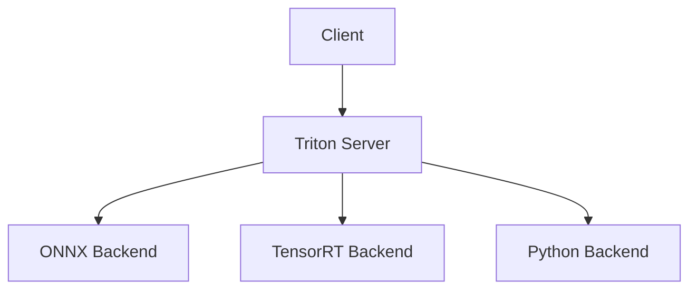
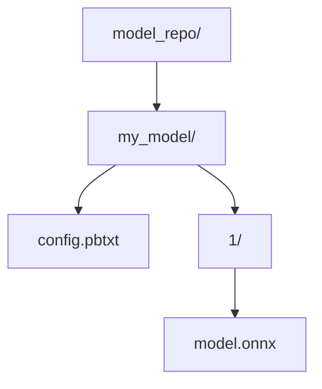
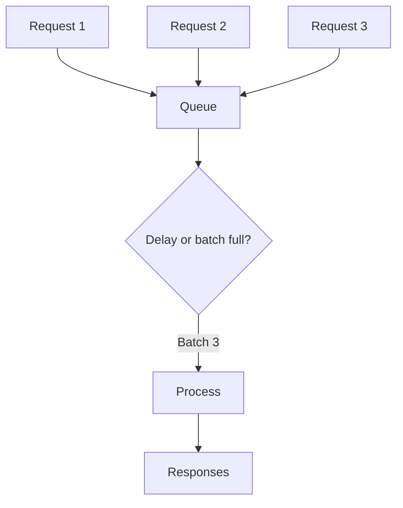

# Triton Inference Server (Deep Dive)

📄 File: `book/12_ai_infrastructure_inference/triton_inference_server.md`

This chapter covers **NVIDIA Triton Inference Server** — a flexible inference server supporting multiple backends (ONNX, TensorRT, Python) and dynamic batching. Used for both CV and NLP models.

---

## Study Plan (2 days)

* Day 1: Triton architecture, model repository, config
* Day 2: Backends, dynamic batching, deployment

---

## 1 — What is Triton?

Triton is a **production inference server** that:
* Supports multiple frameworks (ONNX, TensorRT, PyTorch, Python)
* Provides dynamic batching
* Exposes HTTP/gRPC APIs



---

## 2 — Model Repository Layout



```
model_repo/
  my_model/
    config.pbtxt    # Model config
    1/
      model.onnx   # Version 1
```

---

## 3 — Model Config (config.pbtxt)

```protobuf
# config.pbtxt — line-by-line
name: "my_model"           # Model name
platform: "onnxruntime_onnx"  # Backend

input [
  {
    name: "input"
    data_type: TYPE_FP32
    dims: [ 1, 512 ]       # [batch, seq_len]
  }
]
output [
  {
    name: "output"
    data_type: TYPE_FP32
    dims: [ 1, 512, 32000 ]  # vocab logits
  }
]

# Dynamic batching
dynamic_batching {
  preferred_batch_size: [ 4, 8 ]
  max_queue_delay_microseconds: 500
}
```

---

## 4 — Code: Query Triton (Python)

```python
import tritonclient.http as httpclient
import numpy as np

# Client connection
triton_client = httpclient.InferenceServerClient(url="localhost:8000")

# Prepare input
input_data = np.random.randn(1, 512).astype(np.float32)
inputs = [httpclient.InferInput("input", input_data.shape, "FP32")]
inputs[0].set_data_from_numpy(input_data)

# Infer
outputs = [httpclient.InferRequestedOutput("output")]
result = triton_client.infer("my_model", inputs, outputs=outputs)

# Get output
output = result.as_numpy("output")
print(output.shape)
```

---

## 5 — Dynamic Batching



`max_queue_delay_microseconds`: max wait before processing partial batch.

---

## 6 — Triton vs vLLM

| Aspect | Triton | vLLM |
| ------ | ------ | ----- |
| **Focus** | General (CV, NLP) | LLMs only |
| **Backends** | ONNX, TensorRT, Python | Custom LLM |
| **LLM optimizations** | Via TensorRT-LLM | Native (PagedAttention) |
| **Use case** | Multi-model, CV+NLP | LLM serving |

---

## Exercises

1. Deploy a simple ONNX model to Triton. Query via Python client.
2. Enable dynamic batching; send 10 requests with small delays. Observe batching.
3. Compare latency: batch=1 vs batch=8.

---

## Interview Questions

1. **What is Triton Inference Server?**
   * Answer: NVIDIA's production inference server; supports ONNX, TensorRT, Python; dynamic batching, HTTP/gRPC.

2. **When would you use Triton over vLLM?**
   * Answer: Multi-model (CV + NLP), TensorRT-LLM integration, or non-LLM models.

3. **What is dynamic batching in Triton?**
   * Answer: Queues requests; processes when batch is full or max delay reached; improves throughput.

---

## Key Takeaways

* **Triton** — Multi-backend inference server
* **Model repo** — Directory with config + model files
* **Dynamic batching** — Queue + delay; improves GPU utilization
* **TensorRT-LLM** — Triton backend for LLMs with optimizations

---

## Next Chapter

Proceed to: **ray_serve.md**
