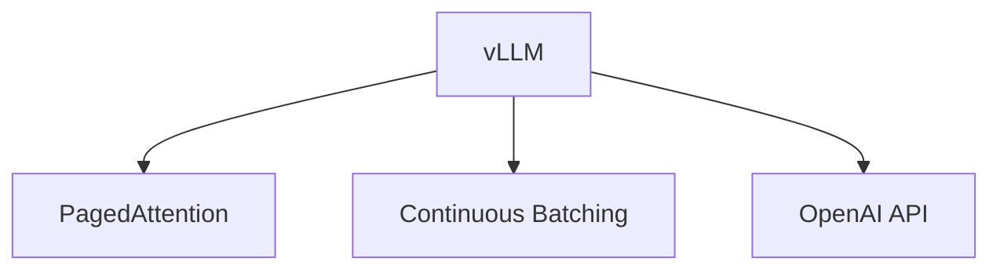
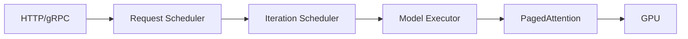
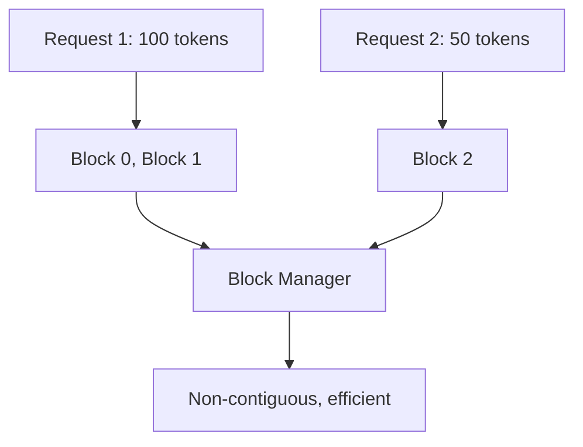

# vLLM (Deep Dive)

📄 File: `book/12_ai_infrastructure_inference/vllm.md`

This chapter covers **vLLM** — a high-throughput LLM inference engine with PagedAttention, continuous batching, and OpenAI-compatible API. Essential for production LLM serving.

---

## Study Plan (2 days)

* Day 1: vLLM architecture, PagedAttention, continuous batching
* Day 2: Deployment, API, tuning

---

## 1 — What is vLLM?

vLLM is an **inference engine** for LLMs that maximizes throughput via:
* **PagedAttention** — Block-based KV cache; less fragmentation
* **Continuous batching** — Add/remove requests per step
* **Optimized kernels** — CUDA for attention, etc.



---

## 2 — vLLM Architecture



---

## 3 — PagedAttention in vLLM



Blocks are fixed size (e.g., 16 tokens). Allocate/free per request; no fragmentation.

---

## 4 — Code: Launch vLLM Server

```python
# Command-line launch — line-by-line
# python -m vllm.entrypoints.openai.api_server \
#     --model meta-llama/Llama-2-7b-chat-hf \   # HuggingFace model
#     --tensor-parallel-size 1 \                  # GPUs for tensor parallelism
#     --max-model-len 4096 \                      # Max sequence length
#     --gpu-memory-utilization 0.9                # Use 90% GPU memory
```

---

## 5 — Code: Query vLLM (OpenAI-Compatible)

```python
from openai import OpenAI

# vLLM exposes OpenAI-compatible API at /v1
client = OpenAI(
    base_url="http://localhost:8000/v1",  # vLLM default port
    api_key="dummy",  # Not used for local vLLM
)

# Chat completion
response = client.chat.completions.create(
    model="meta-llama/Llama-2-7b-chat-hf",  # Must match --model
    messages=[{"role": "user", "content": "What is RAG?"}],
    max_tokens=256,
    temperature=0.7,
)

# Print generated text
print(response.choices[0].message.content)
```

---

## 6 — Code: Streaming with vLLM

```python
# Streaming — tokens as they're generated
stream = client.chat.completions.create(
    model="meta-llama/Llama-2-7b-chat-hf",
    messages=[{"role": "user", "content": "Explain ML."}],
    max_tokens=100,
    stream=True,  # Enable streaming
)

for chunk in stream:
    delta = chunk.choices[0].delta.content
    if delta:
        print(delta, end="")
```

---

## 7 — vLLM vs Alternatives

| Feature | vLLM | HuggingFace | Triton |
| ------- | ----- | ----------- | ------ |
| **Throughput** | High | Low | Medium |
| **PagedAttention** | ✓ | ✗ | ✗ |
| **Continuous batching** | ✓ | ✗ | ✓ |
| **OpenAI API** | ✓ | ✗ | Via backend |

---

## Exercises

1. Launch vLLM with a 7B model. Measure tokens/sec for batch sizes 1, 4, 8.
2. Enable streaming and measure TTFT vs full-response latency.
3. Tune `--gpu-memory-utilization` and observe max batch size.

---

## Interview Questions

1. **What makes vLLM fast?**
   * Answer: PagedAttention (efficient KV cache), continuous batching, optimized CUDA kernels.

2. **What is PagedAttention?**
   * Answer: Store KV cache in fixed-size blocks; allocate/free per request; reduces memory fragmentation.

3. **How does vLLM handle variable-length sequences?**
   * Answer: Continuous batching adds/removes requests per step; PagedAttention handles variable blocks.

---

## Key Takeaways

* **vLLM** — High-throughput LLM inference engine
* **PagedAttention** — Block-based KV cache; less fragmentation
* **Continuous batching** — Dynamic batch per decode step
* **OpenAI API** — Drop-in replacement for local deployment

---

## Next Chapter

Proceed to: **triton_inference_server.md**
