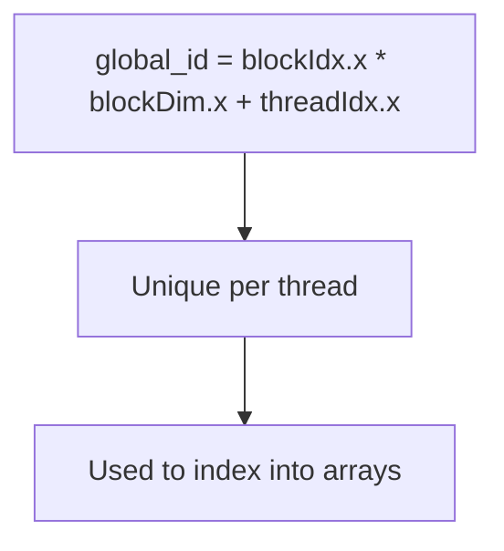
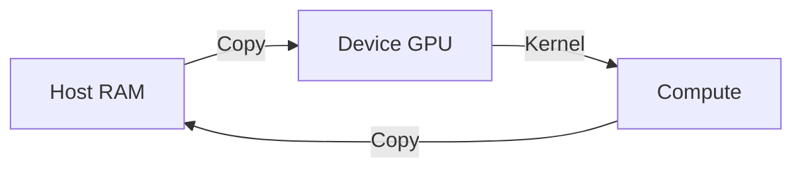

# CUDA Basics (Deep Dive)

📄 File: `book/13_gpu_systems/cuda_basics.md`

This chapter covers **CUDA basics** — writing and launching kernels, thread indexing, and simple parallel patterns. Foundation for understanding GPU-accelerated ML.

---

## Study Plan (2–3 days)

* Day 1: Kernel, grid, block, thread indexing
* Day 2: Memory (global, shared), simple kernels
* Day 3: PyTorch/JAX under the hood

---

## 1 — CUDA Program Structure


Host runs on CPU; kernel runs on GPU. Data copied host↔device.

---

## 2 — Kernel Launch Syntax

```python
# CUDA kernel launch — line-by-line (conceptual, PyTorch style)
# In real CUDA C++:
# kernel<<<grid_dim, block_dim>>>(args);

# grid_dim: number of blocks (e.g., 256)
# block_dim: threads per block (e.g., 256)
# Total threads = 256 * 256 = 65536
```

```cpp
// CUDA C++ example
__global__ void add_kernel(float* a, float* b, float* c, int n) {
    int i = blockIdx.x * blockDim.x + threadIdx.x;
    if (i < n) c[i] = a[i] + b[i];
}

// Launch: 256 blocks, 256 threads each
add_kernel<<<256, 256>>>(a, b, c, n);
```

---

## 3 — Thread Indexing



| Variable | Meaning |
| -------- | ------- |
| `blockIdx.x` | Block index in grid |
| `blockDim.x` | Threads per block |
| `threadIdx.x` | Thread index within block |
| `global_id` | Unique thread ID |

---

## 4 — Code: Vector Add (PyTorch/CUDA)

```python
import torch

# Create vectors on GPU — line-by-line
a = torch.randn(1000, device="cuda")
b = torch.randn(1000, device="cuda")
c = torch.empty(1000, device="cuda")

# Element-wise add — each element parallel
# PyTorch launches CUDA kernel under the hood
torch.add(a, b, out=c)

# Or: c = a + b
print(c[:5])
```

---

## 5 — Memory Transfer



```python
# Explicit transfer — line-by-line
a_cpu = torch.randn(1000)
a_gpu = a_cpu.to("cuda")  # Host → Device
result = a_gpu + 1
result_cpu = result.cpu()  # Device → Host
```

---

## 6 — Grid/Block Sizing

```mermaid
flowchart TD
    A[N elements] --> B[blockDim = 256]
    B --> C[gridDim = ceil(N/256)]
    C --> D[Launch kernel]
```

Typical: 256 threads/block. Grid = ceil(N / 256) blocks.

---

## Exercises

1. Write a kernel (or PyTorch op) that doubles each element. Verify with small input.
2. For N=10000, compute gridDim and blockDim. How many threads total?
3. What happens if global_id >= N? (Bounds check in kernel.)

---

## Interview Questions

1. **What is a CUDA kernel?**
   * Answer: Function that runs on GPU; launched from host; executed by many threads in parallel.

2. **How do you compute global thread ID?**
   * Answer: `blockIdx.x * blockDim.x + threadIdx.x` (1D case).

3. **Why is host-device transfer expensive?**
   * Answer: PCIe bandwidth limited; minimize transfers; keep data on GPU when possible.

---

## Key Takeaways

* **Kernel** — GPU function; launched with <<<grid, block>>>
* **Indexing** — blockIdx, blockDim, threadIdx → global_id
* **Memory** — Explicit host↔device copy; minimize transfers
* **PyTorch** — Abstracts CUDA; .to("cuda") for placement

---

## Next Chapter

Proceed to: **gpu_memory.md**
