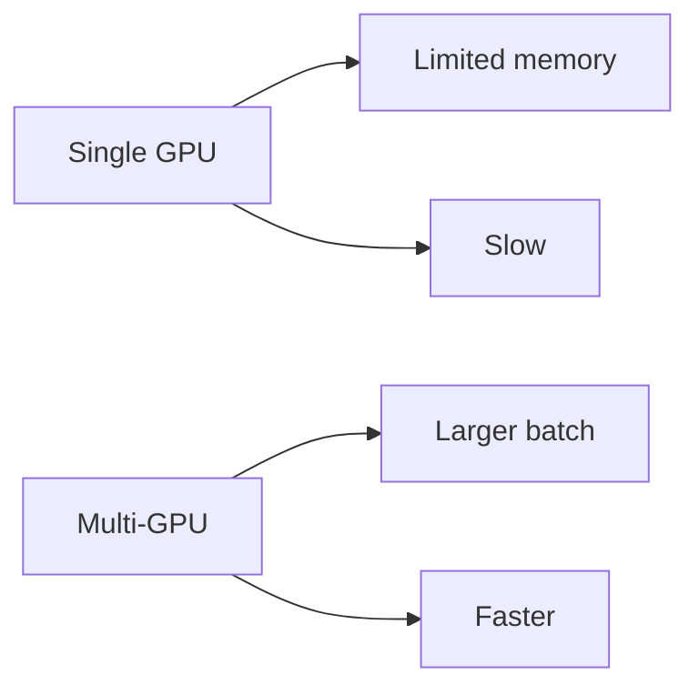
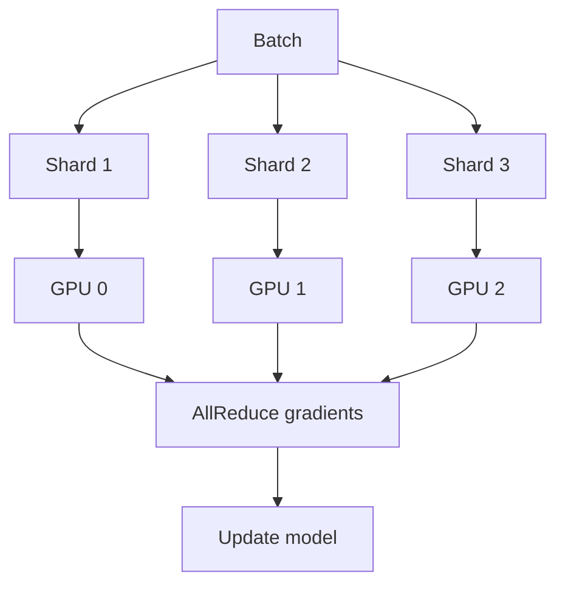
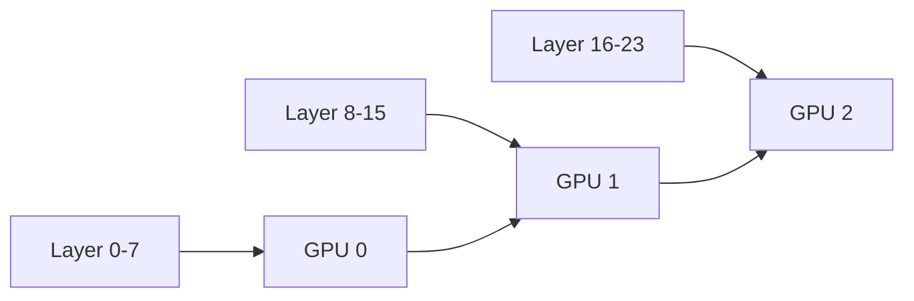
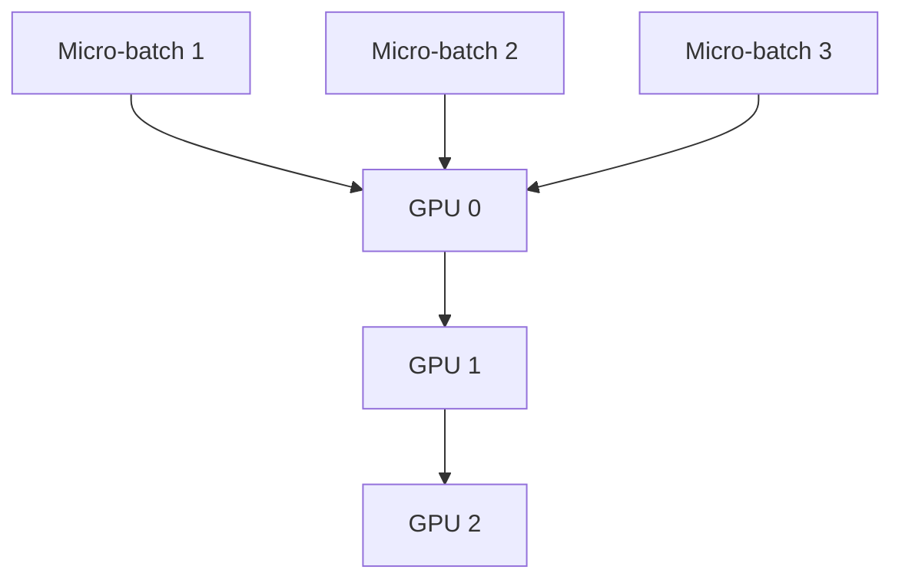
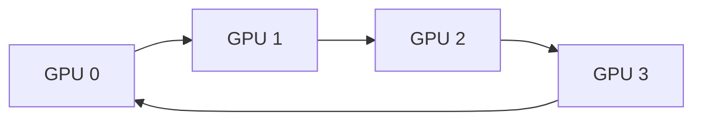
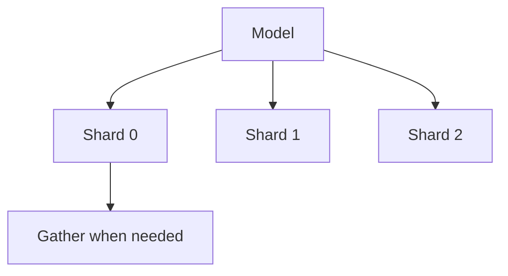

# Distributed Training (Deep Dive)

📄 File: `book/13_gpu_systems/distributed_training.md`

This chapter covers **distributed training** — scaling training across multiple GPUs and nodes via data parallelism, model parallelism, and hybrid approaches.

---

## Study Plan (2–3 days)

* Day 1: Data parallelism (DDP)
* Day 2: Model parallelism, pipeline parallelism
* Day 3: FSDP, Megatron-style

---

## 1 — Why Distribute?



| Goal | Approach |
| ---- | -------- |
| Larger batch | Data parallelism |
| Larger model | Model parallelism |
| Both | Hybrid (e.g., FSDP) |

---

## 2 — Data Parallelism (DDP)

Each GPU has full model copy; different data shard. Gradients averaged across GPUs.



---

## 3 — Model Parallelism

Model split across GPUs. Each GPU holds part of the model.



Used when model doesn't fit on one GPU.

---

## 4 — Pipeline Parallelism

Layers split across GPUs; micro-batches flow through pipeline to hide bubbles.



---

## 5 — Code: DDP with PyTorch

```python
import torch
import torch.distributed as dist
from torch.nn.parallel import DistributedDataParallel as DDP

def setup():
    # Initialize process group — line-by-line
    dist.init_process_group(backend="nccl")  # NCCL for GPU

def train():
    # Create model and wrap with DDP
    model = MyModel().cuda()
    model = DDP(model, device_ids=[local_rank])
    # Each process gets different data via DistributedSampler
    sampler = DistributedSampler(dataset)
    loader = DataLoader(dataset, sampler=sampler, batch_size=32)
    for batch in loader:
        loss = model(batch)
        loss.backward()
        optimizer.step()  # Gradients all-reduced automatically
```

---

## 6 — Ring AllReduce



Gradients reduced in a ring; bandwidth-optimal for large tensors.

---

## 7 — FSDP (Fully Sharded Data Parallel)

Shards model parameters, gradients, optimizer state across GPUs. Enables training models larger than single GPU memory.



---

## Exercises

1. Run DDP on 2 GPUs with a small model. Verify loss matches single-GPU.
2. Estimate: 70B model, 80GB GPU. How many GPUs for model parallelism?
3. What is a "pipeline bubble" and how do micro-batches help?

---

## Interview Questions

1. **What is data parallelism?**
   * Answer: Same model on each GPU; different data; gradients all-reduced and applied.

2. **When use model vs data parallelism?**
   * Answer: Model parallelism when model doesn't fit on one GPU; data parallelism for larger batches.

3. **What is FSDP?**
   * Answer: Fully Sharded Data Parallel; shards parameters, gradients, optimizer state; enables training very large models.

---

## Key Takeaways

* **DDP** — Data parallel; same model, sharded data; AllReduce
* **Model parallel** — Model split across GPUs
* **Pipeline parallel** — Micro-batches through layer stages
* **FSDP** — Shard everything; scale to huge models

---

## Next Chapter

Proceed to: **Evaluation Frameworks** or **Observability**
