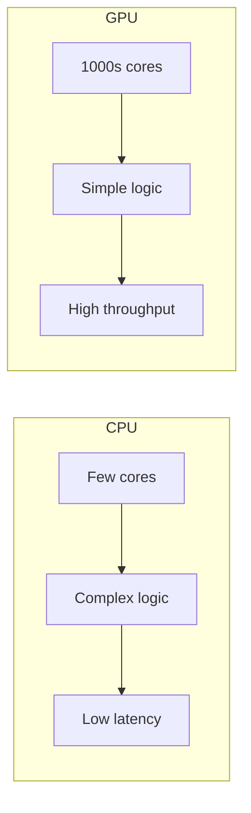
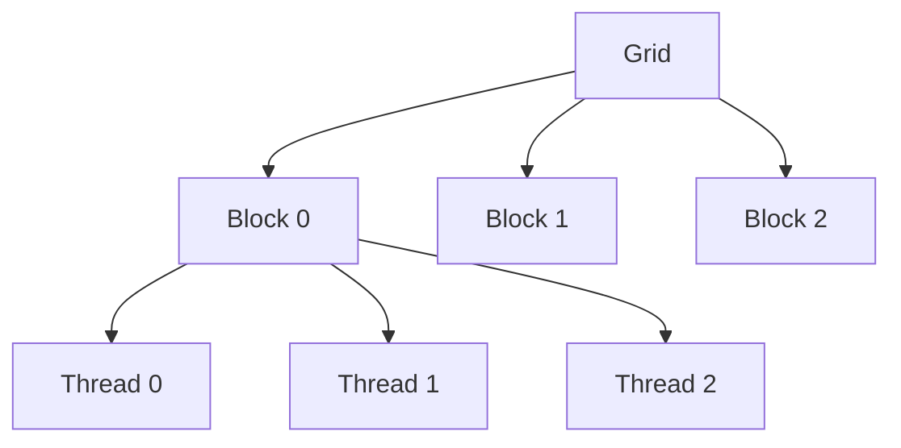
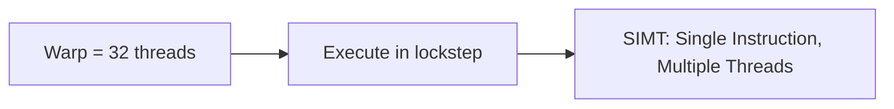
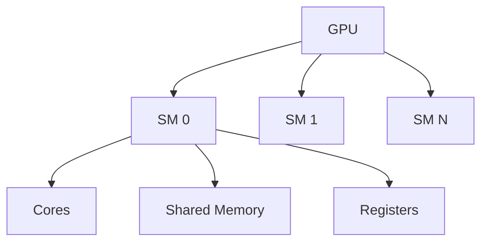
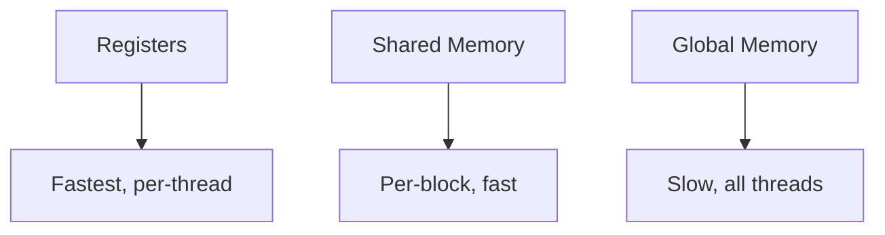

# GPU Architecture (Deep Dive)

📄 File: `book/13_gpu_systems/gpu_architecture.md`

This chapter covers **GPU architecture** — how GPUs differ from CPUs, the execution model (threads, warps, blocks), and why they excel at parallel compute (e.g., deep learning).

---

## Study Plan (2–3 days)

* Day 1: CPU vs GPU, parallelism model
* Day 2: SM, warps, memory hierarchy
* Day 3: How this maps to ML workloads

---

## 1 — CPU vs GPU

| Aspect | CPU | GPU |
| ------ | --- | --- |
| **Cores** | Few (4–64) | Many (1000s) |
| **Focus** | Low latency, branching | High throughput, parallelism |
| **Memory** | Large cache, low latency | High bandwidth, higher latency |
| **Best for** | Sequential, control flow | Data-parallel (matmul, conv) |

---

## 2 — GPU Execution Model

* **Grid** — Entire kernel launch
* **Block** — Group of threads; share shared memory
* **Thread** — Smallest unit of execution

---

## 3 — Warps and SIMT

GPUs execute **warps** (32 threads) in lockstep. Divergent branches serialize execution.

---

## 4 — Streaming Multiprocessor (SM)

Each SM has: cores, shared memory, registers. Blocks are scheduled to SMs.

---

## 5 — Memory Hierarchy

| Memory | Scope | Speed | Size |
| ------ | ----- | ----- | ---- |
| **Register** | Thread | Fastest | Limited |
| **Shared** | Block | Fast | ~48–96 KB/SM |
| **Global** | All | Slow | GBs |

---

## 6 — Why GPUs for Deep Learning?

Matrix multiplies (attention, FFN) are **embarrassingly parallel** — each output element can be computed independently.

---

## Exercises

1. How many threads in a grid of 10 blocks × 256 threads/block?
2. Why does branch divergence hurt GPU performance?
3. Estimate: 4096×4096 matmul — how many output elements? How many threads needed?

---

## Interview Questions

1. **Why are GPUs faster than CPUs for deep learning?**
   * Answer: Thousands of cores; data-parallel workloads (matmul) map well; high memory bandwidth.

2. **What is a warp?**
   * Answer: 32 threads executing in lockstep; SIMT model.

3. **What is shared memory used for?**
   * Answer: Per-block scratchpad; faster than global memory; for tile-based matmul, reductions.

---

## Key Takeaways

* **GPU** — Many simple cores; high throughput for data-parallel
* **Grid/Block/Thread** — Execution hierarchy
* **Warp** — 32 threads, lockstep; divergence hurts
* **Memory** — Registers > Shared > Global

---

## Next Chapter

Proceed to: **cuda_basics.md**
