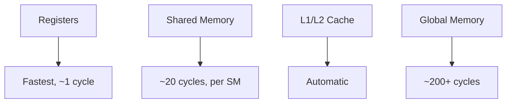
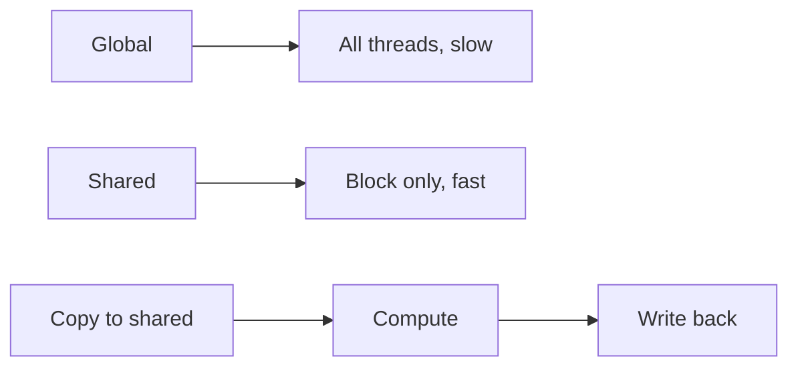
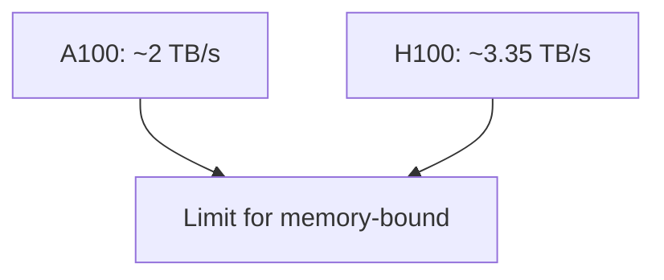
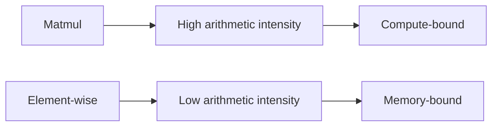
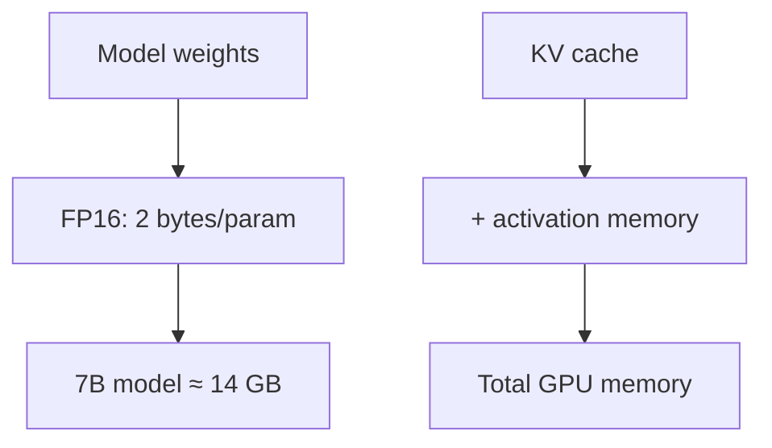

# GPU Memory (Deep Dive)

📄 File: `book/13_gpu_systems/gpu_memory.md`

This chapter covers **GPU memory** — types (global, shared, constant), bandwidth, and memory-bound vs compute-bound kernels. Critical for optimizing ML workloads.

---

## Study Plan (1–2 days)

* Day 1: Memory types, hierarchy, bandwidth
* Day 2: Memory-bound vs compute-bound, optimization

---

## 1 — GPU Memory Hierarchy



| Type | Latency | Bandwidth | Scope |
| ---- | ------- | --------- | ----- |
| **Register** | ~1 cycle | Highest | Thread |
| **Shared** | ~20 cycles | High | Block |
| **Global** | 200+ cycles | Lower | All |

---

## 2 — Global vs Shared Memory



Pattern: Load from global into shared; compute; write back to global.

---

## 3 — Memory Bandwidth



**Memory-bound**: Performance limited by memory bandwidth, not compute.
**Compute-bound**: Limited by FLOPs (matmul with large reuse).

---

## 4 — Roofline Model



Arithmetic intensity = FLOPs / bytes. Higher → compute-bound.

---

## 5 — Code: Shared Memory Pattern (Concept)

```python
# Conceptual: tiled matmul uses shared memory
# 1. Load tile of A and B from global to shared
# 2. Each thread computes partial dot product from shared
# 3. Accumulate in register
# 4. Write result to global

# PyTorch handles this automatically for torch.mm
a = torch.randn(1024, 1024, device="cuda")
b = torch.randn(1024, 1024, device="cuda")
c = torch.mm(a, b)  # Optimized CUDA kernel with shared memory
```

---

## 6 — OOM and Model Size



Estimate: 7B params × 2 bytes = 14 GB for weights alone.

---

## Exercises

1. Estimate memory for LLaMA-7B (fp16) + KV cache for batch=4, seq=2048.
2. Why is matmul compute-bound but element-wise add memory-bound?
3. Look up A100 vs H100 memory bandwidth; compute theoretical peak.

---

## Interview Questions

1. **What is shared memory used for?**
   * Answer: Per-block scratchpad; reuse data; reduce global memory traffic; tiled matmul.

2. **Memory-bound vs compute-bound?**
   * Answer: Memory-bound = limited by bandwidth; compute-bound = limited by FLOPs. Matmul is compute-bound with good tiling.

3. **Why does LLM inference need so much GPU memory?**
   * Answer: Weights (billions of params) + KV cache (batch × seq × layers × heads × dim).

---

## Key Takeaways

* **Hierarchy** — Register > Shared > Global
* **Shared memory** — Block-scoped; for tiling and reuse
* **Roofline** — Low intensity → memory-bound; high → compute-bound
* **LLMs** — Weights + KV cache dominate memory

---

## Next Chapter

Proceed to: **tensor_cores.md**
