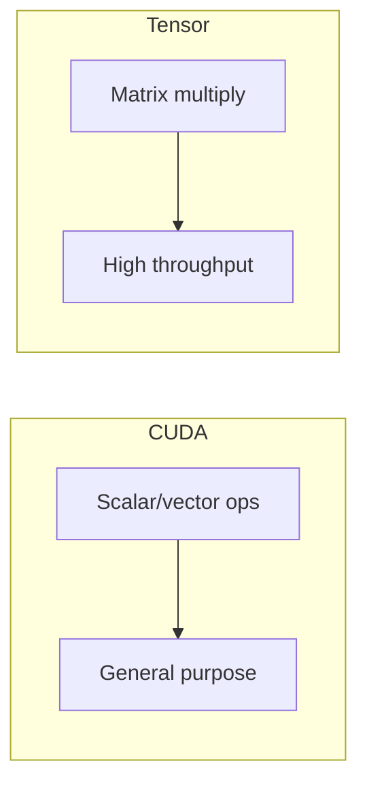
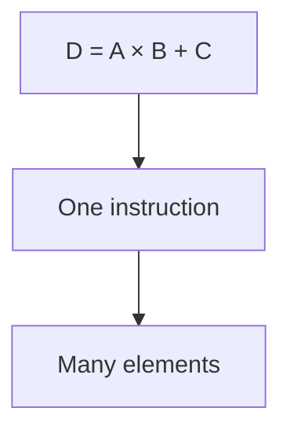
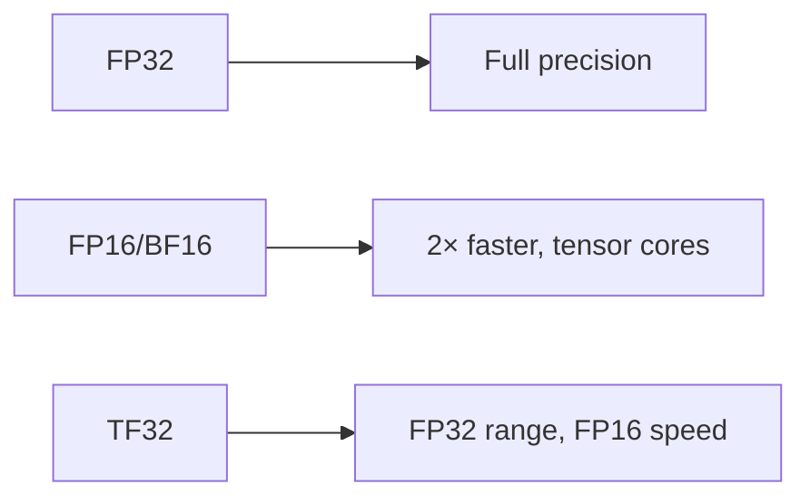
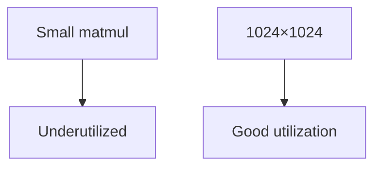

# Tensor Cores (Deep Dive)

📄 File: `book/13_gpu_systems/tensor_cores.md`

This chapter covers **tensor cores** — specialized hardware for matrix multiply-accumulate (MMA) operations. They deliver much higher throughput than CUDA cores for deep learning.

---

## Study Plan (1–2 days)

* Day 1: Tensor cores vs CUDA cores, MMA
* Day 2: Precision (FP16, BF16, TF32), utilization

---

## 1 — CUDA Cores vs Tensor Cores



| Aspect | CUDA Cores | Tensor Cores |
| ------ | ---------- | ------------ |
| **Operation** | FP32, FP64 ops | Matrix multiply-accumulate |
| **Throughput** | Lower | 10–20× higher for matmul |
| **Use case** | General | Deep learning (attention, FFN) |

---

## 2 — Matrix Multiply-Accumulate (MMA)



Tensor core: one instruction computes a small matrix block (e.g., 16×16×16).

---

## 3 — Precision Support



| Precision | Tensor Core | Use |
| --------- | ----------- | --- |
| FP16/BF16 | ✓ | Training, inference |
| TF32 | ✓ | FP32-like, faster |
| FP32 | Limited | Legacy |

---

## 4 — Tensor Core Utilization

To use tensor cores effectively:
* Matrix dimensions multiples of 8 (FP16) or 16
* Use FP16/BF16/TF32
* Large enough matrices



---

## 5 — Code: Enable TF16 in PyTorch

```python
import torch

# Automatic mixed precision — line-by-line
with torch.autocast(device_type="cuda", dtype=torch.float16):
    # Operations run in FP16; tensor cores used
    a = torch.randn(1024, 1024, device="cuda")
    b = torch.randn(1024, 1024, device="cuda")
    c = torch.mm(a, b)  # Uses tensor cores
```

---

## 6 — Throughput Comparison

| Op | CUDA Cores | Tensor Cores |
| --- | ---------- | ------------ |
| 1024×1024 matmul | ~10 TFLOPS | ~100+ TFLOPS |
| Attention | Slower | Dominated by tensor cores |

---

## Exercises

1. Run matmul in FP32 vs FP16; compare speed on your GPU.
2. What happens if matrix dim is 1000 (not multiple of 8)?
3. Look up H100 tensor core peak TFLOPS for FP16.

---

## Interview Questions

1. **What are tensor cores?**
   * Answer: Hardware units for matrix multiply-accumulate; much higher throughput than CUDA cores for matmul.

2. **Why use FP16/BF16 for training?**
   * Answer: Tensor cores are optimized for these; 2× throughput; mixed precision maintains stability.

3. **What is TF32?**
   * Answer: TensorFloat-32; FP32 range with FP16 speed; default on Ampere+ for matmul.

---

## Key Takeaways

* **Tensor cores** — MMA units; 10–20× faster for matmul
* **Precision** — FP16/BF16/TF32 for tensor core use
* **Utilization** — Dims multiple of 8/16; large matrices
* **PyTorch** — autocast for automatic FP16

---

## Next Chapter

Proceed to: **distributed_training.md**
