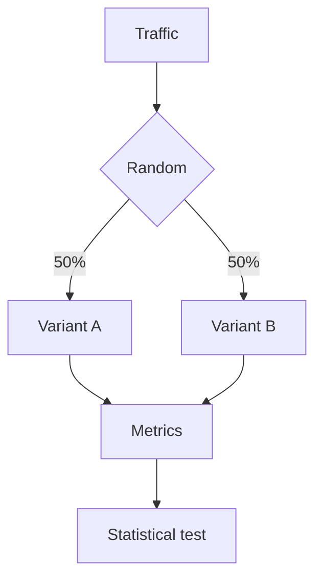
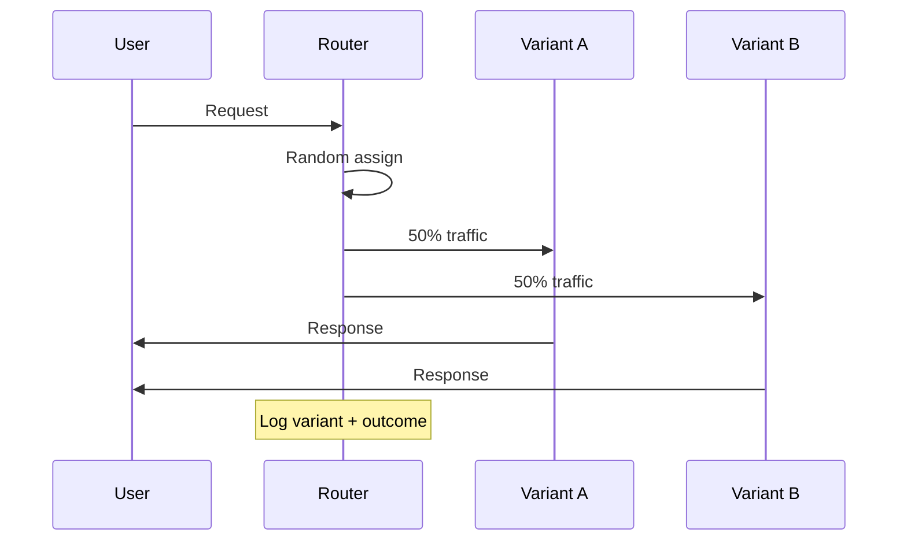
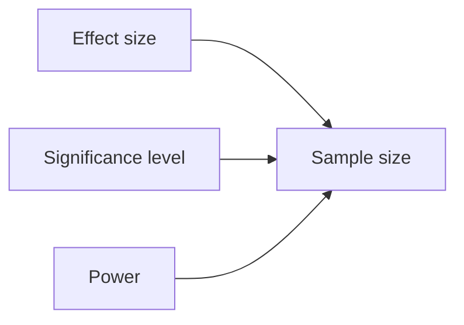
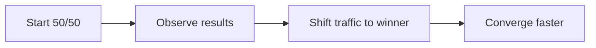

# A/B Testing (Deep Dive)

📄 File: `book/14_evaluation_frameworks/ab_testing.md`

This chapter covers **A/B testing** for AI systems — how to compare prompts, models, and RAG configurations in production with statistical rigor.

---

## Study Plan (1–2 days)

* Day 1: A/B test design, metrics, sample size
* Day 2: Implementation, multi-armed bandits

---

## 1 — What is A/B Testing?

Compare two (or more) variants by randomly assigning users. Measure metrics; determine winner with statistical significance.



---

## 2 — A/B Test Flow



---

## 3 — Key Metrics for AI

| Metric | Definition |
| ------ | ---------- |
| **Latency (p50, p99)** | Response time |
| **Token usage** | Cost proxy |
| **User satisfaction** | Thumbs up/down, ratings |
| **Task success** | Correctness, completion |

---

## 4 — Sample Size



Larger effect → smaller sample. Higher power → larger sample.

---

## 5 — Code: Simple A/B Router

```python
import random
import hashlib

def get_variant(user_id: str, experiment: str) -> str:
    # Deterministic assignment — same user always gets same variant
    # Hash user_id + experiment for consistency
    key = f"{experiment}:{user_id}"
    h = int(hashlib.md5(key.encode()).hexdigest(), 16)
    # 50/50 split
    return "A" if (h % 2 == 0) else "B"

# Usage — line-by-line
user_id = "user_123"
variant = get_variant(user_id, "prompt_v2")
if variant == "A":
    prompt = "You are a helpful assistant."  # Control
else:
    prompt = "You are a concise expert."    # Treatment
```

---

## 6 — Statistical Significance

```python
# Chi-squared for conversion — line-by-line
from scipy import stats

# Variant A: 1000 users, 50 conversions
# Variant B: 1000 users, 65 conversions
observed = [[50, 950], [65, 935]]  # [converted, not] per variant
chi2, p_value, dof, expected = stats.chi2_contingency(observed)
# p_value < 0.05 → reject null; B is better
print(f"p-value: {p_value}")
```

---

## 7 — Multi-Armed Bandits

Alternative to fixed A/B: allocate more traffic to better-performing variant over time.



---

## Exercises

1. Implement A/B router with 70/30 split. Log variant per request.
2. Simulate 1000 requests per variant; compute p-value for conversion difference.
3. Research Thompson Sampling for bandits; compare with fixed split.

---

## Interview Questions

1. **Why use deterministic assignment (hash) for A/B?**
   * Answer: Same user always sees same variant; avoids flickering; consistent experience.

2. **What is statistical power?**
   * Answer: Probability of detecting a real effect; higher power needs larger sample.

3. **When use bandits over A/B?**
   * Answer: When you want to minimize regret during experiment; shift traffic to winner earlier.

---

## Key Takeaways

* **A/B test** — Random assignment; compare metrics; statistical significance
* **Deterministic** — Hash user_id for consistent variant
* **Metrics** — Latency, tokens, satisfaction, correctness
* **Bandits** — Adaptive allocation; less regret

---

## Next Chapter

Proceed to: **Observability** — `book/15_observability_monitoring/prompt_tracing.md`
