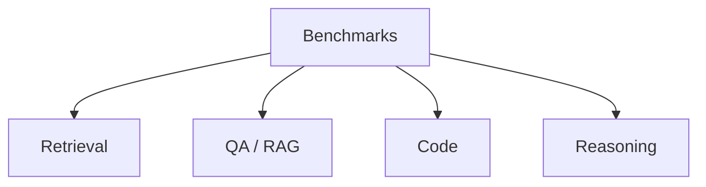
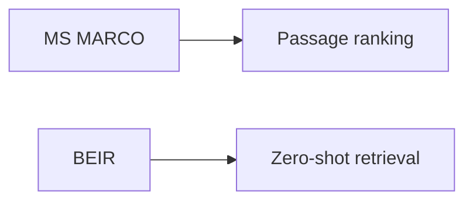
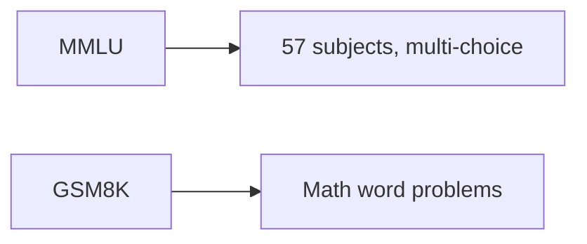
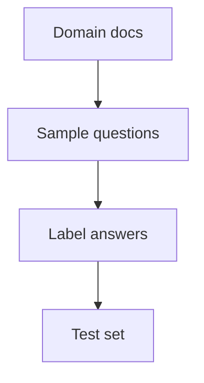

# Benchmark Datasets (Deep Dive)

📄 File: `book/14_evaluation_frameworks/benchmark_datasets.md`

This chapter covers **benchmark datasets** for RAG and LLM evaluation — standard datasets used to compare retrieval, QA, and reasoning systems.

---

## Study Plan (1–2 days)

* Day 1: RAG benchmarks (MS MARCO, Natural Questions)
* Day 2: LLM benchmarks (MMLU, HumanEval), how to use

---

## 1 — Benchmark Categories



| Category | Examples |
| -------- | -------- |
| **Retrieval** | MS MARCO, BEIR |
| **QA/RAG** | Natural Questions, SQuAD |
| **Code** | HumanEval, MBPP |
| **Reasoning** | MMLU, GSM8K |

---

## 2 — Retrieval Benchmarks



| Dataset | Task | Use |
| ------- | ---- | --- |
| **MS MARCO** | Passage ranking | Train/eval retrievers |
| **BEIR** | Multi-domain retrieval | Zero-shot eval |

---

## 3 — QA / RAG Benchmarks

| Dataset | Format | Use |
| ------- | ------ | --- |
| **Natural Questions** | Question + long docs | RAG eval |
| **SQuAD** | Question + paragraph | Extractive QA |
| **HotpotQA** | Multi-hop QA | Complex reasoning |

---

## 4 — Code Benchmarks

```python
# HumanEval: function completion — line-by-line
# Each item: prompt (docstring + signature), test cases
# Model generates function body; run tests for pass@k

# Example prompt:
# "def add(a: int, b: int) -> int:\n    \"\"\"Add two numbers.\"\"\"\n"
# Model completes: "return a + b"
```

| Dataset | Task |
| ------- | ---- |
| **HumanEval** | Python function completion |
| **MBPP** | Basic programming problems |

---

## 5 — Reasoning Benchmarks



| Dataset | Task |
| ------- | ---- |
| **MMLU** | Multi-task knowledge |
| **GSM8K** | Grade-school math |
| **TruthfulQA** | Factual accuracy |

---

## 6 — Code: Load and Use

```python
from datasets import load_dataset

# Load Natural Questions — line-by-line
nq = load_dataset("natural_questions", split="validation")
# Each row: question, long_answer_candidates, short_answers

# Load HumanEval
he = load_dataset("openai_humaneval", split="test")
# Each row: task_id, prompt, test, entry_point

# Load MMLU
mmlu = load_dataset("cais/mmlu", "abstract_algebra", split="test")
# Each row: question, choices, answer
```

---

## 7 — Building Custom Benchmarks



For RAG: questions + ground truth answers + (optionally) relevant doc IDs.

---

## Exercises

1. Load MS MARCO passages; run your retriever on 100 queries; compute MRR.
2. Create a 20-question benchmark from your own docs.
3. Run RAGAS on Natural Questions subset.

---

## Interview Questions

1. **What is BEIR used for?**
   * Answer: Zero-shot retrieval evaluation across multiple domains.

2. **What does HumanEval measure?**
   * Answer: Code generation; pass@k = % of generated solutions that pass unit tests.

3. **How would you build a RAG benchmark?**
   * Answer: Sample questions from domain, retrieve or write ground truth answers, optionally label relevant docs.

---

## Key Takeaways

* **Retrieval** — MS MARCO, BEIR
* **QA/RAG** — Natural Questions, SQuAD, HotpotQA
* **Code** — HumanEval, MBPP
* **Reasoning** — MMLU, GSM8K
* **Custom** — Domain questions + ground truth

---

## Next Chapter

Proceed to: **ab_testing.md**
