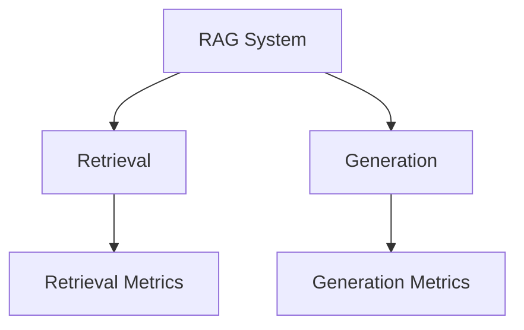
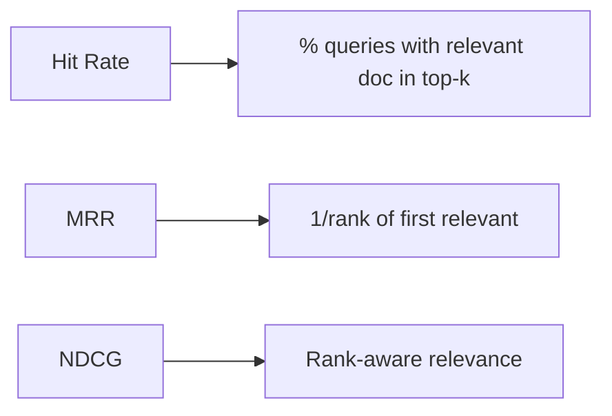
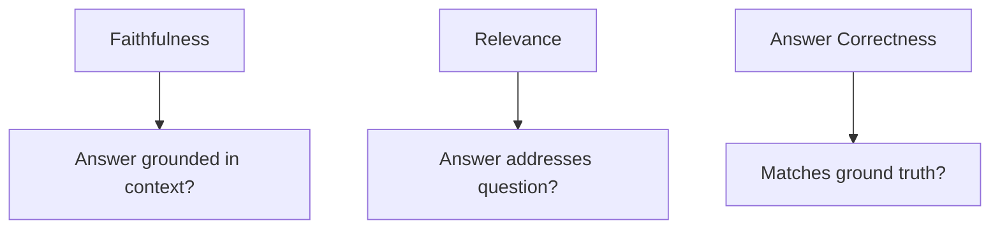

# RAG Evaluation (Deep Dive)

📄 File: `book/14_evaluation_frameworks/rag_evaluation.md`

This chapter covers **RAG evaluation** — metrics for retrieval (hit rate, MRR) and generation (faithfulness, relevance), plus how to design evaluation pipelines.

---

## Study Plan (2–3 days)

* Day 1: Retrieval metrics
* Day 2: Generation metrics (faithfulness, relevance)
* Day 3: End-to-end evaluation pipeline

---

## 1 — RAG Evaluation Overview



| Stage | Metrics |
| ----- | ------- |
| **Retrieval** | Hit rate, MRR, NDCG |
| **Generation** | Faithfulness, relevance, answer correctness |

---

## 2 — Retrieval Metrics



| Metric | Definition |
| ------ | ---------- |
| **Hit@k** | At least one relevant doc in top-k |
| **MRR** | 1 / rank of first relevant doc |
| **NDCG** | Discounted cumulative gain; rewards ranking |

---

## 3 — Generation Metrics



| Metric | What it measures |
| ------ | ----------------- |
| **Faithfulness** | No hallucination; supported by context |
| **Relevance** | Answer addresses the question |
| **Answer Correctness** | Match to reference (BLEU, exact match) |

---

## 4 — Faithfulness (LLM-as-Judge)

```python
# Faithfulness check — line-by-line
def check_faithfulness(context: str, answer: str) -> bool:
    # Use LLM to verify each claim in answer is in context
    prompt = f"""Context: {context}
    Answer: {answer}
    Is every claim in the answer supported by the context? Yes or No."""
    response = llm.generate(prompt)
    return "yes" in response.lower()
```

---

## 5 — Relevance (LLM-as-Judge)

```python
# Relevance check — line-by-line
def check_relevance(question: str, answer: str) -> int:
    # Score 1-5: does answer address the question?
    prompt = f"""Question: {question}
    Answer: {answer}
    Rate 1-5 how relevant the answer is to the question."""
    response = llm.generate(prompt)
    return int(response.strip())
```

---

## 6 — Evaluation Pipeline


---

## 7 — Code: Simple RAG Eval Loop

```python
# RAG evaluation loop — line-by-line
def evaluate_rag(rag_pipeline, test_set: list[dict]) -> dict:
    results = {"faithfulness": [], "relevance": []}
    for item in test_set:
        # Get RAG output
        answer = rag_pipeline(item["question"])
        # Check faithfulness (context = retrieved chunks)
        ctx = item.get("retrieved_context", "")
        results["faithfulness"].append(check_faithfulness(ctx, answer))
        # Check relevance
        results["relevance"].append(check_relevance(item["question"], answer))
    return {
        "faithfulness": sum(results["faithfulness"]) / len(results["faithfulness"]),
        "relevance": sum(results["relevance"]) / len(results["relevance"]),
    }
```

---

## Exercises

1. Build a test set of 10 Q&A pairs. Run your RAG; compute hit@5 and faithfulness.
2. Compare two chunking strategies using the same metrics.
3. Add MRR to your evaluation script.

---

## Interview Questions

1. **What is faithfulness in RAG?**
   * Answer: Answer is grounded in retrieved context; no hallucination.

2. **How do you evaluate retrieval quality?**
   * Answer: Hit@k, MRR, NDCG; need labeled relevant docs per query.

3. **What is LLM-as-Judge?**
   * Answer: Use an LLM to score faithfulness, relevance, etc.; cost-effective but can be noisy.

---

## Key Takeaways

* **Retrieval** — Hit@k, MRR, NDCG
* **Generation** — Faithfulness, relevance, correctness
* **LLM-as-Judge** — Scalable but noisy
* **Pipeline** — Test set → RAG → metrics → report

---

## Next Chapter

Proceed to: **ragas.md**
