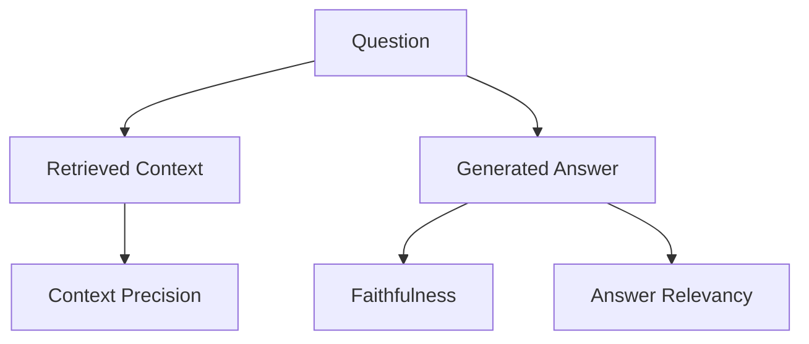
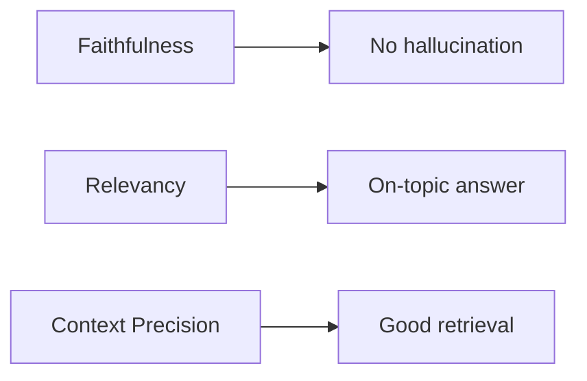
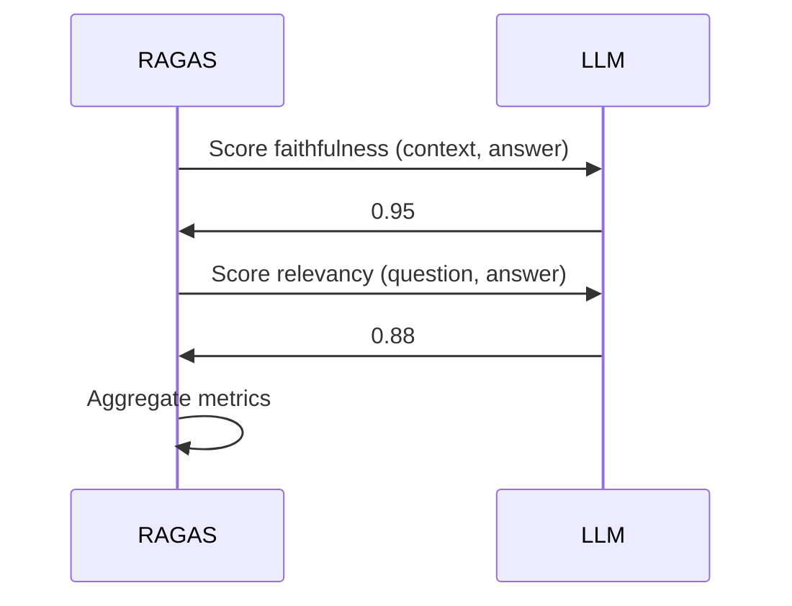

# RAGAS (Deep Dive)

📄 File: `book/14_evaluation_frameworks/ragas.md`

This chapter covers **RAGAS** — a framework for evaluating RAG pipelines with metrics like faithfulness, answer relevancy, and context precision. Uses LLMs for automated scoring.

---

## Study Plan (1–2 days)

* Day 1: RAGAS metrics, setup
* Day 2: Integration with LangChain, custom datasets

---

## 1 — What is RAGAS?

RAGAS = **RAG Assessment** — evaluates RAG with minimal human labeling. Uses LLM to score faithfulness, relevancy, and context quality.



---

## 2 — RAGAS Metrics

| Metric | Input | What it measures |
| ------ | ----- | ------- |
| **Faithfulness** | Context + Answer | Answer grounded in context |
| **Answer Relevancy** | Question + Answer | Answer addresses question |
| **Context Precision** | Question + Context | Retrieved context is relevant |
| **Context Recall** | Context + Ground truth | Context contains answer |



---

## 3 — Installation and Setup

```python
# Install — line-by-line
# pip install ragas

from ragas import evaluate
from ragas.metrics import faithfulness, answer_relevancy, context_precision
from datasets import Dataset
```

---

## 4 — Code: Evaluate with RAGAS

```python
from ragas import evaluate
from ragas.metrics import faithfulness, answer_relevancy, context_precision
from datasets import Dataset

# Prepare data — line-by-line
# Each row: question, answer, contexts (list), ground_truth (optional)
data = {
    "question": ["What is RAG?"],
    "answer": ["RAG is retrieval augmented generation."],
    "contexts": [["RAG combines retrieval with generation. It reduces hallucination."]],
    "ground_truth": ["RAG retrieves docs and augments LLM generation."],
}
dataset = Dataset.from_dict(data)

# Run evaluation
result = evaluate(
    dataset,
    metrics=[faithfulness, answer_relevancy, context_precision],
)

# Print scores (0-1)
print(result)
# faithfulness: 0.95, answer_relevancy: 0.88, context_precision: 0.92
```

---

## 5 — RAGAS Flow



---

## 6 — When to Use RAGAS

| Use RAGAS | Use Custom |
| --------- | ---------- |
| Quick eval setup | Full control |
| Standard metrics | Custom metrics |
| LLM-based scoring | Human eval |

---

## Exercises

1. Run RAGAS on 5 RAG outputs. Compare with manual scoring.
2. Add context_recall using ground truth. When is it useful?
3. Integrate RAGAS into a CI pipeline for RAG changes.

---

## Interview Questions

1. **What is RAGAS?**
   * Answer: RAG evaluation framework; LLM-based metrics for faithfulness, relevancy, context precision/recall.

2. **What is context precision?**
   * Answer: How many retrieved chunks are relevant to the question; measures retrieval quality.

3. **When would you not use RAGAS?**
   * Answer: When you need human eval, custom metrics, or want to avoid LLM cost.

---

## Key Takeaways

* **RAGAS** — Automated RAG evaluation with LLM-based metrics
* **Metrics** — Faithfulness, answer relevancy, context precision/recall
* **Minimal labeling** — No need for full human annotations
* **Integration** — Works with LangChain, HuggingFace datasets

---

## Next Chapter

Proceed to: **benchmark_datasets.md**
