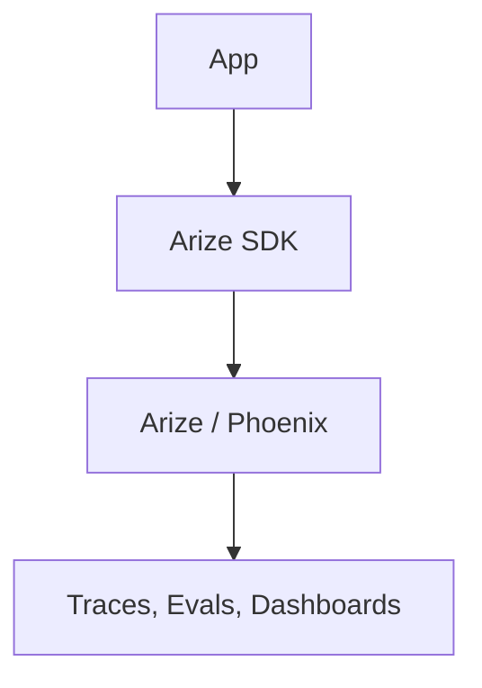
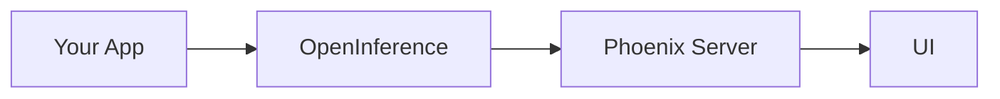
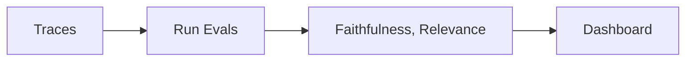

# Arize (Deep Dive)

📄 File: `book/15_observability_monitoring/arize.md`

This chapter covers **Arize** — an ML observability platform with support for LLMs and RAG. Provides tracing, evaluation, and drift detection for AI systems.

---

## Study Plan (1–2 days)

* Day 1: Arize Phoenix (open-source), tracing
* Day 2: Evals, production integration

---

## 1 — What is Arize?

Arize offers:
* **Tracing** — LLM traces, spans
* **Evaluation** — Automated scoring
* **Drift** — Monitor input/output drift



---

## 2 — Arize Phoenix (Open-Source)

Phoenix is the open-source tracing and evals component. Can run locally or with Arize cloud.



---

## 3 — Code: Trace with Arize

```python
# Install: pip install arize

from arize.phoenix import Client
from arize.phoenix.trace import Span, Trace

# Connect to Phoenix — line-by-line
client = Client()
# Create trace
trace = Trace(name="rag_request")
# Add span
span = trace.span(name="retrieve", span_kind="RETRIEVER")
span.end()
# Add LLM span
gen_span = trace.span(name="llm", span_kind="LLM")
gen_span.end()
# Export
client.log_trace(trace)
```

---

## 4 — LangChain Integration

```python
from arize.phoenix.instrumentation.langchain import LangChainInstrumentor

# Auto-instrument LangChain — line-by-line
LangChainInstrumentor().instrument()
# All LangChain calls traced to Phoenix
result = chain.invoke({"input": "What is RAG?"})
```

---

## 5 — Evaluation in Arize



---

## 6 — Arize vs Langfuse

| Aspect | Arize | Langfuse |
| ------ | ----- | -------- |
| **Open-source** | Phoenix | Full OSS |
| **LLM focus** | ✓ | ✓ |
| **Drift** | ✓ | Limited |
| **Evals** | ✓ | ✓ |

---

## Exercises

1. Run Phoenix locally; instrument a simple LLM call.
2. Add LangChain instrumentation; view trace in Phoenix UI.
3. Run a faithfulness eval on 10 traces.

---

## Interview Questions

1. **What is Arize Phoenix?**
   * Answer: Open-source LLM tracing and evals; part of Arize platform; OpenInference format.

2. **How does Arize help with LLM observability?**
   * Answer: Traces, evals (faithfulness, relevance), drift detection, dashboards.

3. **When use Arize over Langfuse?**
   * Answer: When you need drift detection, or prefer Arize's eval workflows.

---

## Key Takeaways

* **Arize** — ML/LLM observability; tracing, evals, drift
* **Phoenix** — Open-source tracing component
* **Instrumentation** — LangChain, manual SDK
* **Evals** — Faithfulness, relevance, custom

---

## Next Chapter

Proceed to: **open_telemetry.md**
