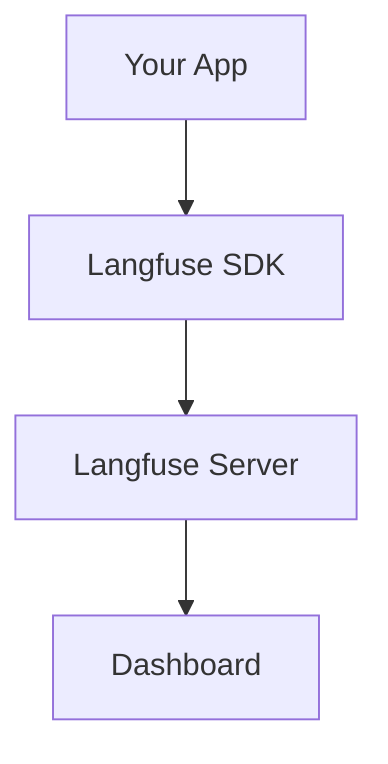
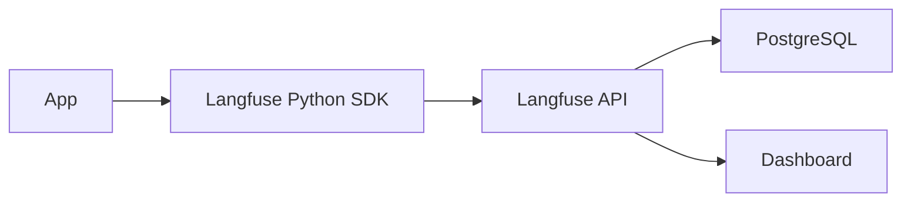
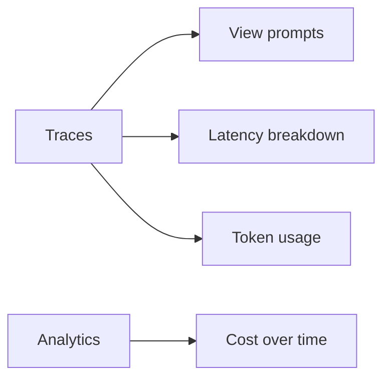

# Langfuse (Deep Dive)

📄 File: `book/15_observability_monitoring/langfuse.md`

This chapter covers **Langfuse** — an open-source LLM observability platform for tracing, analytics, and evaluation. Integrates with LangChain, LlamaIndex, and custom apps.

---

## Study Plan (1–2 days)

* Day 1: Langfuse setup, tracing
* Day 2: Analytics, evals, production

---

## 1 — What is Langfuse?

Langfuse provides:
* **Tracing** — Traces, spans, generations
* **Analytics** — Latency, cost, usage
* **Evaluation** — Score traces, compare



---

## 2 — Langfuse Architecture



---

## 3 — Installation and Setup

```python
# Install — line-by-line
# pip install langfuse

# Set environment variables
# LANGFUSE_SECRET_KEY=sk-...
# LANGFUSE_PUBLIC_KEY=pk-...
# LANGFUSE_HOST=https://cloud.langfuse.com  # or self-hosted

from langfuse import Langfuse
langfuse = Langfuse()
```

---

## 4 — Code: Manual Trace

```python
from langfuse import Langfuse

langfuse = Langfuse()

# Create trace — line-by-line
trace = langfuse.trace(name="rag_request")
# Add span for retrieval
span = trace.span(name="retrieve")
chunks = retriever.invoke("What is RAG?")
span.end()
# Add span for LLM
gen = trace.generation(name="llm", model="gpt-4")
response = llm.invoke(build_prompt(chunks))
gen.end(output=response)
# Flush
langfuse.flush()
```

---

## 5 — LangChain Integration

```python
from langfuse.callback import CallbackHandler

# Add to LangChain — line-by-line
handler = CallbackHandler(
    secret_key="...",
    public_key="...",
)
# Pass to chain
result = chain.invoke({"input": "What is RAG?"}, config={"callbacks": [handler]})
# Trace automatically sent to Langfuse
```

---

## 6 — Dashboard Features



---

## Exercises

1. Add Langfuse callback to your LangChain RAG. Inspect trace in dashboard.
2. Create a manual trace with custom metadata. Query via Langfuse API.
3. Set up scoring (e.g., thumbs up/down) and view in Langfuse.

---

## Interview Questions

1. **What is Langfuse?**
   * Answer: Open-source LLM observability; tracing, analytics, evals; integrates with LangChain.

2. **How does Langfuse capture traces?**
   * Answer: SDK/callback sends traces to server; async flush; stores spans, generations, metadata.

3. **When would you use Langfuse over custom logging?**
   * Answer: When you want a ready-made dashboard, cost analytics, and eval workflows.

---

## Key Takeaways

* **Langfuse** — LLM observability platform
* **Tracing** — Traces, spans, generations
* **Integration** — LangChain callback, manual SDK
* **Dashboard** — Latency, cost, traces, evals

---

## Next Chapter

Proceed to: **arize.md**
