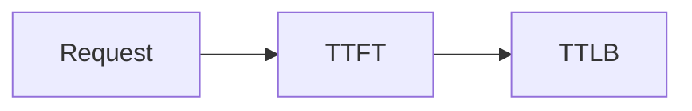
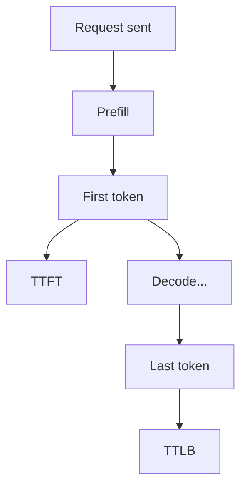
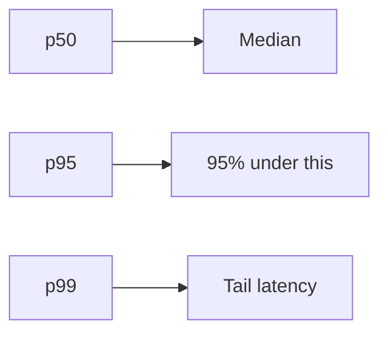
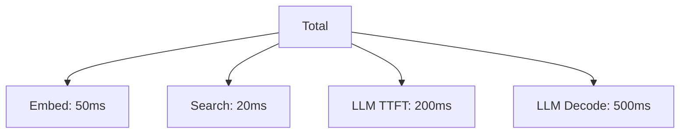

# Latency Metrics (Deep Dive)

📄 File: `book/15_observability_monitoring/latency_metrics.md`

This chapter covers **latency metrics** for AI systems — TTFT, TTLB, percentiles, and how to measure and optimize them in production.

---

## Study Plan (1 day)

* Day 1: TTFT, TTLB, percentiles, measurement

---

## 1 — Key Latency Metrics



| Metric | Definition |
| ------ | ---------- |
| **TTFT** | Time to first token |
| **TTLB** | Time to last byte (full response) |
| **p50, p95, p99** | Percentiles |

---

## 2 — TTFT vs TTLB



TTFT = user perceives "something is happening". TTLB = full response ready.

---

## 3 — Percentiles



| Percentile | Use |
| ---------- | --- |
| **p50** | Typical user |
| **p95** | Most users |
| **p99** | Worst-case, SLAs |

---

## 4 — Code: Measure Latency

```python
import time

def measure_ttft(prompt: str) -> float:
    # Measure time to first token — line-by-line
    start = time.perf_counter()
    stream = client.chat.completions.create(
        model="gpt-4",
        messages=[{"role": "user", "content": prompt}],
        stream=True,
    )
    first_token = None
    for chunk in stream:
        if chunk.choices[0].delta.content:
            first_token = chunk.choices[0].delta.content
            break
    return (time.perf_counter() - start) * 1000  # ms
```

---

## 5 — Code: Percentiles

```python
# Compute percentiles from latency samples — line-by-line
import numpy as np

latencies_ms = [120, 95, 110, 200, 105, ...]  # Sample of TTFT values
p50 = np.percentile(latencies_ms, 50)
p95 = np.percentile(latencies_ms, 95)
p99 = np.percentile(latencies_ms, 99)
print(f"p50: {p50}ms, p95: {p95}ms, p99: {p99}ms")
```

---

## 6 — Latency Breakdown (RAG)



Identify bottleneck: often LLM prefill or decode.

---

## Exercises

1. Measure TTFT and TTLB for 10 requests. Compute p50, p95.
2. Add latency logging to your RAG; break down by embed, search, LLM.
3. Set up Prometheus histogram for latency (see prometheus_grafana.md).

---

## Interview Questions

1. **What is TTFT and why does it matter?**
   * Answer: Time to first token; drives perceived responsiveness; streaming shows progress.

2. **Why use p99 over average?**
   * Answer: Average hides tail latency; p99 captures worst-case user experience.

3. **How would you reduce RAG latency?**
   * Answer: Cache embeddings, smaller/faster model, reduce retrieval count, parallel embed+search.

---

## Key Takeaways

* **TTFT** — Time to first token; perceived latency
* **TTLB** — Time to last byte; full response
* **Percentiles** — p50, p95, p99 for SLAs
* **Breakdown** — Per-step latency for optimization

---

## Next Chapter

Proceed to: **token_usage.md**
