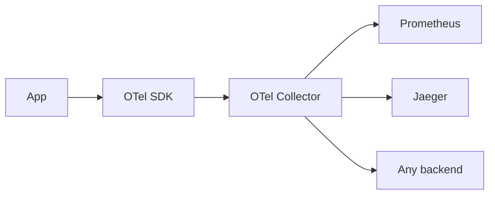
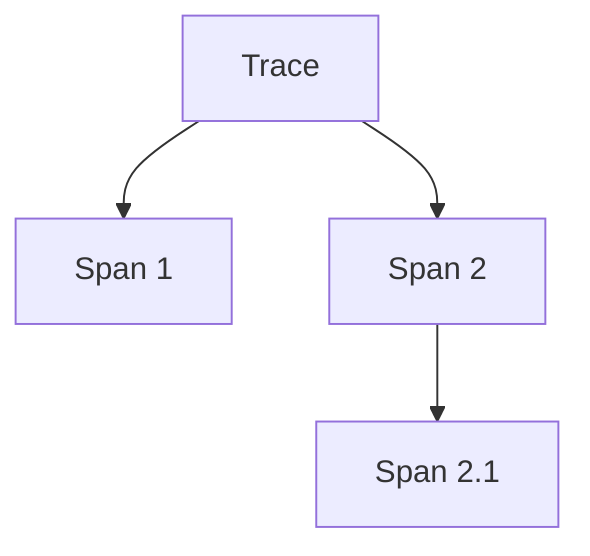
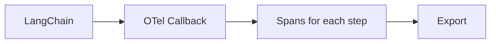

# OpenTelemetry (Deep Dive)

📄 File: `book/15_observability_monitoring/open_telemetry.md`

This chapter covers **OpenTelemetry (OTel)** — the vendor-neutral standard for traces, metrics, and logs. Use it to instrument LLM apps and export to any backend.

---

## Study Plan (1–2 days)

* Day 1: OTel concepts, traces, spans
* Day 2: LLM instrumentation, export to Prometheus/Jaeger

---

## 1 — What is OpenTelemetry?

OTel provides:
* **Traces** — Request flow across services
* **Metrics** — Counters, histograms
* **Logs** — Structured logs



---

## 2 — Trace Model



Trace = tree of spans. Each span: name, start, end, attributes.

---

## 3 — Code: Basic Trace

```python
# Install: pip install opentelemetry-api opentelemetry-sdk

from opentelemetry import trace
from opentelemetry.sdk.trace import TracerProvider
from opentelemetry.sdk.trace.export import ConsoleSpanExporter, BatchSpanProcessor

# Setup — line-by-line
provider = TracerProvider()
processor = BatchSpanProcessor(ConsoleSpanExporter())
provider.add_span_processor(processor)
trace.set_tracer_provider(provider)
tracer = trace.get_tracer("my-app", "1.0")

# Create span
with tracer.start_as_current_span("rag_request") as span:
    span.set_attribute("query", "What is RAG?")
    # ... do work ...
```

---

## 4 — Code: Nested Spans

```python
with tracer.start_as_current_span("rag") as parent:
    parent.set_attribute("query", query)
    with tracer.start_as_current_span("retrieve") as child1:
        chunks = retriever.invoke(query)
    with tracer.start_as_current_span("llm") as child2:
        response = llm.invoke(build_prompt(chunks))
```

---

## 5 — OTel for LLMs



Use `langchain-opentelemetry` or custom callback to create spans per LLM/retriever call.

---

## 6 — Export to Jaeger

```python
from opentelemetry.exporter.jaeger.thrift import JaegerExporter
from opentelemetry.sdk.trace.export import BatchSpanProcessor

jaeger = JaegerExporter(
    agent_host_name="localhost",
    agent_port=6831,
)
provider.add_span_processor(BatchSpanProcessor(jaeger))
```

---

## Exercises

1. Create a trace with 3 spans: embed, search, LLM. Export to console.
2. Add OTel to your RAG; export to Jaeger. View trace.
3. Add a histogram metric for latency; export to Prometheus.

---

## Interview Questions

1. **What is OpenTelemetry?**
   * Answer: Vendor-neutral standard for traces, metrics, logs; export to any backend.

2. **What is a span?**
   * Answer: Unit of work; has name, start/end time, attributes; spans form a trace tree.

3. **Why use OTel for LLM apps?**
   * Answer: Standard instrumentation; plug into existing observability stack; no vendor lock-in.

---

## Key Takeaways

* **OTel** — Standard for traces, metrics, logs
* **Trace** — Tree of spans
* **Export** — Console, Jaeger, Prometheus, etc.
* **LLM** — Custom callback or langchain-opentelemetry

---

## Next Chapter

Proceed to: **prometheus_grafana.md**
