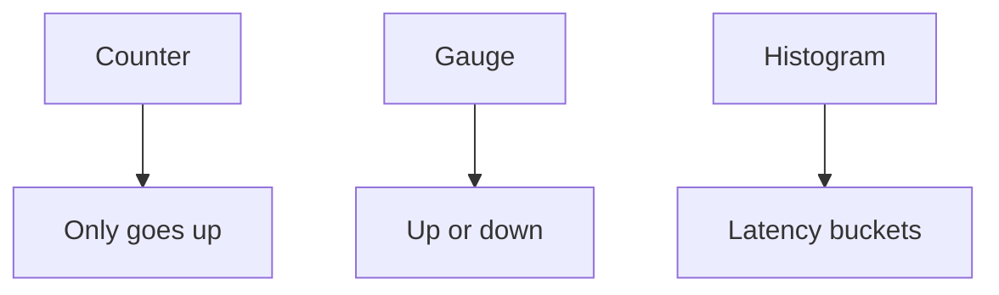
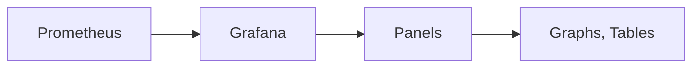

# Prometheus and Grafana (Deep Dive)

📄 File: `book/15_observability_monitoring/prometheus_grafana.md`

This chapter covers **Prometheus** and **Grafana** for metrics and dashboards — the standard stack for monitoring AI inference, latency, and throughput.

---

## Study Plan (1–2 days)

* Day 1: Prometheus metrics, scrape, query
* Day 2: Grafana dashboards, alerts

---

## 1 — Prometheus Overview

Prometheus: pull-based metrics storage and querying. Scrapes HTTP endpoints for metrics.

```mermaid
flowchart LR
    A[Your App] --> B[/metrics]
    C[Prometheus] --> B
    C --> D[TSDB]
    D --> E[PromQL]
```

---

## 2 — Metric Types

| Type | Use |
| ---- | --- |
| **Counter** | Total count (requests, tokens) |
| **Gauge** | Current value (queue size) |
| **Histogram** | Distribution (latency) |
| **Summary** | Similar to histogram, client-side quantiles |



---

## 3 — Code: Expose Metrics (Python)

```python
from prometheus_client import Counter, Histogram, start_http_server

# Define metrics — line-by-line
REQUEST_COUNT = Counter("llm_requests_total", "Total requests", ["model"])
LATENCY = Histogram("llm_latency_seconds", "Request latency", ["model"], buckets=[0.1, 0.5, 1, 2, 5])

# Start metrics server on :8000/metrics
start_http_server(8000)

# In request handler
def handle_request(model: str):
    with LATENCY.labels(model=model).time():
        result = llm.generate(...)
    REQUEST_COUNT.labels(model=model).inc()
    return result
```

---

## 4 — PromQL Basics

```promql
# Request rate per second
rate(llm_requests_total[5m])

# p99 latency
histogram_quantile(0.99, rate(llm_latency_seconds_bucket[5m]))

# Total tokens (if you have a counter)
increase(llm_tokens_total[1h])
```

---

## 5 — Grafana Dashboards



Grafana queries Prometheus; displays graphs, tables, alerts.

---

## 6 — Key Metrics for AI

| Metric | Type | Description |
| ------ | ---- | ----------- |
| `llm_requests_total` | Counter | Total requests |
| `llm_latency_seconds` | Histogram | Request latency |
| `llm_tokens_total` | Counter | Token usage |
| `llm_errors_total` | Counter | Errors |
| `rag_retrieve_latency` | Histogram | Retrieval latency |

---

## 7 — Grafana Panel Example

```promql
# Panel: Request rate
sum(rate(llm_requests_total[5m])) by (model)

# Panel: p99 latency
histogram_quantile(0.99, sum(rate(llm_latency_seconds_bucket[5m])) by (le, model))
```

---

## Exercises

1. Add Prometheus metrics to your inference API. Scrape with Prometheus.
2. Create a Grafana dashboard with request rate and p99 latency.
3. Set up an alert: p99 > 5s for 5 minutes.

---

## Interview Questions

1. **What is Prometheus?**
   * Answer: Pull-based metrics system; scrapes /metrics; stores time-series; PromQL for querying.

2. **When use histogram vs summary?**
   * Answer: Histogram for server-side quantiles, aggregatable; summary for client-side, exact quantiles.

3. **What metrics would you track for an LLM API?**
   * Answer: Request count, latency (histogram), tokens, errors, queue size.

---

## Key Takeaways

* **Prometheus** — Pull metrics; Counter, Gauge, Histogram
* **PromQL** — rate(), histogram_quantile(), increase()
* **Grafana** — Dashboards, alerts
* **AI metrics** — Requests, latency, tokens, errors

---

## Next Chapter

Return to: **Evaluation** or **RAG Systems**
