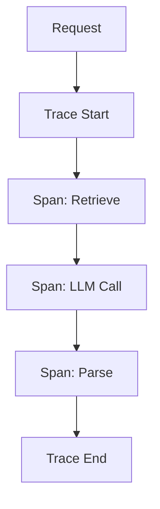
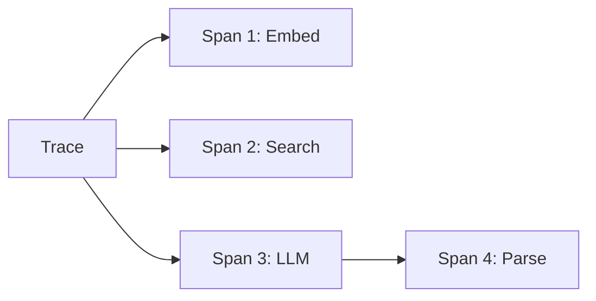
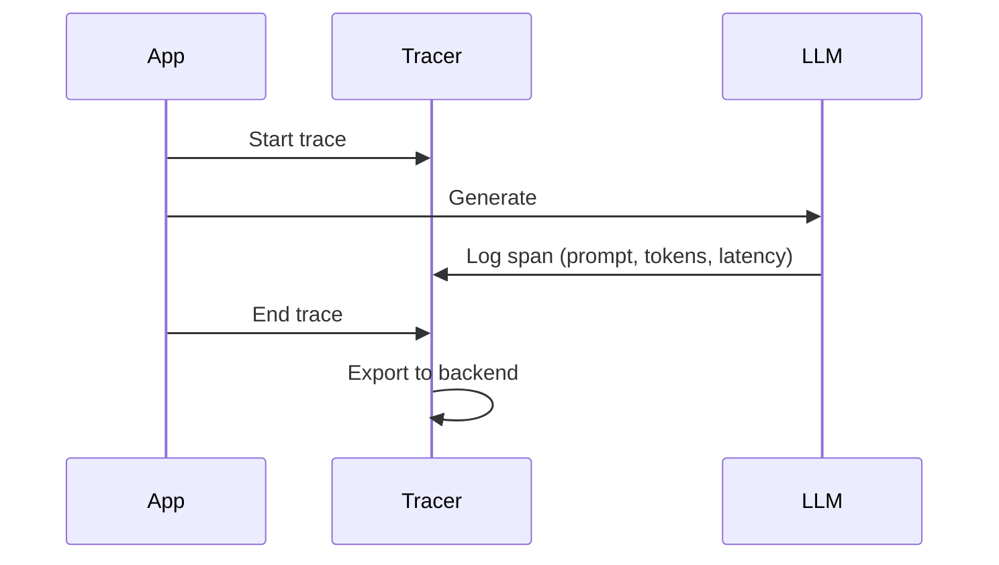

# Prompt Tracing (Deep Dive)

📄 File: `book/15_observability_monitoring/prompt_tracing.md`

This chapter covers **prompt tracing** — recording prompts, model calls, retrieved chunks, and outputs for debugging and observability. Essential for production LLM and RAG systems.

---

## Study Plan (1–2 days)

* Day 1: What to trace, trace structure
* Day 2: Integration with LangChain, OpenTelemetry

---

## 1 — What is Prompt Tracing?

Trace = end-to-end record of a request: prompt → model call → response, plus any retrieval, tool calls, etc.



---

## 2 — Trace Structure



| Level | Contains |
| ----- | -------- |
| **Trace** | Full request lifecycle |
| **Span** | Single operation (embed, search, LLM, etc.) |

---

## 3 — What to Capture

| Field | Purpose |
| ----- | -------- |
| **Prompt** | Debug, reproduce |
| **Model** | Which model used |
| **Tokens in/out** | Cost, latency |
| **Retrieved chunks** | RAG debugging |
| **Latency** | Per-span timing |
| **Error** | Failures |

---

## 4 — Code: Manual Tracing

```python
import time
import uuid

def trace_rag(query: str):
    trace_id = str(uuid.uuid4())
    spans = []
    # Span 1: Retrieve
    t0 = time.perf_counter()
    chunks = retriever.invoke(query)
    spans.append({"name": "retrieve", "latency_ms": (time.perf_counter() - t0) * 1000})
    # Span 2: LLM
    t1 = time.perf_counter()
    prompt = build_prompt(query, chunks)
    response = llm.invoke(prompt)
    spans.append({"name": "llm", "latency_ms": (time.perf_counter() - t1) * 1000})
    # Log trace
    return {"trace_id": trace_id, "spans": spans, "response": response}
```

---

## 5 — LangChain Callbacks

```python
from langchain_community.callbacks import get_openai_callback

# Automatic token + cost tracking — line-by-line
with get_openai_callback() as cb:
    result = chain.invoke({"input": "What is RAG?"})
    # cb.total_tokens, cb.prompt_tokens, cb.completion_tokens
    # cb.total_cost (USD)
    print(f"Tokens: {cb.total_tokens}, Cost: ${cb.total_cost}")
```

---

## 6 — Trace Flow



---

## Exercises

1. Add manual spans to your RAG: embed, search, LLM. Log to stdout.
2. Use LangChain callbacks to capture tokens and cost.
3. Integrate with Langfuse (see langfuse.md) for full tracing.

---

## Interview Questions

1. **What should you trace in a RAG pipeline?**
   * Answer: Prompts, retrieved chunks, model calls, tokens, latency per step, errors.

2. **Why is prompt tracing important?**
   * Answer: Debug failures, reproduce issues, optimize cost/latency, audit.

3. **What is a span vs a trace?**
   * Answer: Trace = full request; span = single operation within a trace.

---

## Key Takeaways

* **Trace** — Full request; **Span** — Single operation
* **Capture** — Prompt, tokens, latency, chunks, errors
* **LangChain** — Callbacks for automatic tracking
* **Export** — Langfuse, Arize, OpenTelemetry

---

## Next Chapter

Proceed to: **latency_metrics.md**
