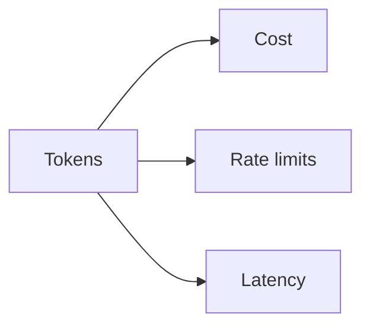
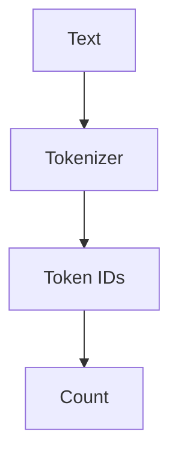
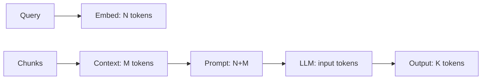

# Token Usage (Deep Dive)

📄 File: `book/15_observability_monitoring/token_usage.md`

This chapter covers **token usage** tracking — why it matters for cost and quotas, how to measure it, and how to optimize token consumption in LLM applications.

---

## Study Plan (1 day)

* Day 1: Token counting, cost estimation, optimization

---

## 1 — Why Track Tokens?



| Reason | Impact |
| ------ | ------ |
| **Cost** | Pay per token (input + output) |
| **Rate limits** | TPM/RPM limits |
| **Latency** | More tokens → longer decode |

---

## 2 — Token Counting



Different models use different tokenizers. Use model-specific tokenizer for accuracy.

---

## 3 — Code: Count Tokens (tiktoken)

```python
import tiktoken

# OpenAI models use tiktoken — line-by-line
enc = tiktoken.get_encoding("cl100k_base")  # GPT-4, GPT-3.5
text = "What is retrieval augmented generation?"
tokens = enc.encode(text)
print(f"Token count: {len(tokens)}")  # ~7 tokens
```

---

## 4 — Code: Estimate Cost

```python
# Cost estimation — line-by-line (OpenAI pricing example)
INPUT_PRICE_PER_1K = 0.0015   # GPT-4o-mini input
OUTPUT_PRICE_PER_1K = 0.006   # GPT-4o-mini output

def estimate_cost(prompt_tokens: int, completion_tokens: int) -> float:
    input_cost = (prompt_tokens / 1000) * INPUT_PRICE_PER_1K
    output_cost = (completion_tokens / 1000) * OUTPUT_PRICE_PER_1K
    return input_cost + output_cost

# Example: 500 prompt + 200 completion
cost = estimate_cost(500, 200)
print(f"Estimated cost: ${cost:.4f}")
```

---

## 5 — Token Flow in RAG



Total input = system + query + context. Minimize context to reduce cost.

---

## 6 — Optimization Strategies

| Strategy | Effect |
| -------- | ------ |
| **Smaller context** | Fewer chunks, fewer tokens |
| **Truncate chunks** | Cap chunk size |
| **Caching** | Reuse embeddings, repeated prompts |
| **Smaller model** | Cheaper per token |

---

## Exercises

1. Count tokens for 10 prompts with tiktoken. Compare with API response.
2. Build a cost tracker: log prompt_tokens, completion_tokens per request.
3. Reduce context from 5 chunks to 3; measure cost and quality tradeoff.

---

## Interview Questions

1. **Why is token usage important?**
   * Answer: Direct cost driver; rate limits; affects latency (decode time).

2. **How do you count tokens accurately?**
   * Answer: Use model-specific tokenizer (e.g., tiktoken for OpenAI); don't estimate by chars/4.

3. **How would you reduce token cost in RAG?**
   * Answer: Fewer/smaller chunks, truncation, caching, smaller model, compression.

---

## Key Takeaways

* **Tokens** — Drive cost, rate limits, latency
* **Counting** — Use tiktoken or model tokenizer
* **Cost** — input + output; track per request
* **Optimize** — Less context, caching, smaller model

---

## Next Chapter

Proceed to: **langfuse.md**
