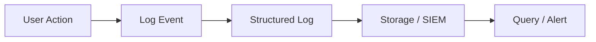
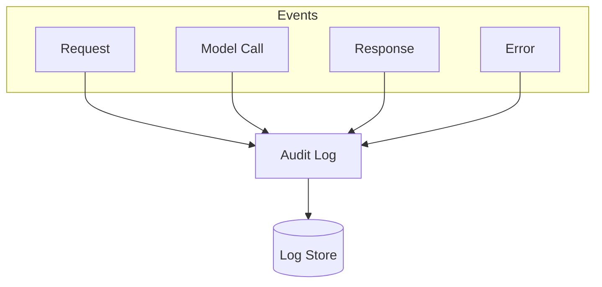
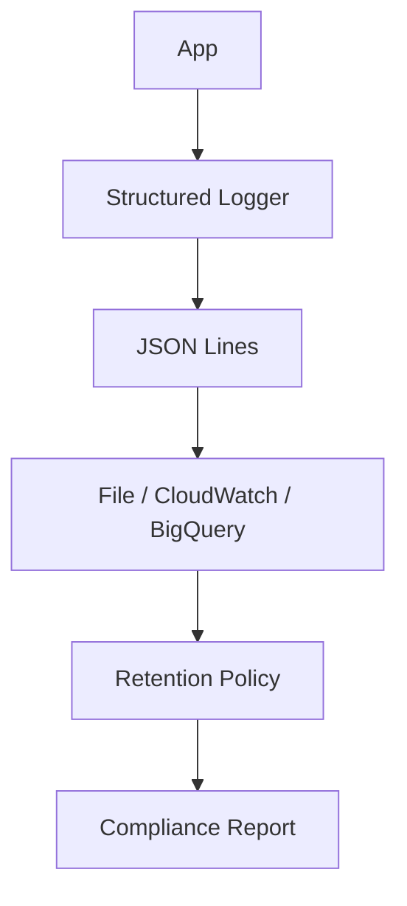

# Audit Logging

📄 File: `book/16_ai_security_compliance/audit_logging.md`

This chapter covers **audit logging** for AI systems—what to log, how to structure logs, and compliance considerations.

---

## Study Plan (2 days)

* Day 1: Log schema + what to capture
* Day 2: Implementation + compliance

---

## 1 — What is Audit Logging?

**Audit logging** records who did what, when, and from where—enabling security analysis, compliance, and incident response.



---

## 2 — What to Log for AI Systems

| Category | Examples |
|----------|----------|
| Access | User ID, endpoint, timestamp |
| Input | Query hash, token count (not raw PII) |
| Output | Response length, model used |
| Errors | Error type, stack trace (sanitized) |
| Config | Model version, feature flags |

### Diagram — Audit Event Flow



---

## 3 — Structured Log Schema

```python
from dataclasses import dataclass, asdict
from datetime import datetime
from typing import Optional
import json

@dataclass
class AuditEvent:
    """Structured audit log event for AI inference."""
    event_id: str
    timestamp: str  # ISO 8601
    user_id: Optional[str]
    action: str  # e.g., "inference", "prompt_injection_blocked"
    model: str
    input_token_count: int
    output_token_count: int
    latency_ms: float
    status: str  # "success", "error", "blocked"
    error_message: Optional[str] = None

    def to_log_line(self) -> str:
        """Serialize to JSON log line (one event per line)."""
        return json.dumps(asdict(self), default=str)

# Example usage
event = AuditEvent(
    event_id="evt_abc123",
    timestamp=datetime.utcnow().isoformat() + "Z",
    user_id="user_42",
    action="inference",
    model="gpt-4",
    input_token_count=150,
    output_token_count=50,
    latency_ms=234.5,
    status="success",
)
print(event.to_log_line())
```

---

## 4 — Logging Middleware

```python
import time
import uuid
from functools import wraps

def audit_log_inference(logger):
    """Decorator to audit-log LLM inference calls."""
    def decorator(func):
        @wraps(func)
        def wrapper(*args, **kwargs):
            start = time.perf_counter()
            event_id = str(uuid.uuid4())[:8]
            try:
                result = func(*args, **kwargs)
                latency_ms = (time.perf_counter() - start) * 1000
                logger.info(
                    "inference",
                    extra={
                        "event_id": event_id,
                        "status": "success",
                        "latency_ms": round(latency_ms, 2),
                    },
                )
                return result
            except Exception as e:
                logger.error(
                    "inference",
                    extra={
                        "event_id": event_id,
                        "status": "error",
                        "error": str(e),
                    },
                )
                raise
        return wrapper
    return decorator
```

---

## 5 — PII-Safe Logging

```python
def safe_log_query(query: str, max_chars: int = 20) -> str:
    """
    Never log full user queries; use hash or truncation.
    """
    if len(query) <= max_chars:
        return query[:max_chars] + "..." if len(query) == max_chars else query
    return query[:max_chars] + "...[truncated]"

# Log hash for correlation without storing PII
import hashlib
def query_hash(query: str) -> str:
    return hashlib.sha256(query.encode()).hexdigest()[:16]
```

---

## Diagram — Log Pipeline



---

## Exercises

1. Add a `blocked_reason` field for security events.
2. Design retention: 90 days hot, 1 year cold for compliance.
3. Implement log sampling for high-volume endpoints.

---

## Interview Questions

1. Why avoid logging raw user input?
   *Answer*: May contain PII; creates compliance and privacy risk; increases storage.

2. What is the benefit of structured (JSON) logs?
   *Answer*: Easy to query, parse, and aggregate; works with SIEM and analytics tools.

3. How does audit logging support SOC2?
   *Answer*: Demonstrates access controls, change tracking, and incident investigation capability.

---

## Key Takeaways

* Log who, what, when, status—not raw PII or full prompts.
* Use structured JSON; correlate via event_id and query_hash.
* Retention and access controls matter for compliance.

---

## Next Chapter

Proceed to: **encryption_rbac.md**
