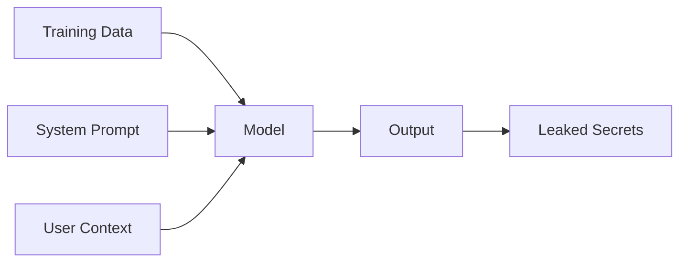
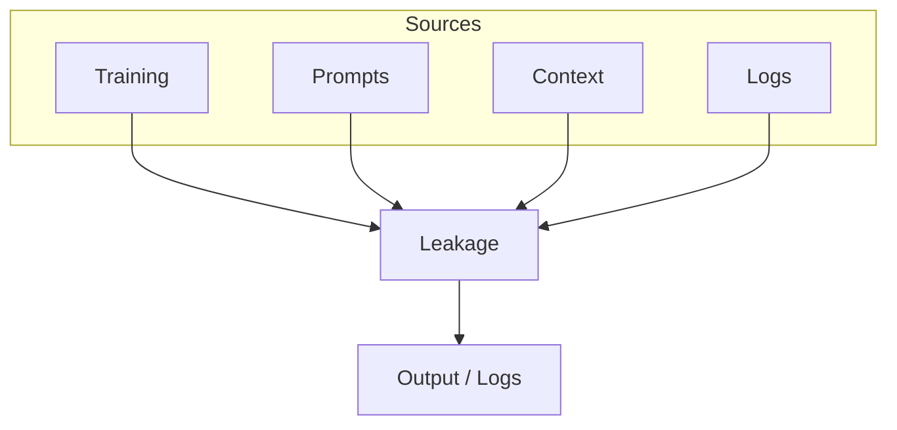
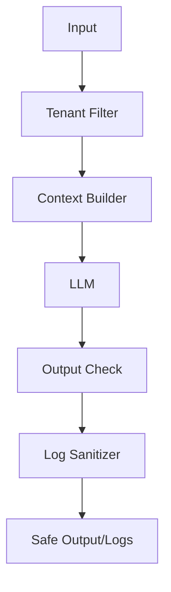

# Data Leakage

📄 File: `book/16_ai_security_compliance/data_leakage.md`

This chapter covers **data leakage** in AI systems—unintended exposure of training data, prompts, or internal information through model outputs or logs.

---

## Study Plan (2–3 days)

* Day 1: Types of leakage
* Day 2: Mitigations + detection
* Day 3: Exercises + audit

---

## 1 — What is Data Leakage?

**Data leakage** is the unintended disclosure of sensitive information: training data, system prompts, API keys, or PII.



---

## 2 — Leakage Types

| Type | Source | Example |
|------|--------|---------|
| Memorization | Training data | Model recites verbatim text |
| Prompt leakage | System prompt | User extracts full prompt |
| Context leakage | RAG/retrieval | Chunks from wrong tenant |
| Log leakage | Logs/metrics | PII in error logs |

### Diagram — Leakage Vectors



---

## 3 — Detecting Memorization

```python
def check_verbatim_overlap(output: str, sensitive_phrases: list[str]) -> list[str]:
    """
    Detect if model output contains verbatim sensitive phrases.
    Returns list of matched phrases.
    """
    found = []
    output_lower = output.lower()
    for phrase in sensitive_phrases:
        if phrase.lower() in output_lower:
            found.append(phrase)
    return found

# Example: block if training data snippet appears
sensitive = ["internal-project-x", "api_v2_secret_"]
matches = check_verbatim_overlap(model_response, sensitive)
if matches:
    raise ValueError(f"Potential memorization: {matches}")
```

---

## 4 — Preventing Context Leakage (Multi-tenant)

```python
from dataclasses import dataclass

@dataclass
class RAGRequest:
    """Request with tenant isolation."""
    tenant_id: str
    query: str

def build_rag_context(request: RAGRequest, vector_store) -> str:
    """
    Retrieve only documents for this tenant.
    Prevents cross-tenant context leakage.
    """
    # Critical: filter by tenant_id in metadata
    results = vector_store.search(
        query=request.query,
        filter={"tenant_id": request.tenant_id},  # Isolation
        top_k=5,
    )
    return "\n\n".join(r.content for r in results)
```

---

## 5 — Log Sanitization

```python
import re

def sanitize_for_logging(text: str, redact_patterns: list[str] = None) -> str:
    """
    Redact sensitive patterns before logging.
    """
    patterns = redact_patterns or [
        r"api[_-]?key['\"]?\s*[:=]\s*['\"]?[\w-]+",
        r"password['\"]?\s*[:=]\s*['\"]?\S+",
        r"\b\d{3}-\d{2}-\d{4}\b",  # SSN
    ]
    result = text
    for p in patterns:
        result = re.sub(p, "[REDACTED]", result, flags=re.IGNORECASE)
    return result

# Usage
log_message = f"Request failed: api_key=sk-abc123"
safe_log = sanitize_for_logging(log_message)  # "Request failed: [REDACTED]"
```

---

## Diagram — Defense Layers



---

## Exercises

1. Design a test for prompt extraction attempts.
2. How would you detect memorization of PII in outputs?
3. Implement a log redactor for email addresses.

---

## Interview Questions

1. What is context leakage in RAG?
   *Answer*: Retrieving documents from the wrong tenant or namespace, exposing data to unauthorized users.

2. Why does memorization matter for LLMs?
   *Answer*: Models can memorize training data; outputs may contain proprietary or PII from training.

3. How do you prevent prompt leakage?
   *Answer*: Don't echo system prompt to users; use output validation; rate-limit extraction attempts.

---

## Key Takeaways

* Leakage can come from training, prompts, context, or logs.
* Mitigations: tenant isolation, output validation, log sanitization, least privilege.
* Audit and test for extraction and memorization regularly.

---

## Next Chapter

Proceed to: **pii_protection.md**
