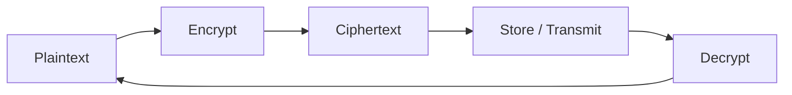
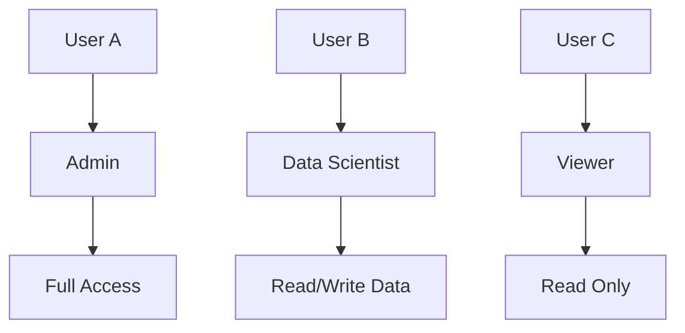
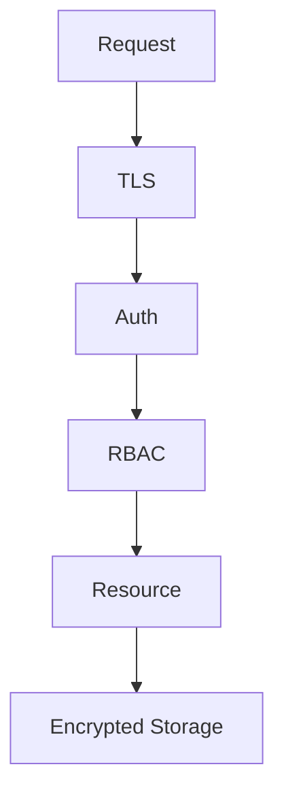

# Encryption & RBAC

📄 File: `book/16_ai_security_compliance/encryption_rbac.md`

This chapter covers **encryption** (at rest and in transit) and **Role-Based Access Control (RBAC)** for AI data platforms.

---

## Study Plan (2–3 days)

* Day 1: Encryption basics
* Day 2: RBAC design
* Day 3: Implementation + exercises

---

## 1 — Encryption Overview

**Encryption** protects data from unauthorized access. Two key states:

| State | Protection | Example |
|-------|------------|---------|
| At rest | Data on disk | AES-256 for S3, databases |
| In transit | Data over network | TLS 1.3 for API calls |



---

## 2 — Encryption at Rest

```python
from cryptography.fernet import Fernet
import os

def generate_key() -> bytes:
    """Generate a symmetric encryption key (store securely!)."""
    return Fernet.generate_key()

def encrypt_at_rest(plaintext: str, key: bytes) -> bytes:
    """
    Encrypt sensitive data before storing.
    Uses Fernet (AES-128-CBC + HMAC).
    """
    f = Fernet(key)
    return f.encrypt(plaintext.encode())

def decrypt_at_rest(ciphertext: bytes, key: bytes) -> str:
    """Decrypt data when reading."""
    f = Fernet(key)
    return f.decrypt(ciphertext).decode()

# Example: encrypt API key before storing
key = generate_key()
api_key = "sk-secret-key"
encrypted = encrypt_at_rest(api_key, key)
# Store `encrypted` in DB; never store `key` with data
```

---

## 3 — RBAC Model

**RBAC** assigns permissions to roles; users get roles.



---

## 4 — RBAC Implementation

```python
from enum import Enum
from typing import Set

class Permission(str, Enum):
    """Permissions for AI platform resources."""
    READ_MODELS = "read:models"
    WRITE_MODELS = "write:models"
    RUN_INFERENCE = "run:inference"
    READ_DATA = "read:data"
    WRITE_DATA = "write:data"
    ADMIN = "admin"

class Role:
    """Role with set of permissions."""
    def __init__(self, name: str, permissions: Set[Permission]):
        self.name = name
        self.permissions = permissions

# Define roles
ROLES = {
    "viewer": Role("viewer", {Permission.READ_MODELS, Permission.READ_DATA}),
    "data_scientist": Role("data_scientist", {
        Permission.READ_MODELS, Permission.WRITE_MODELS,
        Permission.RUN_INFERENCE, Permission.READ_DATA, Permission.WRITE_DATA,
    }),
    "admin": Role("admin", {Permission.ADMIN}),  # Admin implies all
}

def check_permission(user_roles: list[str], required: Permission) -> bool:
    """Check if user has required permission via any role."""
    for r in user_roles:
        role = ROLES.get(r)
        if not role:
            continue
        if Permission.ADMIN in role.permissions:
            return True
        if required in role.permissions:
            return True
    return False

# Example
user_roles = ["data_scientist"]
assert check_permission(user_roles, Permission.RUN_INFERENCE)  # True
assert not check_permission(user_roles, Permission.ADMIN)     # False
```

---

## 5 — API Guard with RBAC

```python
def require_permission(permission: Permission):
    """Decorator to enforce RBAC on API endpoints."""
    def decorator(func):
        def wrapper(*args, user_roles=None, **kwargs):
            if not user_roles or not check_permission(user_roles, permission):
                raise PermissionError(f"Missing permission: {permission}")
            return func(*args, **kwargs)
        return wrapper
    return decorator

@require_permission(Permission.RUN_INFERENCE)
def run_inference(prompt: str, user_roles: list[str]):
    """Only users with run:inference can call this."""
    return model.generate(prompt)
```

---

## Diagram — Security Layers



---

## Exercises

1. Add a `deploy_models` permission and role.
2. Implement key rotation for Fernet (encrypt with new key, re-encrypt old data).
3. Design RBAC for multi-tenant RAG (tenant isolation).

---

## Interview Questions

1. What is the difference between encryption at rest and in transit?
   *Answer*: At rest = disk/storage; in transit = network. Both needed for defense in depth.

2. Why use RBAC instead of per-user permissions?
   *Answer*: Scalability, consistency, easier audit; change role once, affects all users.

3. How do you protect encryption keys?
   *Answer*: Use KMS (AWS KMS, GCP KMS); never store keys with data; rotate periodically.

---

## Key Takeaways

* Encrypt at rest (AES) and in transit (TLS).
* RBAC: users → roles → permissions; check at API layer.
* Keys in KMS; least privilege for roles.

---

## Next Chapter

Proceed to next phase: **17_research_engineering/reading_papers.md**
