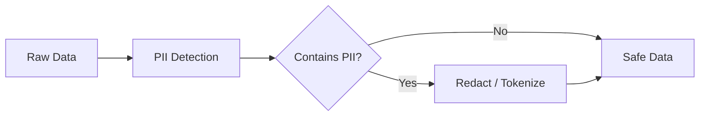
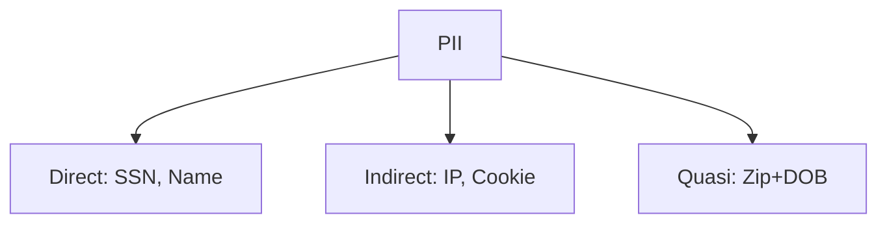
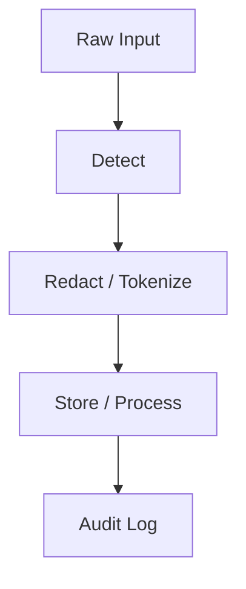

# PII Protection

📄 File: `book/16_ai_security_compliance/pii_protection.md`

This chapter covers **PII (Personally Identifiable Information) protection** in AI pipelines—detection, redaction, and governance.

---

## Study Plan (2–3 days)

* Day 1: PII types + detection
* Day 2: Redaction + tokenization
* Day 3: Governance + exercises

---

## 1 — What is PII?

**PII** is any data that can identify an individual: names, emails, SSNs, phone numbers, addresses.



---

## 2 — Common PII Types

| Type | Example | Regex Pattern |
|------|---------|---------------|
| Email | user@example.com | `[\w.-]+@[\w.-]+\.\w+` |
| SSN | 123-45-6789 | `\d{3}-\d{2}-\d{4}` |
| Phone | (555) 123-4567 | `\(?\d{3}\)?[\s.-]?\d{3}[\s.-]?\d{4}` |
| Credit Card | 4111-1111-1111-1111 | `\d{4}[\s-]?\d{4}[\s-]?\d{4}[\s-]?\d{4}` |

### Diagram — PII Categories



---

## 3 — PII Detection

```python
import re
from dataclasses import dataclass
from typing import Optional

@dataclass
class PIIMatch:
    """Represents a PII match in text."""
    pii_type: str
    start: int
    end: int
    value: str

# Define patterns for common PII
PII_PATTERNS = {
    "email": r"[\w.-]+@[\w.-]+\.\w+",
    "ssn": r"\b\d{3}-\d{2}-\d{4}\b",
    "phone_us": r"\(?\d{3}\)?[\s.-]?\d{3}[\s.-]?\d{4}\b",
}

def detect_pii(text: str) -> list[PIIMatch]:
    """
    Scan text for PII and return list of matches.
    """
    matches = []
    for pii_type, pattern in PII_PATTERNS.items():
        for m in re.finditer(pattern, text):
            matches.append(PIIMatch(
                pii_type=pii_type,
                start=m.start(),
                end=m.end(),
                value=m.group(),
            ))
    return matches

# Example
text = "Contact john.doe@email.com or 555-123-4567"
for m in detect_pii(text):
    print(f"{m.pii_type}: {m.value}")
```

---

## 4 — Redaction

```python
def redact_pii(text: str, replacement: str = "[REDACTED]") -> str:
    """
    Replace all detected PII with replacement string.
    """
    matches = detect_pii(text)
    # Sort by start index descending to replace from end (preserve indices)
    for m in sorted(matches, key=lambda x: x.start, reverse=True):
        text = text[:m.start] + replacement + text[m.end:]
    return text

# Example
original = "User: john@example.com, SSN: 123-45-6789"
redacted = redact_pii(original)  # "User: [REDACTED], SSN: [REDACTED]"
```

---

## 5 — Presidio (Library Example)

```python
# Using Presidio for entity detection (install: pip install presidio-analyzer)
from presidio_analyzer import AnalyzerEngine

def detect_pii_presidio(text: str) -> list[dict]:
    """
    Use Presidio to detect PII entities.
    Returns list of entity dicts with type, start, end, score.
    """
    analyzer = AnalyzerEngine()
    results = analyzer.analyze(text=text, language="en")
    return [
        {"type": r.entity_type, "start": r.start, "end": r.end, "score": r.score}
        for r in results
    ]

# Supported: PERSON, EMAIL_ADDRESS, PHONE_NUMBER, CREDIT_CARD, SSN, etc.
```

---

## Diagram — PII Pipeline



---

## Exercises

1. Add regex for US zip codes (5 or 9 digit).
2. Implement tokenization: replace PII with `[EMAIL_1]`, `[SSN_1]` for reversible mapping.
3. Integrate Presidio and compare with regex detection.

---

## Interview Questions

1. What is the difference between direct and indirect PII?
   *Answer*: Direct (name, SSN) identifies uniquely; indirect (zip + DOB) can identify when combined.

2. When should you redact vs tokenize?
   *Answer*: Redact for irreversible removal; tokenize when you need to reverse for authorized use.

3. How does PII affect model training?
   *Answer*: Training on PII risks memorization and privacy violations; scrub or anonymize before training.

---

## Key Takeaways

* Detect PII with regex or NER (e.g., Presidio) before processing.
* Redact for logs and external outputs; tokenize when reversibility is needed.
* Govern PII via access controls, retention, and audit.

---

## Next Chapter

Proceed to: **audit_logging.md**
