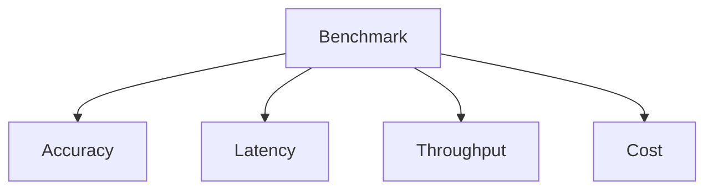
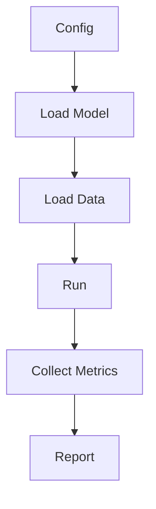

# Benchmarking

📄 File: `book/17_research_engineering/benchmarking.md`

This chapter covers **benchmarking** ML/AI systems—metrics, methodology, and reproducible comparisons.

---

## Study Plan (2–3 days)

* Day 1: Metrics + methodology
* Day 2: Implementation + tools
* Day 3: Reproducibility

---

## 1 — What is Benchmarking?

**Benchmarking** measures system performance against standardized tasks and metrics for fair comparison.


---

## 2 — Benchmark Types

| Type | Example | Metric |
|------|---------|--------|
| Accuracy | GLUE, MMLU | Accuracy, F1 |
| Latency | Inference | ms/token, p99 |
| Throughput | Batch serving | req/s |
| Cost | Training | $/run, GPU-hours |

### Diagram — Benchmark Dimensions



---

## 3 — Latency Benchmarking

```python
import time
import numpy as np

def benchmark_latency(model_fn, inputs: list, warmup: int = 5, runs: int = 100) -> dict:
    """
    Benchmark inference latency with warmup and multiple runs.
    Returns mean, std, p50, p99 in milliseconds.
    """
    # Warmup: avoid cold-start bias
    for _ in range(warmup):
        model_fn(inputs[0])
    # Timed runs
    latencies_ms = []
    for inp in inputs * (runs // len(inputs) + 1):
        if len(latencies_ms) >= runs:
            break
        start = time.perf_counter()
        model_fn(inp)
        latencies_ms.append((time.perf_counter() - start) * 1000)
    arr = np.array(latencies_ms[:runs])
    return {
        "mean_ms": float(np.mean(arr)),
        "std_ms": float(np.std(arr)),
        "p50_ms": float(np.percentile(arr, 50)),
        "p99_ms": float(np.percentile(arr, 99)),
    }

# Example
# result = benchmark_latency(model.generate, [{"prompt": "Hello"}] * 10)
```

---

## 4 — Accuracy Benchmark (Skeleton)

```python
def run_accuracy_benchmark(model, dataset, metric_fn) -> float:
    """
    Run model on benchmark dataset; compute metric.
    """
    predictions = []
    for batch in dataset:
        pred = model(batch["input"])
        predictions.extend(pred)
    return metric_fn(dataset.labels, predictions)

# Standard benchmarks: MMLU, HumanEval, GSM8K, etc.
```

---

## 5 — Reproducibility

```python
import random
import os

def set_seed(seed: int = 42):
    """Set all random seeds for reproducibility."""
    random.seed(seed)
    np.random.seed(seed)
    os.environ["PYTHONHASHSEED"] = str(seed)
    # Add torch/cuda if using PyTorch
    # torch.manual_seed(seed)
    # torch.cuda.manual_seed_all(seed)
```

---

## Diagram — Benchmark Pipeline



---

## Exercises

1. Benchmark a simple model's latency; report mean and p99.
2. Compare two models on the same dataset; use statistical tests.
3. Document hardware and software versions for reproducibility.

---

## Interview Questions

1. Why use warmup in latency benchmarks?
   *Answer*: First runs include JIT, cache fill; warmup stabilizes measurements.

2. What is p99 latency and why matter?
   *Answer*: 99th percentile; captures tail latency that affects user experience.

3. How do you ensure benchmark reproducibility?
   *Answer*: Fixed seeds, pinned versions, document hardware, multiple runs.

---

## Key Takeaways

* Benchmark accuracy, latency, throughput, cost.
* Warmup + multiple runs for latency; report mean, p50, p99.
* Reproducibility: seeds, versions, hardware docs.

---

## Next Chapter

Proceed to: **experiment_design.md**
