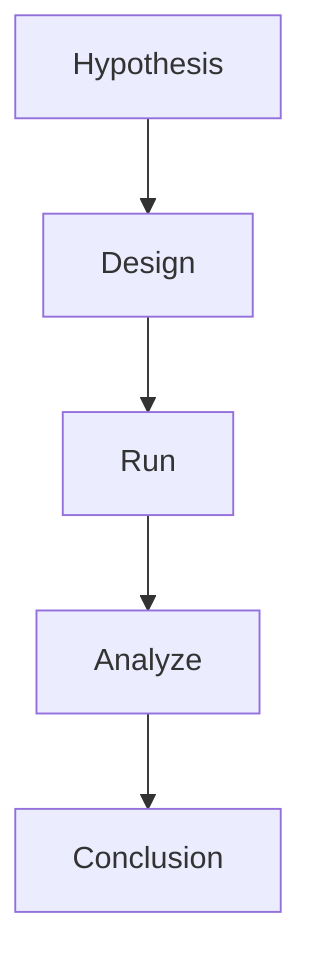
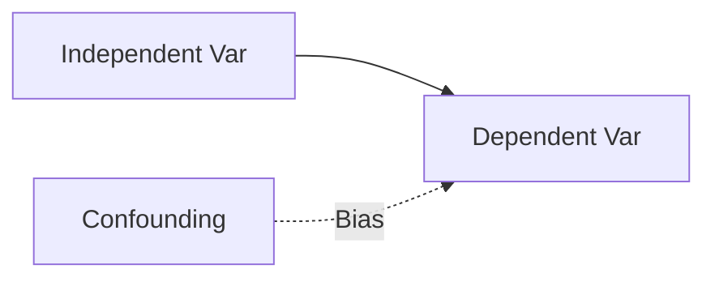
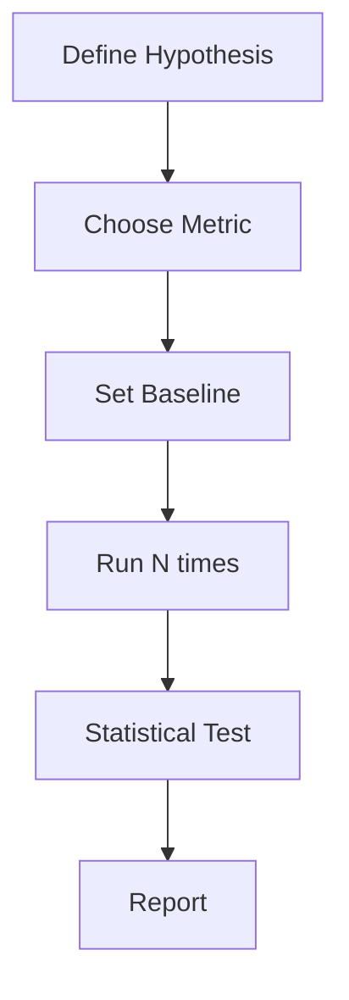

# Experiment Design

📄 File: `book/17_research_engineering/experiment_design.md`

This chapter covers **experiment design** for ML—hypotheses, controls, and statistical validity.

---

## Study Plan (2–3 days)

* Day 1: Hypothesis + variables
* Day 2: Controls + baselines
* Day 3: Analysis + reporting

---

## 1 — Experiment Structure



---

## 2 — Key Concepts

| Concept | Description |
|---------|-------------|
| Independent variable | What you change (e.g., learning rate) |
| Dependent variable | What you measure (e.g., loss) |
| Control | Baseline / unchanged condition |
| Confounding | Uncontrolled factor affecting results |

### Diagram — Variables



---

## 3 — A/B Test for Model Comparison

```python
from dataclasses import dataclass
from typing import List
import numpy as np

@dataclass
class ExperimentResult:
    """Single experiment run."""
    run_id: int
    model_name: str
    metric: float
    config: dict

def run_experiment(model_fn, dataset, config: dict, n_runs: int = 5) -> List[ExperimentResult]:
    """
    Run model n_runs times with same config; collect metrics.
    """
    results = []
    for i in range(n_runs):
        metric = model_fn(dataset, config)
        results.append(ExperimentResult(
            run_id=i,
            model_name=config.get("model", "unknown"),
            metric=metric,
            config=config,
        ))
    return results

def compare_models(results_a: List[ExperimentResult], results_b: List[ExperimentResult]) -> dict:
    """
    Compare two model variants; report mean, std, and simple t-test.
    """
    vals_a = np.array([r.metric for r in results_a])
    vals_b = np.array([r.metric for r in results_b])
    from scipy import stats
    t_stat, p_value = stats.ttest_ind(vals_a, vals_b)
    return {
        "mean_a": float(np.mean(vals_a)),
        "mean_b": float(np.mean(vals_b)),
        "std_a": float(np.std(vals_a)),
        "std_b": float(np.std(vals_b)),
        "p_value": float(p_value),
    }
```

---

## 4 — Baseline Importance

```python
# Always compare against baseline
BASELINES = {
    "random": 0.5,       # Random guess for binary
    "majority": 0.6,     # Predict majority class
    "previous_model": 0.72,  # Production model
}

def report_with_baselines(metric: float, task: str = "classification") -> str:
    """Report metric relative to baselines."""
    lines = [f"Model: {metric:.4f}"]
    for name, val in BASELINES.items():
        diff = metric - val
        lines.append(f"  vs {name}: {diff:+.4f}")
    return "\n".join(lines)
```

---

## Diagram — Experiment Flow



---

## Exercises

1. Design an experiment to compare two learning rates.
2. How many runs for statistical significance? (power analysis)
3. Identify confounds in a given experiment setup.

---

## Interview Questions

1. Why run experiments multiple times?
   *Answer*: Variance; single run can be lucky/unlucky; need mean and confidence.

2. What is a confounding variable?
   *Answer*: Uncontrolled factor that affects the dependent variable; can invalidate conclusions.

3. When is a result statistically significant?
   *Answer*: When p-value < alpha (e.g., 0.05); unlikely to occur by chance.

---

## Key Takeaways

* Hypothesis → design → run → analyze → conclude.
* Control for confounds; use baselines.
* Multiple runs + statistical tests for validity.

---

## Next Chapter

Proceed to: **writing_research.md**
