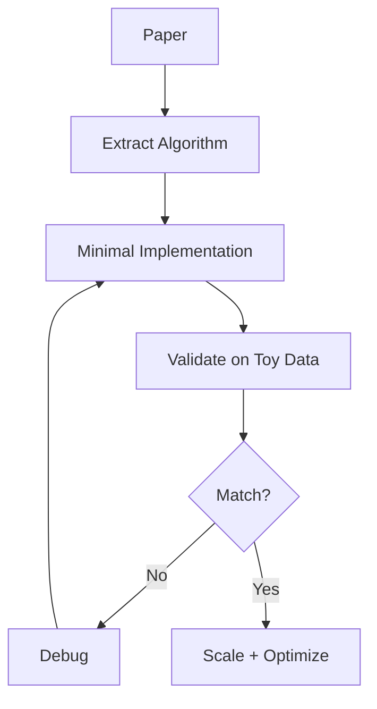
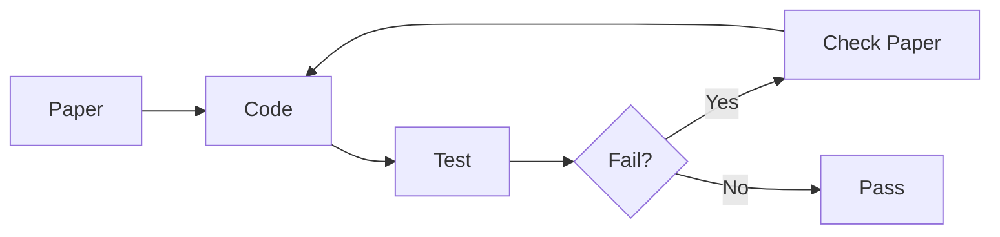

# Implementing Papers

📄 File: `book/17_research_engineering/implementing_papers.md`

This chapter covers **implementing research papers**—from paper to code, debugging, and validation.

---

## Study Plan (2–4 days)

* Day 1: Paper-to-code mapping
* Day 2: Minimal implementation
* Day 3: Validation + debugging
* Day 4: Optimization

---

## 1 — Implementation Workflow



---

## 2 — Paper-to-Code Mapping

| Paper Element | Code Equivalent |
|---------------|-----------------|
| Equation | Function / formula |
| Algorithm 1 | Main loop / function |
| Table 1 (hyperparams) | Config / constants |
| Figure 2 (architecture) | Model class |

---

## 3 — Minimal Implementation Example

```python
# Implementing a simple paper concept: Layer Normalization
# Paper: "Layer Normalization" (Ba et al., 2016)
# Equation: y = (x - mean) / sqrt(var + eps) * gamma + beta

import numpy as np

def layer_norm(x: np.ndarray, gamma: np.ndarray, beta: np.ndarray, eps: float = 1e-5) -> np.ndarray:
    """
    Layer normalization over last axis.
    x: (..., D), gamma/beta: (D,)
    """
    # Step 1: Compute mean over last axis (feature dim)
    mean = np.mean(x, axis=-1, keepdims=True)
    # Step 2: Compute variance
    var = np.var(x, axis=-1, keepdims=True)
    # Step 3: Normalize: (x - mean) / sqrt(var + eps)
    x_norm = (x - mean) / np.sqrt(var + eps)
    # Step 4: Scale and shift: gamma * x_norm + beta
    return gamma * x_norm + beta

# Validate on toy input
x = np.random.randn(2, 4).astype(np.float32)
gamma = np.ones(4)
beta = np.zeros(4)
out = layer_norm(x, gamma, beta)
print(out.shape)  # (2, 4)
```

---

## 4 — Validation Checklist

```python
# Validation: compare with reference (e.g., PyTorch)
import torch
import torch.nn as nn

def validate_layer_norm():
    """Check our impl matches PyTorch."""
    torch.manual_seed(42)
    x_np = np.random.randn(2, 4).astype(np.float32)
    x_torch = torch.from_numpy(x_np)
    ln = nn.LayerNorm(4)
    out_torch = ln(x_torch).detach().numpy()
    gamma = ln.weight.detach().numpy()
    beta = ln.bias.detach().numpy()
    out_ours = layer_norm(x_np, gamma, beta)
    assert np.allclose(out_ours, out_torch, atol=1e-5), "Mismatch!"
```

---

## Diagram — Debug Loop



---

## Exercises

1. Implement softmax from a paper definition; validate against `torch.softmax`.
2. Implement one attention head from "Attention Is All You Need."
3. Add unit tests for edge cases (zeros, large values).

---

## Interview Questions

1. How do you approach implementing an unfamiliar paper?
   *Answer*: Extract algorithm, build minimal version, validate on toy data, compare with reference impl if available.

2. What if your implementation doesn't match paper results?
   *Answer*: Check hyperparams, initialization, numerical precision; compare intermediate outputs; seek reference code.

3. Why start with minimal implementation?
   *Answer*: Isolate correctness; easier to debug; then add batching, optimization.

---

## Key Takeaways

* Map paper elements (equations, algorithms) to code explicitly.
* Validate against reference impl or known benchmarks.
* Minimal first, then scale and optimize.

---

## Next Chapter

Proceed to: **benchmarking.md**
