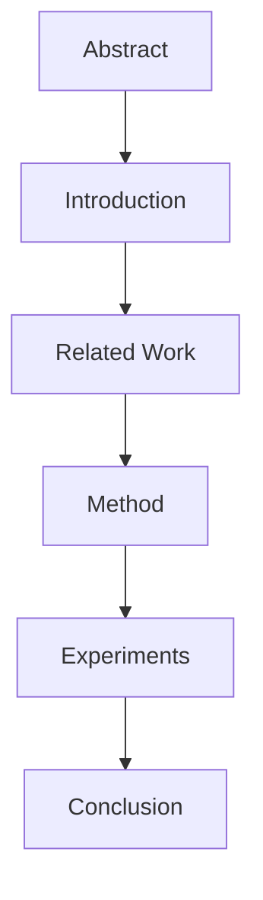
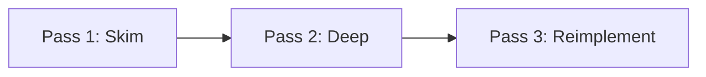

# Reading Papers

📄 File: `book/17_research_engineering/reading_papers.md`

This chapter covers **how to read research papers effectively**—structure, strategies, and note-taking for AI/ML engineers.

---

## Study Plan (2–3 days)

* Day 1: Paper anatomy + first pass
* Day 2: Deep reading + notation
* Day 3: Practice on 2–3 papers

---

## 1 — What is a Research Paper?

A typical ML paper has: **Abstract** → **Introduction** → **Related Work** → **Method** → **Experiments** → **Conclusion**.



---

## 2 — Three-Pass Reading Strategy

| Pass | Time | Goal |
|------|------|------|
| 1st | 5–10 min | Get the big picture |
| 2nd | 30–60 min | Understand details |
| 3rd | 1–2 hr | Reimplement mentally |

### Diagram — Reading Flow



---

## 3 — Pass 1: Skim (5–10 min)

* Read: Abstract, Intro (first/last para), Section headers, Figures, Conclusion
* Skip: Method details, proofs
* Ask: What problem? What solution? What result?

---

## 4 — Pass 2: Deep Read

* Read: Full Method, equations, figure captions
* Note: Algorithm pseudocode, hyperparameters, datasets
* Ask: Could I implement this?

---

## 5 — Note-Taking Template (Code)

```python
# Paper notes template - use as structured notes
paper_notes = {
    "title": "",
    "problem": "",           # What gap does it address?
    "method": "",            # Core idea in 1-2 sentences
    "key_equation": "",      # Main formula or algorithm
    "datasets": [],          # Benchmarks used
    "results": {},           # Metric -> value
    "limitations": [],       # What they don't claim
    "reproducible": False,   # Code/data available?
}
```

---

## Exercises

1. Read "Attention Is All You Need" with the three-pass strategy.
2. Extract the attention equation and implement it in NumPy.
3. Compare your notes with an existing summary (e.g., distill.pub).

---

## Interview Questions

1. How do you approach a 50-page paper?
   *Answer*: Three-pass: skim for structure, deep read for method, third pass to reimplement mentally.

2. What do you look for in the Method section?
   *Answer*: Core algorithm, key equations, assumptions, complexity.

3. Why skip proofs on first read?
   *Answer*: Build intuition first; proofs matter for correctness but not for implementation.

---

## Key Takeaways

* Three-pass: skim → deep → reimplement.
* Focus on Method and Experiments; skim Related Work.
* Take structured notes; extract equations and pseudocode.

---

## Next Chapter

Proceed to: **implementing_papers.md**
