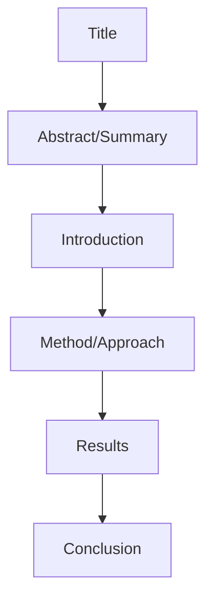
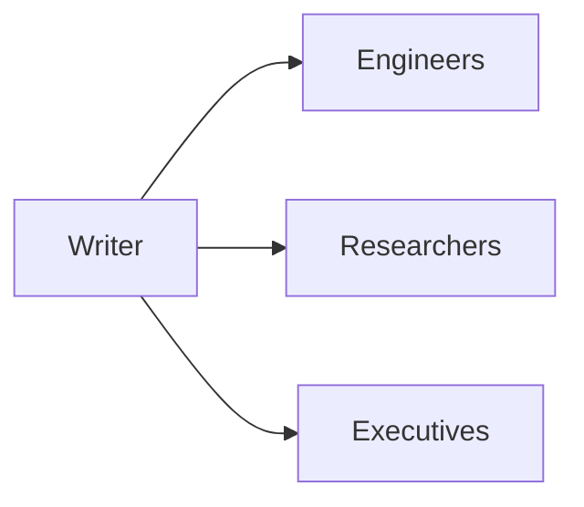
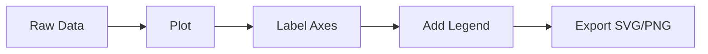

# Writing Research

📄 File: `book/17_research_engineering/writing_research.md`

This chapter covers **writing research**—blog posts, technical reports, and paper-style documentation for AI engineers.

---

## Study Plan (2–3 days)

* Day 1: Structure + audience
* Day 2: Drafting + figures
* Day 3: Revision + publishing

---

## 1 — Writing Structure



---

## 2 — Audience Types

| Audience | Tone | Depth |
|----------|------|-------|
| Engineers | Technical, code-heavy | Implementation details |
| Researchers | Formal, citations | Novelty, baselines |
| Executives | High-level, impact | Business value |

### Diagram — Audience Mapping



---

## 3 — Technical Blog Template

```python
# Template for technical blog / report
BLOG_TEMPLATE = """
# {title}

## TL;DR
{one_paragraph_summary}

## Problem
{what_gap_or_question}

## Approach
{method_in_plain_english}

## Implementation
```python
{code_snippet}
```

## Results
{metrics_table_or_figure}

## Takeaways
- {takeaway_1}
- {takeaway_2}

## References
{links}
"""
```

---

## 4 — Code Documentation

```python
def attention(q, k, v, mask=None):
    """
    Scaled dot-product attention.
    
    Args:
        q: Query tensor (batch, heads, seq, dim)
        k: Key tensor (batch, heads, seq, dim)
        v: Value tensor (batch, heads, seq, dim)
        mask: Optional attention mask
    
    Returns:
        Output tensor (batch, heads, seq, dim)
    
    Reference: Vaswani et al., "Attention Is All You Need" (2017)
    """
    scale = q.shape[-1] ** -0.5
    scores = (q @ k.transpose(-2, -1)) * scale
    if mask is not None:
        scores = scores.masked_fill(mask == 0, float("-inf"))
    weights = softmax(scores, dim=-1)
    return weights @ v
```

---

## 5 — Figure Best Practices



* Use clear axis labels and units
* Prefer vector (SVG) for scalability
* One main message per figure

---

## Exercises

1. Write a 500-word blog post explaining a paper you implemented.
2. Document a function with Args, Returns, and a reference.
3. Create a results table from benchmark output.

---

## Interview Questions

1. How do you structure a technical report?
   *Answer*: Problem → approach → implementation → results → takeaways; match depth to audience.

2. Why document code with paper references?
   *Answer*: Traceability; readers can verify correctness; credit original work.

3. What makes a good figure?
   *Answer*: Clear labels, one message, readable at small size, vector when possible.

---

## Key Takeaways

* Match structure and depth to audience.
* TL;DR first; code + figures support narrative.
* Document with references; revise for clarity.

---

## Next Chapter

Proceed to: **18_open_source_engineering/git_mastery.md**
