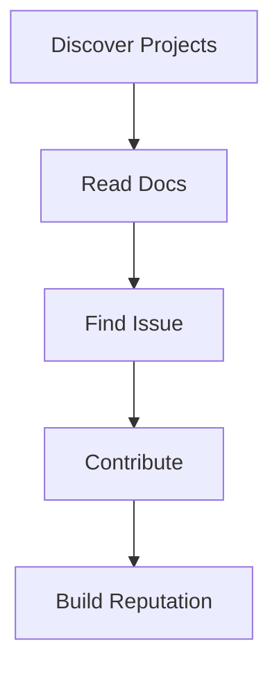
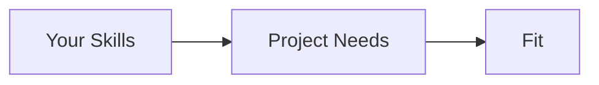
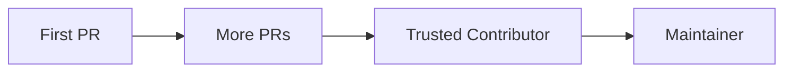

# Contribution Strategy

📄 File: `book/18_open_source_engineering/contribution_strategy.md`

This chapter covers **contribution strategy**—how to choose projects, build reputation, and contribute effectively.

---

## Study Plan (2 days)

* Day 1: Project selection + first steps
* Day 2: Building momentum

---

## 1 — Contribution Funnel



---

## 2 — Project Selection Criteria

| Criterion | Why |
|-----------|-----|
| Active maintenance | Issues get reviewed |
| Good first issue labels | Onboarding |
| Clear CONTRIBUTING.md | Know the process |
| Tech stack fit | Use your skills |

### Diagram — Project Fit



---

## 3 — Contribution Types

```python
# Contribution types by effort and impact
CONTRIBUTION_TYPES = {
    "docs": {"effort": "low", "impact": "medium"},   # Fix typos, improve README
    "bug_fix": {"effort": "medium", "impact": "high"},
    "feature": {"effort": "high", "impact": "high"},
    "review": {"effort": "low", "impact": "medium"},  # Code review, feedback
}
```

---

## 4 — First Contribution Checklist

```python
# Checklist before first PR
def first_contribution_checklist():
    return [
        "Read CONTRIBUTING.md",
        "Star/fork the repo",
        "Pick 'good first issue' or 'help wanted'",
        "Comment on issue: 'I'll take this'",
        "Create branch from main",
        "Make small, focused change",
        "Add tests if applicable",
        "Follow commit message convention",
    ]
```

---

## 5 — Building Reputation



* Start small; consistency > one big PR
* Respond to feedback promptly
* Help others in discussions

---

## Exercises

1. Find 3 projects with "good first issue" in your domain.
2. Make a documentation-only PR to a project you use.
3. Review one open PR and leave constructive feedback.

---

## Interview Questions

1. How do you choose an OSS project to contribute to?
   *Answer*: Active, good first issues, clear contributing guide, tech fit.

2. Why start with docs or small bugs?
   *Answer*: Learn codebase, build trust, lower barrier to merge.

3. What if your PR is rejected?
   *Answer*: Ask for feedback, iterate; rejection is part of the process.

---

## Key Takeaways

* Pick active projects with clear contribution guides.
* Start with docs/bugs; build to features.
* Consistency and responsiveness build reputation.

---

## Next Chapter

Proceed to: **finding_good_issues.md**
