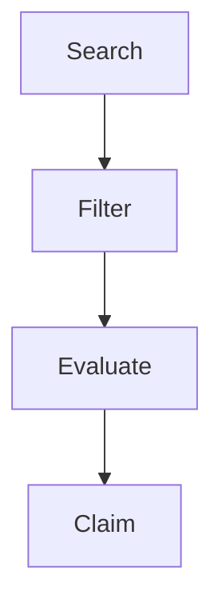
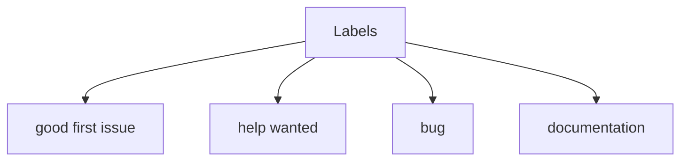
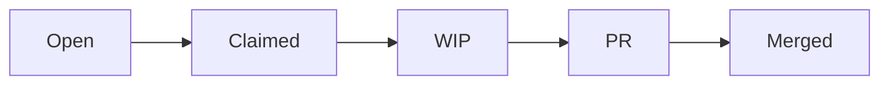

# Finding Good Issues

📄 File: `book/18_open_source_engineering/finding_good_issues.md`

This chapter covers **finding good issues** to contribute—labels, filters, and evaluation.

---

## Study Plan (1–2 days)

* Day 1: Labels + search
* Day 2: Evaluation + claiming

---

## 1 — Issue Discovery Flow



---

## 2 — Key Labels

| Label | Meaning |
|-------|---------|
| good first issue | Beginner-friendly |
| help wanted | Maintainers want help |
| bug | Something broken |
| documentation | Docs improvement |
| enhancement | New feature |

### Diagram — Label Hierarchy



---

## 3 — GitHub Search Queries

```bash
# Good first issues in Python ML repos
# is:issue is:open label:"good first issue" language:Python

# Help wanted in specific org
# org:langchain is:issue label:"help wanted"

# Bugs in a repo
# repo:owner/repo is:issue label:bug
```

---

## 4 — Issue Evaluation Script

```python
def evaluate_issue(issue: dict) -> dict:
    """
    Score an issue for contribution fit.
    Returns score and reasons.
    """
    score = 0
    reasons = []
    # Has clear description
    if len(issue.get("body", "")) > 100:
        score += 2
        reasons.append("Clear description")
    # Has good first issue label
    if "good first issue" in [l["name"] for l in issue.get("labels", [])]:
        score += 2
        reasons.append("Beginner friendly")
    # Not too old (stale)
    # Assumes issue has "created_at"
    # Recent = higher chance maintainers care
    if "created_at" in issue:
        from datetime import datetime, timedelta
        created = datetime.fromisoformat(issue["created_at"].replace("Z", "+00:00"))
        if datetime.now(created.tzinfo) - created < timedelta(days=30):
            score += 1
            reasons.append("Recent")
    return {"score": score, "reasons": reasons}
```

---

## 5 — Claiming an Issue

```python
# Template for claiming
CLAIM_MESSAGE = """
I'd like to work on this issue. I'll:
1. [Brief plan]
2. [Expected outcome]
3. [ETA: X days]

Let me know if this approach works!
"""
```

---

## Diagram — Issue Lifecycle



---

## Exercises

1. Find 5 "good first issue" in an AI/ML project.
2. Evaluate 3 issues using the scoring criteria.
3. Claim one issue and post your plan.

---

## Interview Questions

1. What makes an issue "good" for a first contribution?
   *Answer*: Clear scope, labeled, recent, maintainer responsive.

2. Why check if an issue is stale?
   *Answer*: Old issues may be fixed elsewhere or no longer relevant.

3. Should you always comment before working?
   *Answer*: Yes for significant work; avoids duplicate effort and confirms approach.

---

## Key Takeaways

* Use labels: good first issue, help wanted.
* Evaluate: clarity, scope, recency.
* Claim with a brief plan before coding.

---

## Next Chapter

Proceed to: **writing_prs.md**
