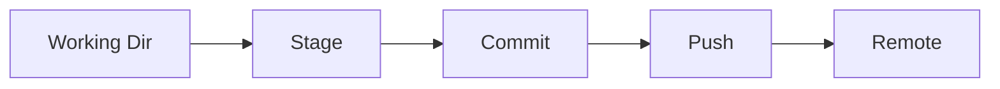
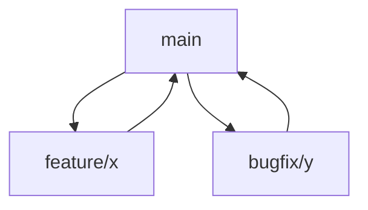
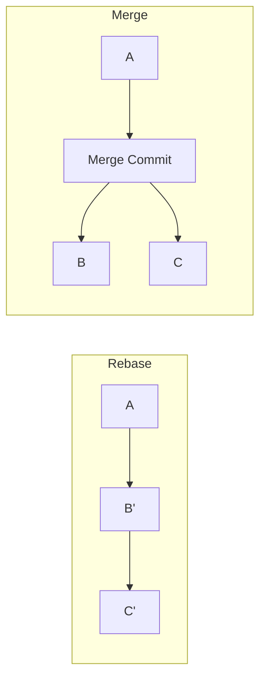

# Git Mastery

📄 File: `book/18_open_source_engineering/git_mastery.md`

This chapter covers **Git mastery** for open source—branching, rebasing, and collaboration workflows.

---

## Study Plan (2–3 days)

* Day 1: Branching + merging
* Day 2: Rebase + interactive
* Day 3: Collaboration patterns

---

## 1 — Git Workflow Overview



---

## 2 — Key Concepts

| Concept | Description |
|---------|-------------|
| Branch | Isolated line of development |
| Rebase | Replay commits on new base |
| Merge | Combine branches (creates merge commit) |
| Cherry-pick | Apply specific commit elsewhere |

### Diagram — Branch Model



---

## 3 — Feature Branch Workflow

```bash
# Create feature branch from main
git checkout main
git pull origin main
git checkout -b feature/add-metrics

# Make changes, commit with clear message
git add src/metrics.py
git commit -m "feat: add latency metrics collection"

# Keep branch updated with main (rebase)
git fetch origin
git rebase origin/main

# Push and open PR
git push origin feature/add-metrics
```

---

## 4 — Interactive Rebase (Squash)

```bash
# Squash last 3 commits into one
git rebase -i HEAD~3

# In editor, change:
# pick abc123 First commit
# squash def456 Second commit
# squash ghi789 Third commit
# Save and edit final message
```

---

## 5 — Undo and Recovery

```bash
# Discard unstaged changes
git checkout -- file.py

# Unstage file
git reset HEAD file.py

# Soft reset: undo commit, keep changes
git reset --soft HEAD~1

# Reflog: find lost commits
git reflog
git checkout <commit-hash>
```

---

## Diagram — Rebase vs Merge



---

## Exercises

1. Create branch, make 3 commits, squash to 1, push.
2. Resolve a merge conflict manually.
3. Use `git bisect` to find a breaking commit.

---

## Interview Questions

1. When to rebase vs merge?
   *Answer*: Rebase for linear history before PR; merge for integrating feature branches.

2. What does `git rebase -i` do?
   *Answer*: Interactive rebase; edit, squash, reorder commits.

3. How do you recover a deleted branch?
   *Answer*: `git reflog` to find commit, then `git checkout -b branch-name <hash>`.

---

## Key Takeaways

* Feature branches; rebase on main before PR.
* Interactive rebase for clean history.
* Reflog for recovery; understand reset modes.

---

## Next Chapter

Proceed to: **contribution_strategy.md**
