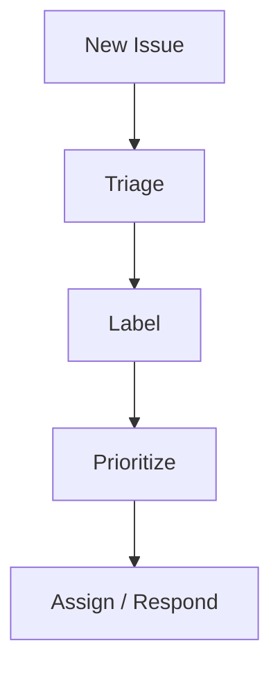
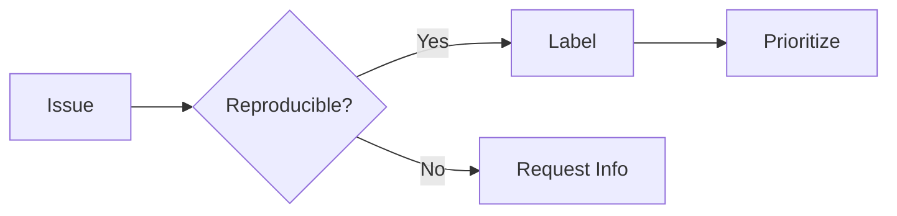
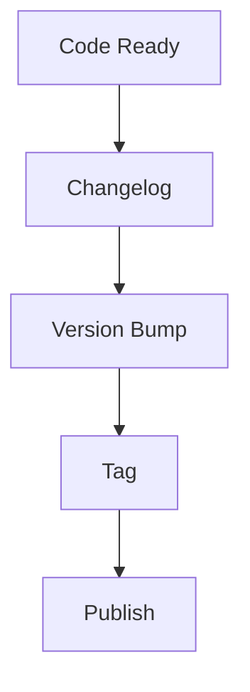

# Maintaining Projects

📄 File: `book/18_open_source_engineering/maintaining_projects.md`

This chapter covers **maintaining open source projects**—triaging issues, releases, and community health.

---

## Study Plan (2–3 days)

* Day 1: Triage + labels
* Day 2: Releases + versioning
* Day 3: Community health

---

## 1 — Maintenance Workflow



---

## 2 — Triage Process

| Step | Action |
|------|--------|
| 1 | Reproduce or clarify |
| 2 | Label (bug, feature, question) |
| 3 | Prioritize (P0, P1, P2) |
| 4 | Respond or close |

### Diagram — Triage Flow



---

## 3 — Issue Triage Template

```python
TRIAGE_RESPONSE = """
Thanks for reporting! To help us triage:
1. Version: What version are you using?
2. Steps: Minimal steps to reproduce?
3. Expected vs actual: What did you expect?
4. Environment: OS, Python version, etc.
"""
```

---

## 4 — Semantic Versioning

```python
# SemVer: MAJOR.MINOR.PATCH
# MAJOR: Breaking changes
# MINOR: New features, backward compatible
# PATCH: Bug fixes

def bump_version(current: str, bump: str) -> str:
    """Bump version string."""
    major, minor, patch = map(int, current.split("."))
    if bump == "major":
        return f"{major + 1}.0.0"
    if bump == "minor":
        return f"{major}.{minor + 1}.0"
    if bump == "patch":
        return f"{major}.{minor}.{patch + 1}"
    raise ValueError(f"Unknown bump: {bump}")
```

---

## 5 — Release Checklist

```python
RELEASE_CHECKLIST = [
    "Update CHANGELOG.md",
    "Bump version in pyproject.toml / setup.py",
    "Run full test suite",
    "Create git tag (v1.2.3)",
    "Push tag to trigger CI release",
    "Draft GitHub release notes",
]
```

---

## Diagram — Release Pipeline



---

## Exercises

1. Triage 3 open issues in a project; add labels and a response.
2. Draft a CHANGELOG entry for a hypothetical release.
3. Define a simple issue/PR template for a repo.

---

## Interview Questions

1. How do you prioritize issues?
   *Answer*: Severity, user impact, maintainer capacity; P0 = critical bugs.

2. What is semantic versioning?
   *Answer*: MAJOR.MINOR.PATCH; major = breaking, minor = feature, patch = fix.

3. Why use issue templates?
   *Answer*: Consistent info from reporters; faster triage; better quality issues.

---

## Key Takeaways

* Triage: reproduce, label, prioritize, respond.
* SemVer for releases; maintain CHANGELOG.
* Templates and labels improve efficiency.

---

## Next Chapter

Proceed to: **23_orchestration_workflow_ops/00_orchestration_overview.md**
