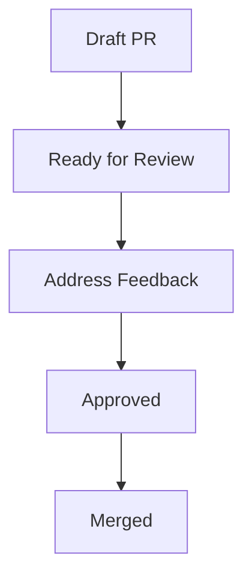
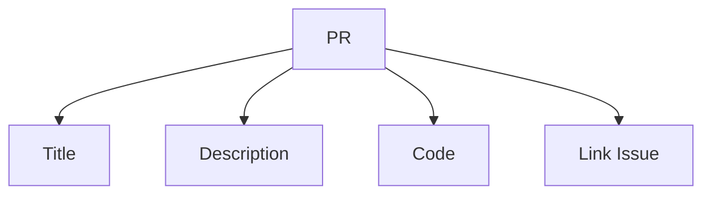
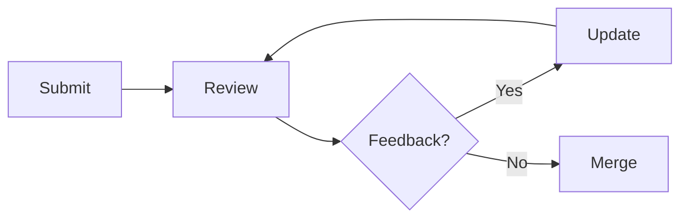

# Writing PRs

📄 File: `book/18_open_source_engineering/writing_prs.md`

This chapter covers **writing effective pull requests**—structure, description, and review etiquette.

---

## Study Plan (2 days)

* Day 1: PR structure + description
* Day 2: Addressing feedback

---

## 1 — PR Lifecycle



---

## 2 — PR Checklist

| Item | Purpose |
|------|---------|
| Clear title | Convey change at a glance |
| Description | What, why, how |
| Link issue | Traceability |
| Tests | Confidence |
| Screenshots | For UI changes |

### Diagram — PR Components



---

## 3 — PR Description Template

```markdown
## What
Brief one-line summary of the change.

## Why
Problem this solves or motivation.

## How
Key approach or implementation notes.

## Testing
- [ ] Unit tests added/updated
- [ ] Manual testing steps

## Checklist
- [ ] Follows project style (black, ruff)
- [ ] Docs updated if needed
- [ ] Linked issue: #123
```

---

## 4 — Commit Message Convention

```python
# Conventional Commits format
COMMIT_PATTERNS = [
    "feat: add X",      # New feature
    "fix: resolve Y",   # Bug fix
    "docs: update Z",   # Documentation
    "test: add tests for X",
    "refactor: simplify Y",
]

# Example
# feat: add latency metrics to inference endpoint
# fix: handle empty input in tokenizer
```

---

## 5 — Addressing Review Feedback

```python
# Best practices
REVIEW_RESPONSE = """
1. Acknowledge each comment
2. Explain changes or push back politely
3. Mark resolved when addressed
4. Re-request review when ready
"""
```

---

## Diagram — Review Loop



---

## Exercises

1. Write a PR description for a small change you made.
2. Convert 3 commits into conventional commit messages.
3. Simulate addressing 2 review comments in writing.

---

## Interview Questions

1. What makes a good PR title?
   *Answer*: Action + scope; e.g., "feat: add retry logic to API client".

2. Why link the issue in the PR?
   *Answer*: Context for reviewers; auto-closes issue on merge; traceability.

3. How do you handle conflicting feedback from reviewers?
   *Answer*: Discuss in thread; maintainer often decides; be respectful.

---

## Key Takeaways

* Clear title + description; link issue.
* Conventional commits; small, focused PRs.
* Respond to feedback promptly and professionally.

---

## Next Chapter

Proceed to: **maintaining_projects.md**
