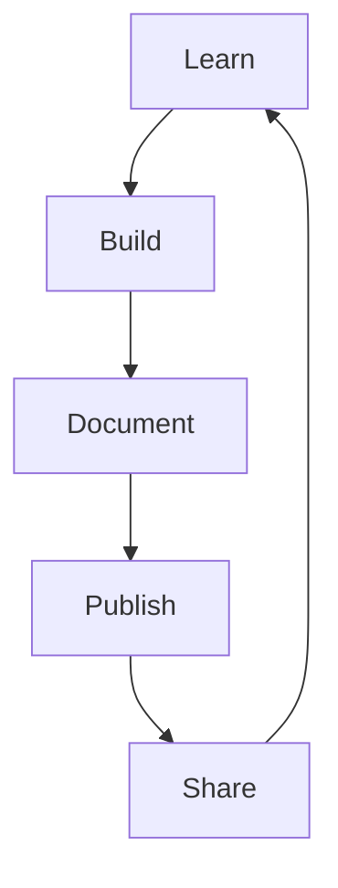

# Portfolio Projects Roadmap

📄 File: `book/19_portfolio_projects/00_portfolio_roadmap.md`

This chapter guides you to build **portfolio projects** that demonstrate top-tier AI Data Engineering capability. Projects attract recruiters and prove you can ship.

---

## Study Plan (Ongoing)

* Build 1 project per quarter
* Document, publish, share
* Iterate based on feedback

---

## 1 — Why Portfolio Projects?

* **Proof of work**: Resume claims vs working code
* **Conversation starter**: Interviews reference your projects
* **Open source**: Contributions to major projects count



---

## 2 — Project Ideas (from Master Roadmap)

| Project | Skills Demonstrated |
| ------- | ------------------- |
| **Vector search engine** | Embeddings, ANN, FAISS/Qdrant |
| **RAG pipeline** | Chunking, retrieval, LLM integration |
| **Distributed data pipeline** | Spark, Kafka, orchestration |
| **LLM inference server** | vLLM, batching, FastAPI |
| **Feature store** | Feast, offline/online serving |
| **Data quality dashboard** | Great Expectations, dbt, BI |

---

## 3 — Project Structure

```
project/
├── README.md          # Problem, solution, how to run
├── docs/              # Architecture, design decisions
├── src/               # Code
├── tests/
├── docker-compose.yml # Easy local run
└── requirements.txt
```

---

## 4 — What Makes a Strong Project?

* **Solves real problem**: Not toy data
* **Production-ready**: Tests, docs, error handling
* **Differentiated**: Unique angle or scale
* **Documented**: README, architecture diagram

---

## 5 — Next Steps

1. Pick one project from the list
2. Scope to 2–4 weeks
3. Build, document, publish
4. Add to resume and LinkedIn

---

## Key Takeaways

* Portfolio = proof of capability
* Build, document, publish, share
* Quality over quantity

---

## Next Chapter

Proceed to: **01_vector_search_engine.md**
