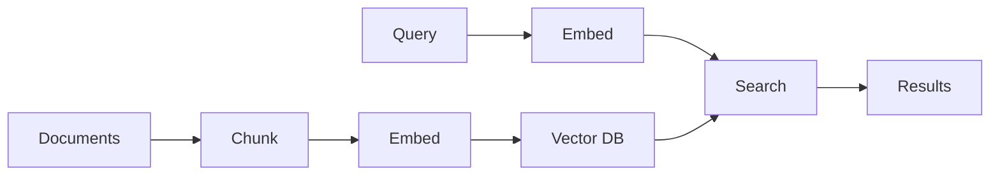

# Portfolio Project: Vector Search Engine

📄 File: `book/19_portfolio_projects/01_vector_search_engine.md`

Build a **semantic search engine** — embed documents, index in vector DB, serve search API. Demonstrates embeddings + ANN + serving.

---

## Study Plan (2–4 weeks)

* Week 1: Embeddings, FAISS/Qdrant
* Week 2: API, indexing pipeline
* Week 3–4: Polish, docs, deploy

---

## 1 — Architecture



---

## 2 — Tech Stack

* **Embeddings**: sentence-transformers or OpenAI
* **Vector DB**: FAISS, Qdrant, or pgvector
* **API**: FastAPI
* **Orchestration**: Optional — Airflow for batch index refresh

---

## 3 — Core Components

### Indexing Pipeline

```python
# Pseudocode with comments
def index_documents(docs):
    # 1. Chunk documents (overlap, size)
    chunks = chunk_documents(docs)
    # 2. Embed each chunk
    embeddings = embed_model.encode(chunks)
    # 3. Upsert to vector DB
    vector_db.upsert(ids=range(len(chunks)), vectors=embeddings, payloads=chunks)
```

### Search API

```python
# 1. Embed query
query_embedding = embed_model.encode([query])[0]
# 2. Search top-k
results = vector_db.search(query_embedding, top_k=10)
# 3. Return with metadata
return [{"text": r.payload, "score": r.score} for r in results]
```

---

## 4 — Differentiation Ideas

* **Hybrid search**: Combine vector + keyword (BM25)
* **Reranking**: Cross-encoder for top-20
* **Multi-tenant**: Per-user or per-org indices
* **Scale**: Millions of documents

---

## 5 — Deliverables

* GitHub repo with README
* Docker Compile for local run
* Architecture diagram (Mermaid)
* Blog post or video walkthrough

---

## Key Takeaways

* Vector search = embed + index + search
* Demonstrate ANN, API design
* Document and publish

---

## Next Chapter

Proceed to: **02_rag_pipeline.md**
