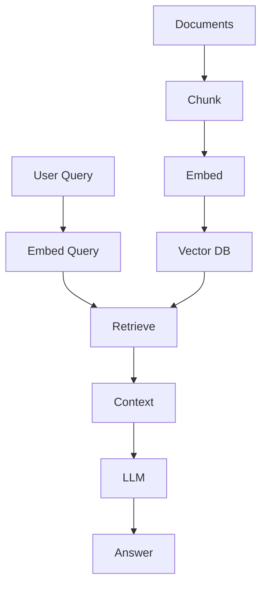

# Portfolio Project: RAG Pipeline

📄 File: `book/19_portfolio_projects/02_rag_pipeline.md`

Build an end-to-end **RAG pipeline** — ingest docs, chunk, embed, retrieve, generate. The most common AI product pattern.

---

## Study Plan (2–4 weeks)

* Week 1: Chunking, embedding, vector DB
* Week 2: Retrieval, LLM integration
* Week 3: Evaluation, reranking
* Week 4: API, docs

---

## 1 — Architecture

---

## 2 — Tech Stack

* **Chunking**: LangChain RecursiveCharacterTextSplitter or custom
* **Embeddings**: sentence-transformers, OpenAI
* **Vector DB**: Qdrant, Chroma, pgvector
* **LLM**: OpenAI, Anthropic, or local (Ollama)
* **Orchestration**: LangChain or LlamaIndex (optional)

---

## 3 — Evaluation

* **Retrieval**: Hit@k, MRR
* **Generation**: Faithfulness, relevance (RAGAS or manual)
* **End-to-end**: User satisfaction, A/B test

---

## 4 — Differentiation

* **Agentic RAG**: Tool use, multi-step
* **Hybrid search**: Vector + keyword
* **Streaming**: Token streaming to client
* **Evaluation dashboard**: Track metrics over time

---

## Key Takeaways

* RAG = retrieve + augment + generate
* Evaluate retrieval and generation
* Document design decisions

---

## Next Chapter

Proceed to: **20_resume_linkedin**
