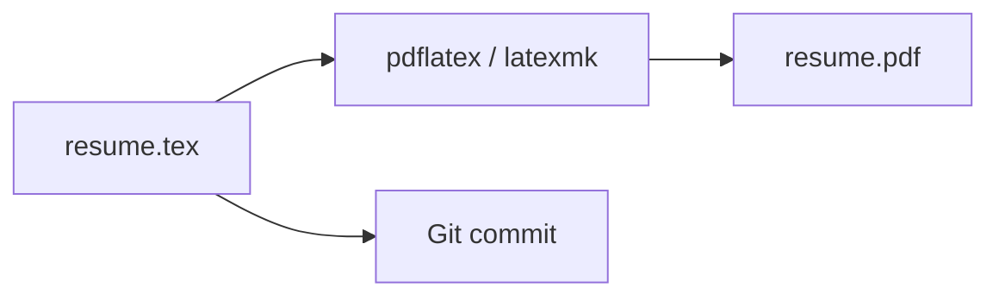
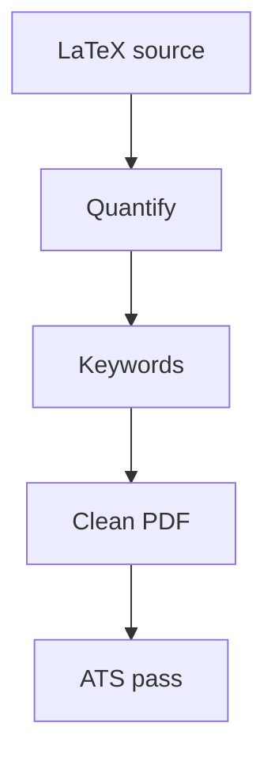

# Resume & LinkedIn Roadmap

📄 File: `book/20_resume_linkedin/00_resume_roadmap.md`

This chapter covers **resume writing** and **LinkedIn optimization** for AI Data Engineer roles at top companies.

---

## Study Plan (1–2 weeks)

* Week 1: **Set up LaTeX resume** (Overleaf or local), structure, bullets
* Week 2: LinkedIn profile, content, export PDF workflow

---

## 0 — Build Your Resume in LaTeX (Strong Recommendation)

**Everyone in this Gita should maintain their resume as LaTeX source**, not only as Word/Google Docs.

### Why LaTeX for resumes

| Benefit | Why it matters |
| ------- | -------------- |
| **Version control** | Plain `.tex` files diff cleanly in Git — track every change, branch variants (e.g. “ML-heavy” vs “data-platform” resume) |
| **Consistent layout** | No accidental spacing/font drift when you edit one bullet |
| **Professional typography** | Clean, readable PDFs that look sharp on screen and in print |
| **Single source of truth** | One file generates a polished PDF; no “which doc is latest?” |
| **Engineering signal** | For technical roles, a LaTeX resume subtly signals you care about precision and tooling |

### ATS (Applicant Tracking Systems)

* Export **PDF from LaTeX** — use a **simple, text-based** template (no complex multi-column tricks, no embedding text as images).
* Avoid fancy graphics, icons-as-images, and scanned PDFs.
* See **01_resume_templates.md** for LaTeX stacks and ATS-safe patterns.

### How to get started (pick one)

1. **Overleaf** — browser editor, templates, collaboration — fastest for beginners
2. **Local** — TeX Live (Linux/Windows) or MacTeX (macOS) + VS Code + LaTeX Workshop extension

**Rule for this handbook**: Treat your resume like code — **LaTeX in Git**, **PDF as build artifact**.

---

## 1 — Resume Principles

* **One page** for < 10 years experience
* **Quantify** impact (%, scale, latency)
* **Keywords** from job descriptions
* **ATS-friendly**: Simple LaTeX template, text-selectable PDF, standard section titles

---

## 2 — Bullet Formula

**Action verb** + **what you did** + **impact** (number)

* Bad: "Worked on data pipeline"
* Good: "Built Spark pipeline processing 10TB/day, reducing latency by 40%"

---

## 3 — Sections

1. **Header**: Name, contact, LinkedIn, GitHub
2. **Summary**: 2–3 lines, tailored to role
3. **Experience**: Reverse chronological, bullets
4. **Projects**: Portfolio links
5. **Skills**: Technologies, frameworks
6. **Education**: Degree, relevant coursework

---

## 4 — LinkedIn Optimization

* **Headline**: Role + key skills (e.g., "AI Data Engineer | Spark, RAG, ML Pipelines")
* **About**: Story, value prop
* **Experience**: Match resume
* **Recommendations**: Request from colleagues
* **Content**: Post projects, insights

---

## Key Takeaways

* **Use LaTeX** for your resume — version control, consistency, professional output
* Quantify impact; keep PDF **simple** for ATS
* LinkedIn = extended resume + network

---

## Download-ready `.tex` template

* **`book/20_resume_linkedin/ai_data_engineer_resume.tex`** — structure aligned with strong industry resumes (profile, categorized skills, experience, education, certificates).
* **`RESUME_LATEX_README.md`** — how to use **[Overleaf](https://www.overleaf.com)** or compile locally.

---

## Next Chapter

Proceed to: **01_resume_templates.md** (LaTeX templates, starter `.tex`, tools)
