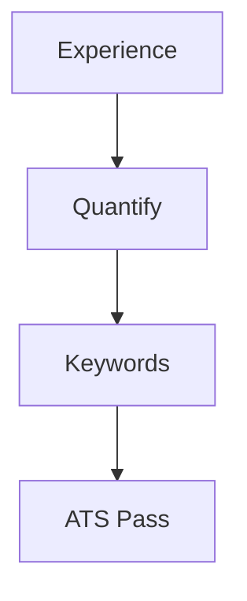

# Resume & LinkedIn Roadmap

📄 File: `book/20_resume_linkedin/00_resume_roadmap.md`

This chapter covers **resume writing** and **LinkedIn optimization** for AI Data Engineer roles at top companies.

---

## Study Plan (1–2 weeks)

* Week 1: Resume structure, bullets
* Week 2: LinkedIn profile, content

---

## 1 — Resume Principles

* **One page** for < 10 years experience
* **Quantify** impact (%, scale, latency)
* **Keywords** from job descriptions
* **ATS-friendly**: Simple format, no graphics

---

## 2 — Bullet Formula

**Action verb** + **what you did** + **impact** (number)

* Bad: "Worked on data pipeline"
* Good: "Built Spark pipeline processing 10TB/day, reducing latency by 40%"

---

## 3 — Sections

1. **Header**: Name, contact, LinkedIn, GitHub
2. **Summary**: 2–3 lines, tailored to role
3. **Experience**: Reverse chronological, bullets
4. **Projects**: Portfolio links
5. **Skills**: Technologies, frameworks
6. **Education**: Degree, relevant coursework

---

## 4 — LinkedIn Optimization

* **Headline**: Role + key skills (e.g., "AI Data Engineer | Spark, RAG, ML Pipelines")
* **About**: Story, value prop
* **Experience**: Match resume
* **Recommendations**: Request from colleagues
* **Content**: Post projects, insights

---

## Key Takeaways

* Quantify impact
* ATS-friendly format
* LinkedIn = extended resume + network

---

## Next Chapter

Proceed to: **01_resume_templates.md**
