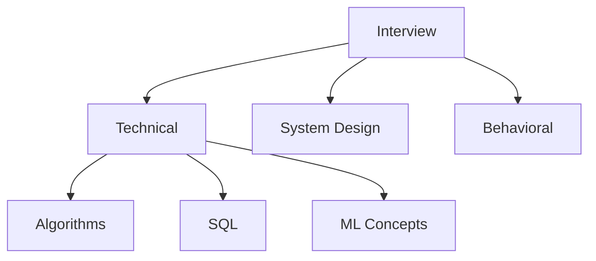

# Interview Preparation Roadmap

📄 File: `book/21_interview_preparation/00_interview_roadmap.md`

This chapter covers **interview preparation** for AI Data Engineer roles. Technical, system design, and behavioral.

---

## Study Plan (4–8 weeks)

* Weeks 1–2: Algorithms (LeetCode)
* Weeks 3–4: System design
* Weeks 5–6: ML/AI concepts
* Weeks 7–8: Behavioral, mock interviews

---

## 1 — Interview Types

---

## 2 — Technical Focus Areas

| Area | Topics |
| ---- | ------ |
| **Algorithms** | Arrays, hash, trees, graphs, DP |
| **SQL** | Joins, window functions, optimization |
| **System Design** | Data pipelines, RAG, scaling |
| **ML** | Training, inference, RAG, embeddings |

---

## 3 — System Design Framework

1. **Clarify**: Requirements, scale, constraints
2. **High-level**: Components, data flow
3. **Deep dive**: Critical components
4. **Scale**: Bottlenecks, solutions

---

## 4 — Behavioral (STAR)

* **S**ituation: Context
* **T**ask: Your responsibility
* **A**ction: What you did
* **R**esult: Outcome, metrics

---

## 5 — Practice Strategy

* 2–3 LeetCode per day (medium focus)
* 1 system design per week
* Mock interviews with peers

---

## Key Takeaways

* Technical + system design + behavioral
* STAR for behavioral
* Practice consistently

---

## Next Chapter

Proceed to: **01_technical_interview.md**
