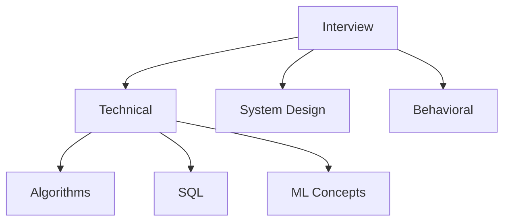

# Interview Preparation Roadmap

📄 File: `book/21_interview_preparation/00_interview_roadmap.md`

This chapter covers **interview preparation** for AI Data Engineer roles. Technical, system design, and behavioral.

---

## Study Plan (4–8 weeks)

* Weeks 1–2: Algorithms (LeetCode)
* Weeks 3–4: System design
* Weeks 5–6: ML/AI concepts
* Weeks 7–8: Behavioral, mock interviews

---

## 8-Week Execution Plan (Suggested)

### Week 1-2: Coding Foundations

- Daily: 2 coding problems (mostly medium)
- Focus: arrays, hash maps, two pointers, sliding window
- SQL: 3 window-function drills per week

### Week 3-4: Data and AI System Design

- 2 system design sessions/week
- 2 architecture write-ups/week
- Topics: data pipelines, RAG systems, inference serving

### Week 5-6: ML/LLM Depth

- revise embeddings, retrieval, model serving, evaluation
- answer 1 "trade-off question" daily
- run 2 end-to-end mock design rounds/week

### Week 7-8: Interview Simulation

- 3 mock coding rounds/week
- 2 mock system design rounds/week
- daily behavioral STAR rehearsal (15 min)

## 1 — Interview Types

```mermaid
flowchart TD
    A[Interview] --> B[Technical]
    A --> C[System Design]
    A --> D[Behavioral]
    B --> E[Algorithms]
    B --> F[SQL]
    B --> G[ML Concepts]
```

---

## 2 — Technical Focus Areas

| Area | Topics |
| ---- | ------ |
| **Algorithms** | Arrays, hash, trees, graphs, DP |
| **SQL** | Joins, window functions, optimization |
| **System Design** | Data pipelines, RAG, scaling |
| **ML** | Training, inference, RAG, embeddings |

---

## 3 — System Design Framework

1. **Clarify**: Requirements, scale, constraints
2. **High-level**: Components, data flow
3. **Deep dive**: Critical components
4. **Scale**: Bottlenecks, solutions

---

## 4 — Behavioral (STAR)

* **S**ituation: Context
* **T**ask: Your responsibility
* **A**ction: What you did
* **R**esult: Outcome, metrics

---

## 5 — Practice Strategy

* 2–3 LeetCode per day (medium focus)
* 1 system design per week
* Mock interviews with peers

### Daily Session (120-150 Minutes)

- 60 min coding
- 25 min SQL/design prompt
- 20 min ML/LLM concept recap
- 15 min behavioral STAR practice
- 10 min mistakes log and revision plan

---

## Key Takeaways

* Technical + system design + behavioral
* STAR for behavioral
* Practice consistently

---

## Next Chapter

Proceed to: **01_technical_interview.md**
