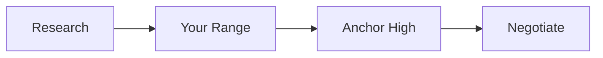

# Salary Negotiation

📄 File: `book/22_salary_negotiation/00_salary_negotiation.md`

This chapter covers **salary negotiation** — research, anchoring, and tactics for AI Data Engineer roles.

---

## Study Plan (1 week)

* Research market rates
* Prepare your number
* Practice the conversation

---

## 1 — Research

* **Levels.fyi**, **Blind**: Company-specific data
* **Glassdoor**, **Payscale**: Ranges
* **Network**: Ask peers (discreetly)

---

## 2 — Anchoring

* **First number** often anchors the conversation
* Give range with your target as floor
* "Based on my research, I'm looking for $X–$Y"

---

## 3 — Tactics

* **Don't disclose current salary** (illegal in some states)
* **Get offer first**: Let them make first move if possible
* **Total comp**: Base + bonus + equity + benefits
* **Non-salary**: Signing bonus, remote, PTO

---

## 4 — Scripts

* "I'm excited about the role. Based on my experience and market research, I was thinking $X. Is that in range?"
* "I have another offer at $Y. I prefer your team — can you get closer?"

---

## Key Takeaways

* Research before negotiating
* Anchor with your number
* Consider total comp, not just base

---

## Next Chapter

You've completed **Career Engineering**. Return to **00_master_roadmap.md** for the full journey.
