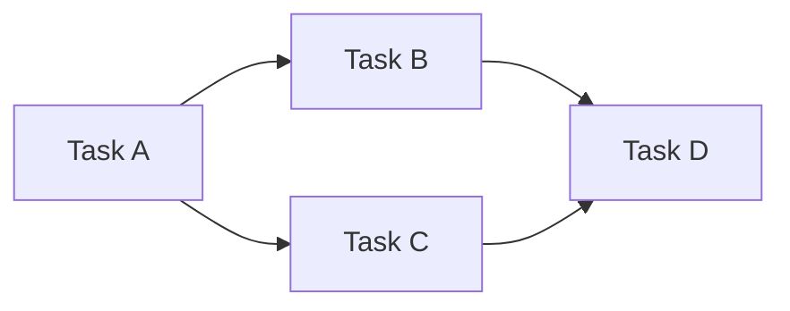
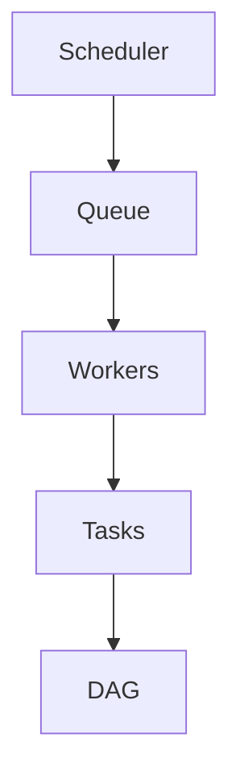
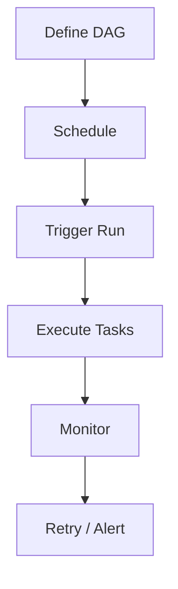

# Orchestration Overview

📄 File: `book/23_orchestration_workflow_ops/00_orchestration_overview.md`

This chapter introduces **workflow orchestration**—scheduling, dependency management, and monitoring for data pipelines.

---

## Study Plan (2 days)

* Day 1: Concepts + landscape
* Day 2: Comparison + use cases

---

## 1 — What is Orchestration?

**Orchestration** automates the execution of multi-step workflows with dependencies, scheduling, and failure handling.



---

## 2 — Core Concepts

| Concept | Description |
|---------|-------------|
| DAG | Directed Acyclic Graph of tasks |
| Task | Atomic unit of work |
| Schedule | When to run (cron, interval) |
| Trigger | Event that starts a run |

### Diagram — Orchestrator Components



---

## 3 — Orchestration Landscape

| Tool | Focus | Best For |
|------|-------|----------|
| Airflow | Data pipelines | Batch ETL, analytics |
| Dagster | Assets + pipelines | Modern data platforms |
| Prefect | Dynamic workflows | Flexible orchestration |
| Argo Workflows | Kubernetes | Cloud-native, K8s |
| Kubeflow | ML pipelines | Training, deployment |

---

## 4 — DAG Example (Conceptual)

```python
# Conceptual DAG: extract -> transform -> load
# Task A: Extract from API
# Task B: Transform (depends on A)
# Task C: Load to warehouse (depends on B)

dag = {
    "extract": [],
    "transform": ["extract"],
    "load": ["transform"],
}
```

---

## Diagram — Workflow Lifecycle



---

## Exercises

1. Draw a DAG for: fetch data → validate → aggregate → write.
2. Compare Airflow vs Prefect for a daily batch job.
3. When would you choose Kubernetes-native (Argo) over Airflow?

---

## Interview Questions

1. What is a DAG and why acyclic?
   *Answer*: Directed Acyclic Graph; acyclic prevents infinite loops and enables topological sort for execution order.

2. What is the difference between orchestration and scheduling?
   *Answer*: Scheduling is when to run; orchestration adds dependencies, retries, monitoring.

3. Why use workflow orchestration vs cron?
   *Answer*: Dependencies, retries, observability, scaling; cron is single-job, no dependency awareness.

---

## Key Takeaways

* Orchestration = DAG + schedule + execution + monitoring.
* Choose tool by environment (K8s vs VM) and use case (data vs ML).
* Idempotency and retries are critical.

---

## Next Chapter

Proceed to: **01_airflow_core.md**
