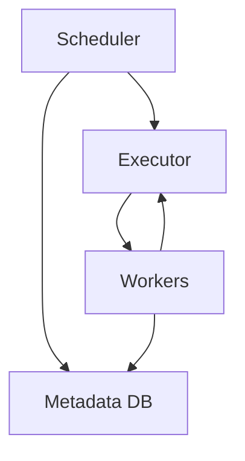
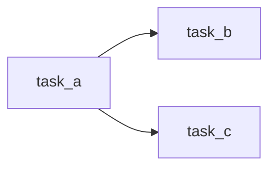

# Airflow Core

📄 File: `book/23_orchestration_workflow_ops/01_airflow_core.md`

This chapter covers **Apache Airflow** core concepts—DAGs, operators, and task dependencies.

---

## Study Plan (2–3 days)

* Day 1: DAGs + operators
* Day 2: XCom + variables
* Day 3: Running locally

---

## 1 — Airflow Architecture



---

## 2 — Core Components

| Component | Role |
|-----------|------|
| DAG | Workflow definition |
| Task | Operator instance |
| Operator | How to run (Python, Bash, etc.) |
| XCom | Cross-task communication |

---

## 3 — Minimal DAG

```python
from airflow import DAG
from airflow.operators.python import PythonOperator
from datetime import datetime

# Define a simple task function
def print_hello():
    """Task that prints hello."""
    print("Hello from Airflow!")

# Create DAG
with DAG(
    dag_id="hello_dag",
    start_date=datetime(2025, 1, 1),
    schedule="@daily",
    catchup=False,
) as dag:
    # Create task using PythonOperator
    task = PythonOperator(
        task_id="hello_task",
        python_callable=print_hello,
    )
```

---

## 4 — Task Dependencies

```python
from airflow.operators.bash import BashOperator

with DAG("deps_dag", start_date=datetime(2025, 1, 1), schedule=None) as dag:
    # Task A: run a bash command
    task_a = BashOperator(
        task_id="task_a",
        bash_command="echo 'Task A'",
    )
    # Task B: depends on A
    task_b = BashOperator(
        task_id="task_b",
        bash_command="echo 'Task B'",
    )
    # Task C: depends on A
    task_c = BashOperator(
        task_id="task_c",
        bash_command="echo 'Task C'",
    )
    # Set dependencies: A -> B, A -> C
    task_a >> [task_b, task_c]
```

---

## 5 — XCom (Cross-Task Data)

```python
def push_value(**context):
    """Push a value to XCom for downstream task."""
    context["ti"].xcom_push(key="my_key", value=42)

def pull_value(**context):
    """Pull value from upstream task."""
    val = context["ti"].xcom_pull(key="my_key", task_ids="push_task")
    print(f"Received: {val}")

with DAG("xcom_dag", start_date=datetime(2025, 1, 1), schedule=None) as dag:
    push = PythonOperator(
        task_id="push_task",
        python_callable=push_value,
    )
    pull = PythonOperator(
        task_id="pull_task",
        python_callable=pull_value,
    )
    push >> pull
```

---

## Diagram — Task Flow



---

## Exercises

1. Create a DAG with 3 tasks: extract, transform, load.
2. Use XCom to pass a string from task 1 to task 2.
3. Add a sensor that waits for a file before running.

---

## Interview Questions

1. What is an Airflow Operator?
   *Answer*: Encapsulates a unit of work (Bash, Python, etc.); defines how a task runs.

2. When to use XCom vs Variables?
   *Answer*: XCom for task-to-task data within a run; Variables for config across runs.

3. What is catchup?
   *Answer*: If True, Airflow runs missed DAG runs from start_date; set False to avoid backfill.

---

## Key Takeaways

* DAG = workflow; Task = Operator instance; >> sets dependencies.
* XCom for small task-to-task data; avoid large payloads.
* catchup=False for most use cases.

---

## Next Chapter

Proceed to: **02_airflow_scaling_patterns.md**
