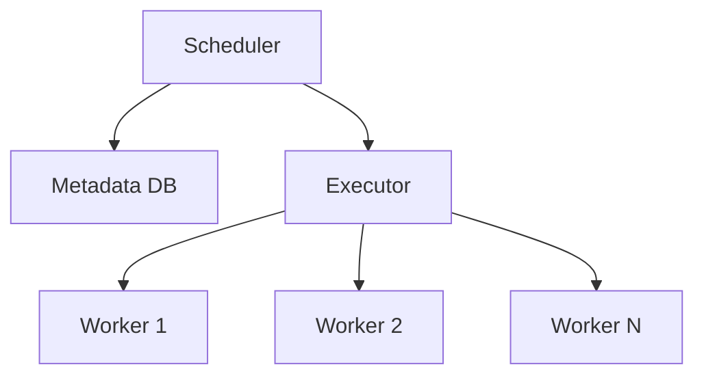
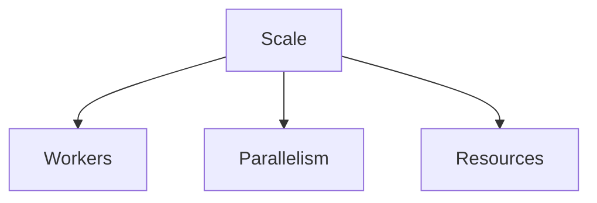

# Airflow Scaling Patterns

📄 File: `book/23_orchestration_workflow_ops/02_airflow_scaling_patterns.md`

This chapter covers **Airflow scaling**—Celery/Kubernetes executors, parallelism, and resource tuning.

---

## Study Plan (2 days)

* Day 1: Executors + workers
* Day 2: Tuning + patterns

---

## 1 — Scaling Architecture



---

## 2 — Executor Types

| Executor | Use Case | Scaling |
|----------|----------|---------|
| Sequential | Dev, single task | N/A |
| Local | Dev, few tasks | Single process |
| Celery | Production | Add workers |
| Kubernetes | Cloud-native | Pod per task |

### Diagram — Executor Comparison


---

## 3 — Parallelism Config

```python
# airflow.cfg (or env vars)
# parallelism = 32          # Max tasks across all DAGs
# dag_concurrency = 16      # Max tasks per DAG run
# max_active_runs_per_dag = 1  # Max concurrent runs per DAG
```

---

## 4 — Task-Level Resource Limits (K8s)

```python
from airflow.providers.cncf.kubernetes.operators.kubernetes_pod import KubernetesPodOperator

task = KubernetesPodOperator(
    task_id="heavy_task",
    namespace="default",
    image="my-image:latest",
    cmds=["python", "run.py"],
    # Resource limits for the pod
    container_resources={
        "request_memory": "1Gi",
        "limit_memory": "2Gi",
        "request_cpu": "500m",
        "limit_cpu": "1",
    },
)
```

---

## 5 — Dynamic Task Mapping (Airflow 2.3+)

```python
from airflow.decorators import task, dag
from datetime import datetime

@dag(schedule=None, start_date=datetime(2025, 1, 1))
def dynamic_dag():
    @task
    def get_items():
        """Return list of items to process."""
        return ["a", "b", "c"]

    @task
    def process(item: str):
        """Process each item (runs in parallel)."""
        print(f"Processing {item}")

    items = get_items()
    process.expand(item=items)

dynamic_dag()
```

---

## Diagram — Scaling Dimensions



---

## Exercises

1. Configure Celery with 4 workers in docker-compose.
2. Use KubernetesPodOperator for a Spark job.
3. Implement dynamic task mapping for 10 files.

---

## Interview Questions

1. When to use Celery vs Kubernetes executor?
   *Answer*: Celery for VM-based; K8s for cloud-native, per-task isolation, autoscaling.

2. What is parallelism vs dag_concurrency?
   *Answer*: parallelism = global task limit; dag_concurrency = per-DAG-run limit.

3. How does dynamic task mapping work?
   *Answer*: Upstream returns a list; downstream expands to N tasks, one per item.

---

## Key Takeaways

* Celery/K8s for production scaling.
* Tune parallelism, dag_concurrency, max_active_runs.
* Dynamic task mapping for variable workloads.

---

## Next Chapter

Proceed to: **03_dagster.md**
