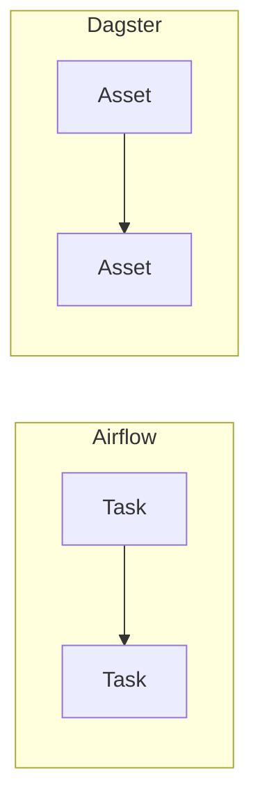
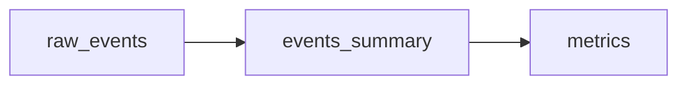

# Dagster

📄 File: `book/23_orchestration_workflow_ops/03_dagster.md`

This chapter covers **Dagster**—asset-centric orchestration, software-defined assets, and modern data platform patterns.

---

## Study Plan (2–3 days)

* Day 1: Assets + ops
* Day 2: Resources + I/O
* Day 3: Dagster UI + deployment

---

## 1 — Dagster vs Airflow



* Airflow: task-centric. Dagster: **asset-centric** (data products).

---

## 2 — Core Concepts

| Concept | Description |
|---------|-------------|
| Asset | Data product (table, file) |
| Op | Computation that produces assets |
| Job | Graph of ops to run |
| Resource | Shared connection (DB, API) |

---

## 3 — Simple Asset

```python
from dagster import asset

@asset
def raw_events():
    """Produce raw_events asset (e.g., fetch from API)."""
    # In practice: fetch, return or write to storage
    return [{"id": 1, "event": "click"}]

@asset
def events_summary(raw_events):
    """Produce events_summary; depends on raw_events."""
    return {"count": len(raw_events)}
```

---

## 4 — Job Definition

```python
from dagster import define_asset_job, AssetSelection

# Job that materializes selected assets
job = define_asset_job(
    name="daily_ingest",
    selection=AssetSelection.all(),
)
```

---

## 5 — Resources

```python
from dagster import asset, resource

@resource
def db_connection():
    """Shared DB connection resource."""
    # Return connection object
    return {"conn": "postgres://..."}

@asset(required_resource_keys={"db"})
def users_table(context):
    """Asset that uses db resource."""
    conn = context.resources.db["conn"]
    # Use conn to create table
    return "users"
```

---

## Diagram — Asset Graph



---

## Exercises

1. Create 3 assets: raw → cleaned → aggregated.
2. Add a resource for S3 and use it in an asset.
3. Schedule a job to run daily.

---

## Interview Questions

1. What is the difference between Dagster assets and Airflow tasks?
   *Answer*: Assets represent data products; lineage and freshness are first-class; tasks are just execution units.

2. What is a Dagster resource?
   *Answer*: Shared connection or client (DB, API) injected into ops/assets; enables testing with mocks.

3. Why asset-centric?
   *Answer*: Data lineage, freshness, impact analysis; aligns with data platform thinking.

---

## Key Takeaways

* Assets = data products; ops = computations.
* Resources for connections; I/O managers for storage.
* Dagster UI shows asset lineage and runs.

---

## Next Chapter

Proceed to: **04_prefect.md**
