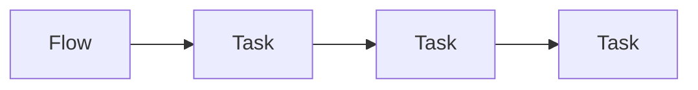
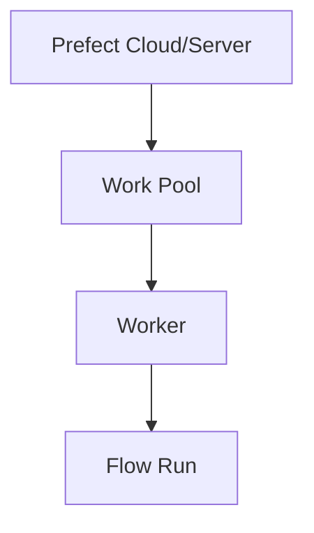

# Prefect

📄 File: `book/23_orchestration_workflow_ops/04_prefect.md`

This chapter covers **Prefect**—dynamic workflows, hybrid execution, and developer-friendly orchestration.

---

## Study Plan (2 days)

* Day 1: Flows + tasks
* Day 2: Deployment + hybrid

---

## 1 — Prefect Overview



* **Flow**: Top-level workflow (decorated function)
* **Task**: Unit of work; can be dynamic

---

## 2 — Core Concepts

| Concept | Description |
|---------|-------------|
| Flow | Workflow definition |
| Task | Atomic unit; can have retries |
| Deployment | Scheduled or triggered run |
| Work Pool | Where work runs (process, K8s) |

---

## 3 — Simple Flow

```python
from prefect import flow, task

@task
def fetch_data():
    """Task: fetch data from source."""
    return [1, 2, 3]

@task
def process(data):
    """Task: process data."""
    return sum(data)

@flow
def my_flow():
    """Flow: orchestrate tasks."""
    data = fetch_data()
    result = process(data)
    return result

# Run locally
my_flow()
```

---

## 4 — Dynamic Workflows

```python
@flow
def dynamic_flow():
    """Flow with dynamic task creation."""
    items = ["a", "b", "c"]
    # Create task per item; runs in parallel
    results = [process.submit(item) for item in items]
    return [r.result() for r in results]
```

---

## 5 — Deployment

```python
from prefect.deployments import Deployment
from prefect.server.schemas.schedules import CronSchedule

# Create deployment with schedule
deployment = Deployment.build_from_flow(
    flow=my_flow,
    name="daily-run",
    schedule=CronSchedule(cron="0 6 * * *"),  # 6 AM daily
)
deployment.apply()
```

---

## Diagram — Prefect Architecture



---

## Exercises

1. Create a flow with 3 tasks and run it.
2. Use dynamic mapping for a list of URLs.
3. Deploy a flow with a cron schedule.

---

## Interview Questions

1. How does Prefect handle dynamic workflows?
   *Answer*: Tasks can be created at runtime; no static DAG; supports loops and conditionals.

2. What is a work pool?
   *Answer*: Defines where work runs (process, Docker, K8s); workers pull from pool.

3. Prefect vs Airflow for ad-hoc workflows?
   *Answer*: Prefect better for dynamic, Python-native; Airflow for static DAGs, mature ecosystem.

---

## Key Takeaways

* Flows and tasks; dynamic creation at runtime.
* Deployments for scheduling; work pools for execution.
* Developer-friendly; runs as Python.

---

## Next Chapter

Proceed to: **05_argo_workflows.md**
