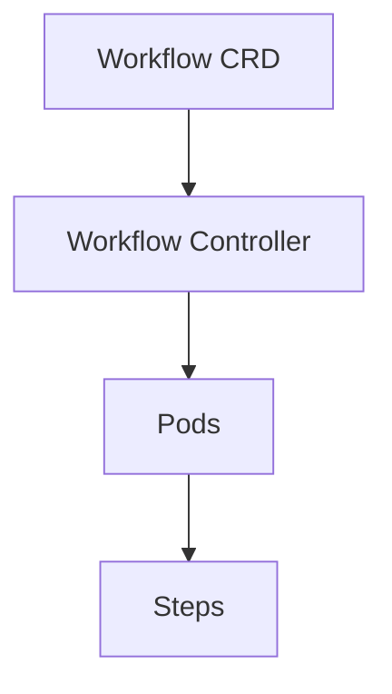
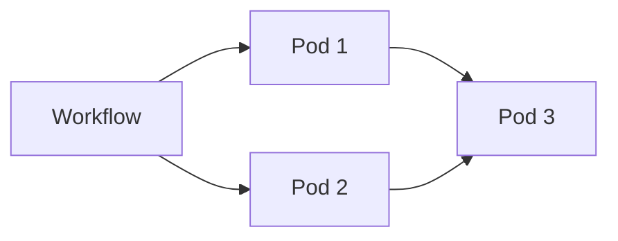

# Argo Workflows

📄 File: `book/23_orchestration_workflow_ops/05_argo_workflows.md`

This chapter covers **Argo Workflows**—Kubernetes-native workflow orchestration for cloud-native pipelines.

---

## Study Plan (2 days)

* Day 1: Workflow spec + templates
* Day 2: DAGs + artifacts

---

## 1 — Argo Overview



* Runs on Kubernetes; each step = Pod
* CRD-based; GitOps friendly

---

## 2 — Core Concepts

| Concept | Description |
|---------|-------------|
| Workflow | Top-level resource |
| Template | Reusable step/container spec |
| Step | Single unit; can have dependencies |
| DAG | Directed graph of steps |

---

## 3 — Simple Workflow (YAML)

```yaml
apiVersion: argoproj.io/v1alpha1
kind: Workflow
metadata:
  generateName: hello-
spec:
  entrypoint: main
  templates:
  - name: main
    steps:
    - - name: step-a
        template: echo
        arguments:
          parameters:
          - name: message
            value: "Hello"
    - - name: step-b
        template: echo
        arguments:
          parameters:
          - name: message
            value: "World"
        # Depends on step-a (implicit: same step group)
  - name: echo
    inputs:
      parameters:
      - name: message
    container:
      image: alpine
      command: [echo, "{{inputs.parameters.message}}"]
```

---

## 4 — DAG Template

```yaml
- name: dag-example
  dag:
    tasks:
    - name: A
      template: echo-a
    - name: B
      template: echo-b
      dependencies: [A]
    - name: C
      template: echo-c
      dependencies: [A]
    - name: D
      template: echo-d
      dependencies: [B, C]
```

---

## 5 — Python Script (Argo Python SDK)

```python
from argo_workflows.models import Workflow, WorkflowSpec
from argo_workflows.api import WorkflowServiceApi

# Define workflow programmatically
workflow = Workflow(
    metadata={"generateName": "python-workflow-"},
    spec=WorkflowSpec(
        entrypoint="main",
        templates=[...],  # Define templates
    ),
)
# Submit via API
api = WorkflowServiceApi()
api.create_workflow(namespace="default", body=workflow)
```

---

## Diagram — Argo on K8s



---

## Exercises

1. Create a 3-step workflow: fetch → process → store.
2. Add a DAG with parallel steps.
3. Use artifacts to pass data between steps.

---

## Interview Questions

1. Why use Argo over Airflow on Kubernetes?
   *Answer*: Native K8s; no external scheduler; each step is a Pod; GitOps; lighter.

2. What is a WorkflowTemplate?
   *Answer*: Reusable workflow definition; can be referenced by ClusterWorkflowTemplate or submitted directly.

3. How does Argo pass data between steps?
   *Answer*: Artifacts (S3, GCS, etc.) or parameters; outputs of one step become inputs of another.

---

## Key Takeaways

* Kubernetes-native; each step = Pod.
* DAG and steps templates; artifacts for data passing.
* GitOps-friendly; CRD-based.

---

## Next Chapter

Proceed to: **06_kubeflow_pipelines.md**
