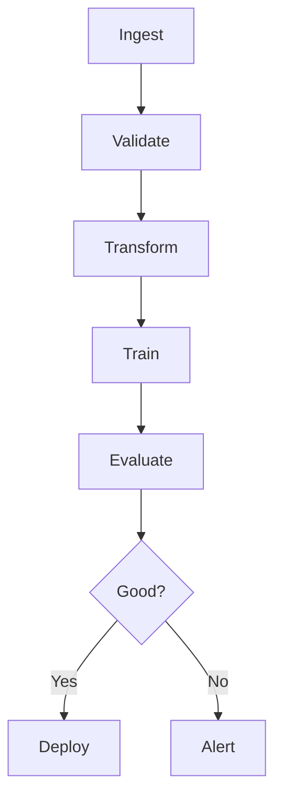

# Kubeflow Pipelines

📄 File: `book/23_orchestration_workflow_ops/06_kubeflow_pipelines.md`

This chapter covers **Kubeflow Pipelines**—ML workflow orchestration on Kubernetes for training and deployment.

---

## Study Plan (2–3 days)

* Day 1: Pipeline DSL + components
* Day 2: ML-specific patterns
* Day 3: Deployment + UI

---

## 1 — Kubeflow Pipelines Overview


* ML-focused; runs on Kubernetes
* Built on Argo Workflows

---

## 2 — Core Concepts

| Concept | Description |
|---------|-------------|
| Component | Reusable step (containerized) |
| Pipeline | DAG of components |
| Run | Single execution |
| Experiment | Group of runs |

---

## 3 — Pipeline DSL (Python)

```python
from kfp import dsl
from kfp.dsl import pipeline, component

@component(
    base_image="python:3.9",
    packages_to_install=["pandas"],
)
def preprocess(data_path: str) -> str:
    """Preprocess data; output path."""
    import pandas as pd
    df = pd.read_csv(data_path)
    df = df.dropna()
    output_path = "/tmp/cleaned.csv"
    df.to_csv(output_path, index=False)
    return output_path

@component(base_image="python:3.9")
def train(data_path: str) -> str:
    """Train model; return model path."""
    # Training logic
    return "/tmp/model.pkl"

@pipeline(name="ml-pipeline")
def ml_pipeline(data_path: str):
    """Define pipeline DAG."""
    preprocessed = preprocess(data_path)
    train(preprocessed.output)
```

---

## 4 — Component with Outputs

```python
@component
def train_model(epochs: int) -> dsl.Artifact:
    """Component that produces model artifact."""
    # Train and save model
    model_path = "/tmp/model.pkl"
    return dsl.Artifact(path=model_path)
```

---

## 5 — Conditional Execution

```python
with dsl.Condition(accuracy > 0.9):
    deploy_task = deploy(model_output)
```

---

## Diagram — ML Pipeline Stages



---

## Exercises

1. Create a pipeline: load → train → evaluate.
2. Add a conditional step based on metric.
3. Use pipeline parameters for config.

---

## Interview Questions

1. Kubeflow vs Argo for ML?
   *Answer*: Kubeflow adds ML abstractions (artifacts, metrics, experiments); built on Argo.

2. What is a pipeline component?
   *Answer*: Containerized step with inputs/outputs; reusable across pipelines.

3. How do you pass artifacts between components?
   *Answer*: Output of one component becomes input of another; stored in object storage (minio, GCS).

---

## Key Takeaways

* ML-focused; components = containerized steps.
* Pipeline DSL in Python; compiles to Argo.
* Experiments, runs, artifacts for ML lifecycle.

---

## Next Chapter

Proceed to: **07_workflow_design_patterns.md**
