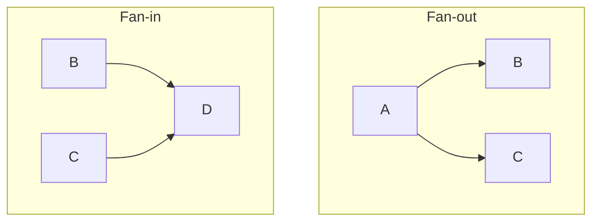
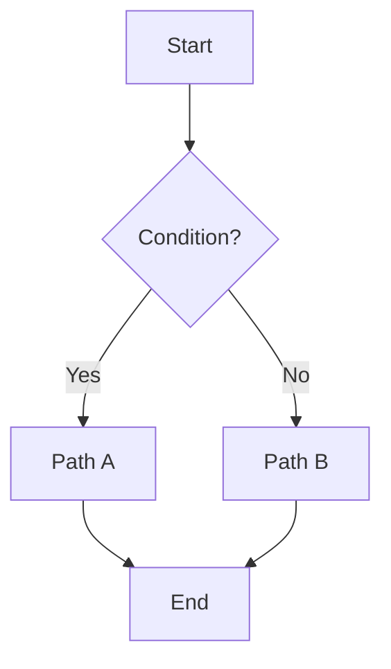

# Workflow Design Patterns

📄 File: `book/23_orchestration_workflow_ops/07_workflow_design_patterns.md`

This chapter covers **workflow design patterns**—fan-out, fan-in, branching, and idempotency.

---

## Study Plan (2 days)

* Day 1: Patterns + diagrams
* Day 2: Implementation

---

## 1 — Common Patterns



---

## 2 — Pattern Catalog

| Pattern | Use Case | Example |
|---------|----------|---------|
| Fan-out | Parallel processing | Process N files in parallel |
| Fan-in | Aggregate | Merge N outputs |
| Branch | Conditional | If A then B else C |
| Loop | Iterative | Process each partition |

---

## 3 — Fan-Out / Fan-In (Airflow)

```python
from airflow import DAG
from airflow.operators.python import PythonOperator
from datetime import datetime

def process_file(file_id: int):
    """Process single file."""
    return f"result_{file_id}"

def merge_results(**context):
    """Pull results from upstream tasks."""
    ti = context["ti"]
    results = [ti.xcom_pull(task_ids=f"process_{i}") for i in range(3)]
    return results

with DAG("fanout_fanin", start_date=datetime(2025, 1, 1), schedule=None) as dag:
    # Fan-out: 3 parallel tasks
    tasks = [
        PythonOperator(
            task_id=f"process_{i}",
            python_callable=process_file,
            op_kwargs={"file_id": i},
        )
        for i in range(3)
    ]
    # Fan-in: merge task
    merge = PythonOperator(
        task_id="merge",
        python_callable=merge_results,
    )
    tasks >> merge
```

---

## 4 — Branching (Conceptual)

```python
# Branch based on condition
# If condition: run path_a else path_b
# Use BranchPythonOperator in Airflow
def choose_path(**context):
    if context["params"].get("use_new_logic"):
        return "path_a"
    return "path_b"
```

---

## 5 — Idempotency Pattern

```python
def idempotent_load(table: str, data_path: str):
    """
    Idempotent load: replace partition or upsert.
    Same input -> same output; safe to retry.
    """
    # Option 1: Replace partition by date
    # Option 2: Upsert by key
    # Option 3: Truncate + load for full refresh
    pass
```

---

## Diagram — Branching



---

## Exercises

1. Implement fan-out for 5 API calls; fan-in to aggregate.
2. Add a branch: if error rate > 5% then alert else continue.
3. Design an idempotent daily load for a fact table.

---

## Interview Questions

1. What is fan-out and when to use?
   *Answer*: Parallelize independent work; e.g., process N files concurrently.

2. Why is idempotency important?
   *Answer*: Retries and backfills produce same result; no duplicates or partial state.

3. How do you handle partial failures in fan-out?
   *Answer*: Retry individual tasks; or fail entire run and retry all; depends on semantics.

---

## Key Takeaways

* Fan-out/fan-in for parallelism; branching for conditionals.
* Idempotency for safe retries and backfills.
* Design for failure; assume tasks can fail.

---

## Next Chapter

Proceed to: **08_retries_backfills_idempotency.md**
