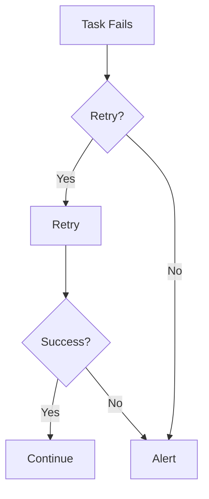

# Retries, Backfills & Idempotency

📄 File: `book/23_orchestration_workflow_ops/08_retries_backfills_idempotency.md`

This chapter covers **retries, backfills, and idempotency**—critical patterns for reliable pipelines.

---

## Study Plan (2 days)

* Day 1: Retries + backfills
* Day 2: Idempotency design

---

## 1 — Failure Handling



---

## 2 — Key Concepts

| Concept | Description |
|---------|-------------|
| Retry | Re-run failed task N times |
| Backfill | Re-run past dates/runs |
| Idempotency | Same input → same output; safe to retry |

---

## 3 — Retry Configuration (Airflow)

```python
from airflow.operators.python import PythonOperator

task = PythonOperator(
    task_id="fetch_data",
    python_callable=fetch,
    retries=3,
    retry_delay=timedelta(minutes=5),
    retry_exponential_backoff=True,  # 5, 10, 20 min
)
```

---

## 4 — Backfill (Airflow CLI)

```bash
# Backfill DAG for specific date range
airflow dags backfill my_dag \
  --start-date 2025-01-01 \
  --end-date 2025-01-07

# Backfill specific task
airflow tasks backfill my_dag.fetch_task \
  --start-date 2025-01-01
```

---

## 5 — Idempotent Load Pattern

```python
def idempotent_load(table: str, partition: str, data: list):
    """
    Idempotent load: delete partition + insert.
    Re-running produces same result.
    """
    # 1. Delete existing partition
    execute_sql(f"DELETE FROM {table} WHERE dt = '{partition}'")
    # 2. Insert new data
    insert_data(table, data)
    # Same partition + data -> same final state
```

---

## 6 — Idempotency Checklist

```python
IDEMPOTENCY_CHECKLIST = [
    "Use partition/date in load (replace, not append blindly)",
    "Use upsert by key for incremental",
    "Avoid 'INSERT INTO' without dedup for same key",
    "Make API calls idempotent (e.g., PUT over POST)",
]
```

---

## Diagram — Backfill Scope


---

## Exercises

1. Configure retries with exponential backoff.
2. Run a backfill for 7 days; verify idempotency.
3. Design an upsert for incremental load.

---

## Interview Questions

1. When to use exponential backoff?
   *Answer*: Transient failures (rate limits, network); give system time to recover.

2. What is a backfill and when needed?
   *Answer*: Re-run past dates; needed after bug fix, new logic, or missed runs.

3. How do you ensure idempotency for a daily load?
   *Answer*: Partition by date; replace or upsert that partition; same input = same output.

---

## Key Takeaways

* Retries with backoff for transient failures.
* Backfill for historical correction; design for it.
* Idempotency: partition replace or upsert; safe retries.

---

## Next Chapter

Proceed to: **24_ci_cd_gitops/gitops_overview.md**
