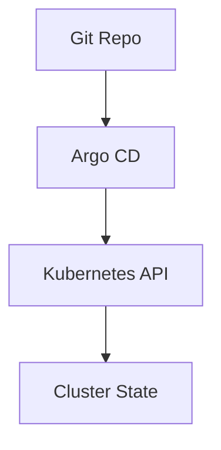
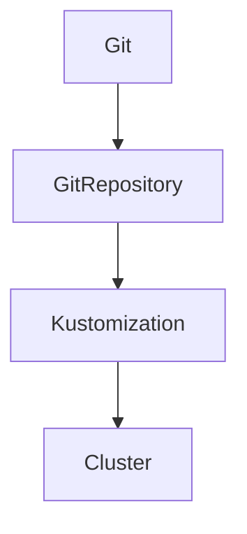

# Argo CD & Flux

📄 File: `book/24_ci_cd_gitops/argo_cd_flux.md`

This chapter compares **Argo CD** and **Flux**—the two leading GitOps tools for Kubernetes.

---

## Study Plan (2 days)

* Day 1: Argo CD
* Day 2: Flux + comparison

---

## 1 — Argo CD Overview



* Pulls from Git; syncs to cluster
* UI for visualization; supports multi-cluster

---

## 2 — Argo CD Application

```yaml
# Application manifest
apiVersion: argoproj.io/v1alpha1
kind: Application
metadata:
  name: my-app
  namespace: argocd
spec:
  project: default
  source:
    repoURL: https://github.com/org/repo
    path: k8s/overlays/prod
    targetRevision: main
  destination:
    server: https://kubernetes.default.svc
    namespace: my-app
  syncPolicy:
    automated:
      prune: true
      selfHeal: true
```

---

## 3 — Flux Overview



* Controller-based; no separate server
* Integrates with Helm, Kustomize

---

## 4 — Flux Kustomization

```yaml
apiVersion: kustomize.toolkit.fluxcd.io/v1
kind: Kustomization
metadata:
  name: my-app
  namespace: flux-system
spec:
  interval: 10m
  sourceRef:
    kind: GitRepository
    name: flux-system
  path: ./k8s/overlays/prod
  prune: true
```

---

## 5 — Comparison

| Feature | Argo CD | Flux |
|---------|---------|------|
| UI | Yes | Minimal (Weave GitOps) |
| Multi-cluster | Yes | Yes |
| Helm | Yes | Yes |
| Philosophy | App-centric | Controller-centric |

---

## Diagram — Sync Flow


---

## Exercises

1. Deploy an app with Argo CD from a Git repo.
2. Set up Flux to watch a path and sync.
3. Compare sync behavior: manual vs automated.

---

## Interview Questions

1. Argo CD vs Flux?
   *Answer*: Argo has rich UI, app-centric; Flux is controller-based, lighter. Both do GitOps.

2. What is self-heal in Argo CD?
   *Answer*: Automatically revert manual cluster changes to match Git.

3. How does Flux detect Git changes?
   *Answer*: Polling (interval) or webhook; reconciles when change detected.

---

## Key Takeaways

* Argo CD: UI, app-centric; Flux: controller-based.
* Both support Helm, Kustomize; automated sync.
* Choose by preference for UI and ops model.

---

## Next Chapter

Proceed to: **ci_cd_for_ml.md**
